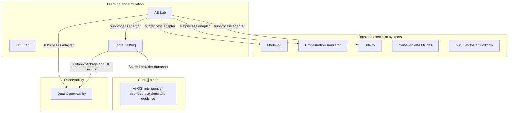

# Engineering ecosystem architecture

This is a short guide to the current workspace. Detailed shared runtime and
provider behavior remains in [architecture/runtime.md](architecture/runtime.md)
and [architecture/model-router.md](architecture/model-router.md). The
[systems map](SYSTEMS.md) links each independent project's own guidance.

| Layer | Systems | Plain-language responsibility |
| --- | --- | --- |
| Control plane | AI-OS | Shared engineering directions, reusable Skills, configuration, and model routing. Projects keep their own application runtimes. |
| Data / execution | Modeling, Orchestration, Quality, Semantic & Metrics | Decide how data is shaped, how tasks proceed, whether data passes rules, and what business metrics mean. Current projects use local exercises or bounded synthetic data. |
| Observability | Data Observability | Describe what happened using metadata, lineage, incidents, and impact. Learner policy remains in consuming labs. |
| Learning / simulation | AE Lab, FDE Lab, Toptal Testing | Practice workflows, customer reasoning, SQL, and assessment. Own their scenarios, learner state, and integration adapters. |
| Existing workflow execution | n8n / Northstar | A separate lead-intake workflow and local runner. External account setup and live outcomes are not verified by this map. |

Think of the control plane as the engineering rulebook, data systems as
specialist workshops, observability as the instrument panel, and labs as
practice rooms. A layer label describes responsibility; it does not mean
one application runs another.

Arrows point from the consumer to the implementation it uses. Only these
implemented sibling dependencies are drawn. Toptal's provider consumers now use
AI-OS transport; other apps have not all adopted its runtime. Artifact adapters and descriptive future
connections are recorded in [SYSTEMS.md](SYSTEMS.md), not promoted to live links.

`systems-registry/` stores metadata and registry checks. Source code,
credentials, state, business contracts, and project tests stay with their
owning projects. Reference an existing contract at its original path; do not
copy it into this shared layer. AE Lab and FDE Lab both use a package named
`lab`, so keep their environments separate.

When a change crosses a public interface, inspect its contract and affected
consumers, then use their targeted checks. The first registry validator proves
metadata consistency only. It does not run or certify the applications.
