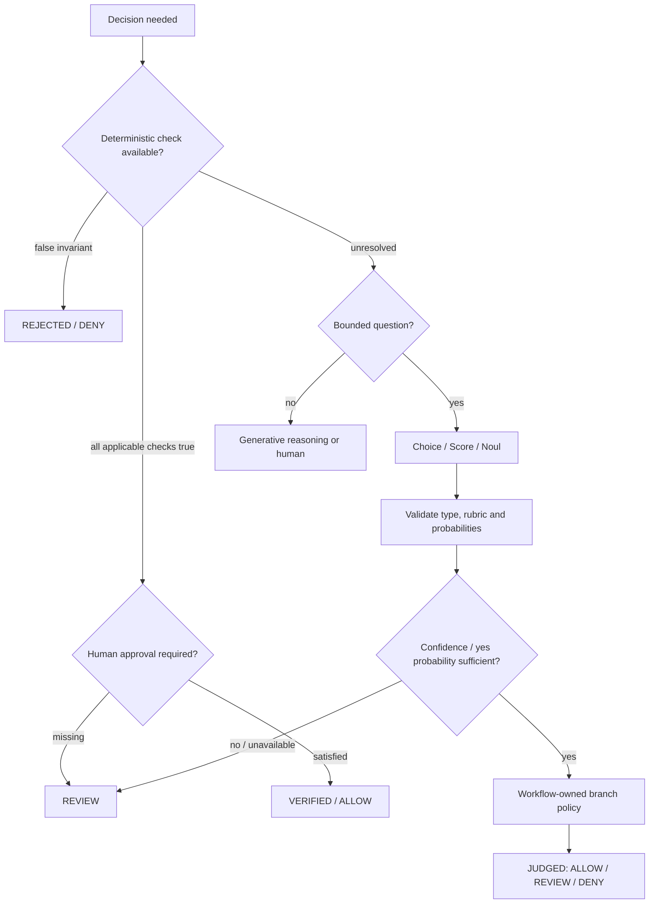

# Bounded decision plane

Jev provides typed probabilistic judgment through `DecisionRequest`, `DecisionQuestion`, `DecisionAnswer`, `DecisionResult` and `DecisionService`. It cannot generate prose, code, explanations, SQL or rich stakeholder conversations. The service does not use a generative fallback when Jev is unavailable.

A failed deterministic check terminates before calling Jev. High-risk requests without trusted human approval terminate at REVIEW. All supplied applicable deterministic checks passing returns VERIFIED without a provider call; unresolved checks use `None`. Empty checks do not vacuously certify success. A judgment is labeled JUDGED and carries `probabilistic=true`, never VERIFIED.

Choice criteria are distinct known safe labels. Score criteria are ordered rubric descriptions, starting at zero; the score is a continuous probability-weighted average, not necessarily an integer. Noul is the probability of yes in [0,1], with no invented confidence field. Returned question sets/types must match. Probabilities must be finite, complete and approximately normalized. A selected choice must agree with the distribution. A score must remain in its rubric and agree with its weighted probabilities. A changed score legend or model identity rejects the response.

Confidence thresholds are explicit and exceed 0.5. Choice/Score confidence below threshold goes to REVIEW. Noul between `1-threshold` and `threshold` is uncertain and goes to REVIEW. The workflow owns downstream branch interpretation; by default every valid judgment remains REVIEW. Security authorization and canonical metric approval are never branch-policy judgments.

The first scenario is a synthetic incident fixture: pipeline SUCCESS, revenue +38%, quality WARN, downstream dashboard impact, usual movement ±5%. It requests severity CHOICE, owner route CHOICE, risk SCORE and escalation NOUL. The contract fixture expects HIGH / DATA_ENGINEERING, risk 2, escalation 0.95 and REVIEW. These are stubbed contract/policy tests, not measured live Jev model behavior or calibration.

Metadata records request/run/caller, provider/model, usage/latency/status, primitive, criteria/version/threshold, selected result, distribution/confidence and branch. State and instructions are omitted. If audit recording fails, action remains REVIEW. Daily attempted calls and per-run limits are reserved before evaluation, including failed calls. Keep one service instance for a workflow run so its per-run budget remains effective.
