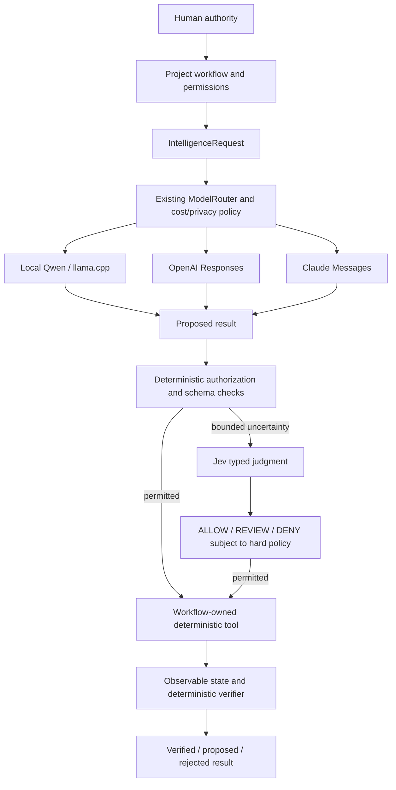

# Shared intelligence plane

AI-OS owns provider integration. Projects own prompts, business decisions, tool implementations, deterministic checks and durable state. This extends `py_dev`; it is not another scheduler or independent agent framework.

## Discovery and transition

The baseline already had `ModelRouter`, loopback Qwen/llama.cpp transport, optional OpenAI Responses and Anthropic Messages adapters, a conservative capability registry, schema validation, daily attempted-call budgeting and metadata audit. `AIOSRuntime` adds configuration inheritance and measured local context/reasoning checks. It did not execute tools. Toptal separately created OpenAI interviewer/evaluator clients and an OpenAI-compatible Qwen evaluator client. Other inspected project applications did not create model clients.

The transition preserves project stores, original exercise prompts, server-owned evaluator rubrics, answer withholding, exact deterministic rejection, and existing local workflows. Shared neutral contracts wrap the existing router. Native generative tool proposals pass through workflow-owned authority; Jev has a separate typed decision contract. Provider/client migration does not merge project state or rewrite canonical business definitions. Safe stable aliases retain project identities after directory renames.

Probabilistic ALLOW never grants filesystem, network, credential, scheduler or metric-definition authority. A tool's permission is supplied by its workflow. Human approval is required by the workflow's risk policy, even if a model or Jev is confident.

## Discovered local Qwen

The installed artifact is Qwen3-4B-Q4_K_M GGUF under the existing AI-OS model discovery path. The runtime is llama.cpp. The local health check could not verify the server at the configured loopback endpoint. The installed file proves configuration, not operational inference. No cloud Qwen client was added. Local tool calling stays unsupported until the loaded template/runtime is explicitly verified; structured output and coding assistance use the existing generation boundary.

## System access and ownership

| System | Allowed capability request | Deterministic authority retained |
|---|---|---|
| Data Modeling | SQL assistance, explanation, review | Executed SQL, rows and grain |
| Orchestration | Explain failures, diagnose, recommend | Scheduling, retries and execution identity |
| Quality | Explain failed rules; bounded fuzzy classification | Contract/rule evaluation |
| Observability | Incident explanation; bounded severity/routing | Measured evidence, snapshots and impact graph |
| Semantic & Metrics | Explain/query a governed metric | Business owner, exact version, grain/time and calculation |
| AE Lab | Tutor/debugger after learner reasoning | Withholding gates, warehouse assertions and progress |
| FDE Lab | Stakeholder simulation, critique, exploration | Exercise disclosure, execution evidence and tutor review |
| Toptal | Question/interviewer/evaluation | Separate learner input, private rubric, objective checks and mastery policy |

The table is an interface/adoption contract, not a claim that every listed project already invokes AI. Toptal's existing provider consumers are the migration target; other projects can adopt explicit requests when needed. Semantic adapters are deterministic artifact consumers rather than live sibling applications.

## Readiness

Use `python3 -m py_dev ai providers --probe`. Supported code, configured model/enable policy, present credential, authenticated metadata, tested task and available task are separate facts. Cloud metadata checks do not spend inference budget or establish a model-task pass. A live local model-task check is required for local AVAILABLE. No provider was marked AVAILABLE in the observed environment; cloud keys and SDKs were absent from the shared interpreter.

See [provider contract](provider-contract.md), [routing](provider-routing.md), [decision policy](decision-plane.md), [verification](verification.md) and [failure behavior](provider-failure.md).
