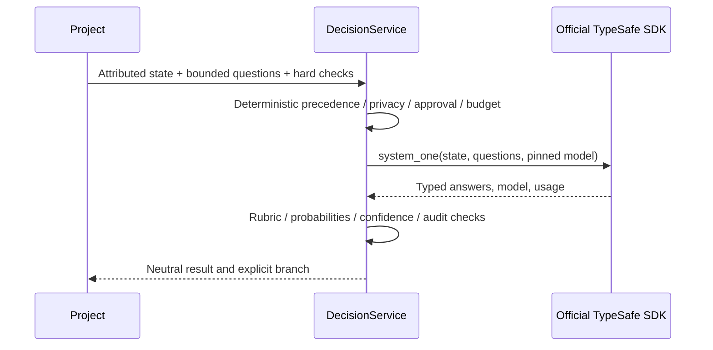

# Jev / TypeSafe System One adapter

`py_dev/providers/jev.py` uses the maintained official `typesafe-sdk` rather than a handwritten HTTP protocol. The lazy adapter accepts only bounded questions. The SDK's public raw-question input preserves vendor types inside the adapter; projects receive neutral `DecisionAnswer` values. The inspected official SDK source identifies version **0.7.2**, supports synchronous `TypeSafeClient.system_one`, public question dictionaries and `RetryPolicy(max_retries=0)`. [Official SDK](https://docs.typesafe.ai/sdk/python), [public source](https://github.com/typesafe-ai/typesafe-sdk-python).

Keep `TYPESAFE_API_KEY` in the server environment or secret manager. Never expose it in browser code, JSON process requests, prompts, metrics contracts or traces. Set a pinned `JEV_MODEL`; aliases that return a different concrete model are deliberately rejected by exact identity checking. Resolve an alias to a pinned model before use.

Paid decisions require `AI_OS_PROVIDER_JEV_ENABLED=true`, `ALLOW_JEV=true`, a configured model, an installed SDK, a credential and positive `AI_OS_JEV_DAILY_CALLS`. `AI_OS_JEV_PER_RUN_CALLS` defaults to 1. `AI_OS_JEV_BUDGET_FILE` defaults to the shared user's protected Py.Dev configuration directory. Automatic SDK retries are disabled; every attempted call must consume central budget. An unavailable/timeout/malformed/uncertain decision returns REVIEW. Private or offline data never reaches Jev.

Install the optional SDK in the server interpreter only when enabling this capability. No SDK installation, credential configuration, paid inference or live Jev calibration was performed for this change. Contract tests exercise CHOICE/SCORE/NOUL, official SDK call arguments and failure behavior through injected clients. `credential_present` is not authentication. `AUTHENTICATED` metadata is not a live decision test or AVAILABLE task proof.

Jev probabilities are judgments, not guarantees. A confident revenue anomaly judgment cannot override a failed row-count check or approve a business metric definition. Do not enable SDK body-level debug logging for sensitive state; AI-OS telemetry deliberately stores metadata only.
