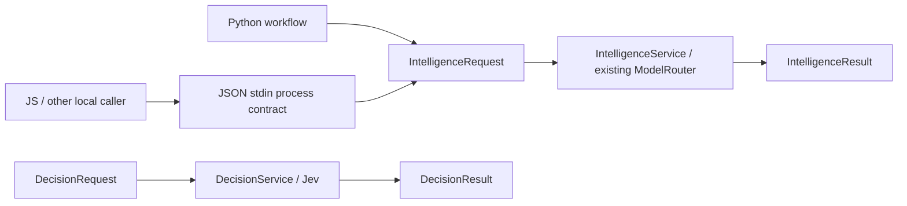

# Provider-neutral contracts

Python workflows import from `py_dev.intelligence` and `py_dev.decisions`. JSON process requests use `python3 -m py_dev ai request` or `ai decision`; this is local process input, not a deployed authenticated web service. JSON cannot supply executable handlers, verifier callbacks, tool grants or human approval. Each workflow retains its project state and secrets outside the request.



`IntelligenceRequest` carries task, calling_system, run_id, request_id, context, required_capabilities, constraints, privacy, latency_class, cost_class, tools, output schema and project-owned system instructions. Supported initial capabilities are reasoning, planning, coding, structured_output and tools. Retrieval is caller-supplied context; no RAG index or MCP runtime is implied. Handoffs, provider-managed agents, autonomous shell, images and a universal scheduler are outside this implementation.

`IntelligenceResult` returns provider/model, output, tool_trace, usage, latency_ms, status, verification_metadata, fallback and a safe error. A completed unverified response is **proposed**. **verified** requires a trusted workflow verifier. **rejected**, **review**, **unavailable** and **uncertain** expose policy rejection, pending approval, failure and possibly incomplete state changes separately. Vendor call/session objects remain inside adapters.

Every request needs safe nonempty attribution IDs. Caller IDs use stable slugs rather than project display names. Privacy is public/private/local_only. Cost is free/local/low/balanced/high; latency is fast/balanced/batch. Unknown capabilities/policy fields reject before invoking a provider. Tools are named workflow definitions with schema, handler, mutation/risk label and optional post-state verifier. Tool requests never create their own authorization. Mutation idempotency belongs to the workflow's durable store; the shared loop supplies stable keys and suppresses repeated proposals within the run.

Minimal local-process request:

```json
{"task":"Explain the supplied failure evidence without repairing it","calling_system":"ae-lab","run_id":"analysis-001","required_capabilities":["reasoning"],"privacy":"private","context":{"expected_records":1000,"observed_records":700}}
```

The JSON result remains a proposal because no domain verifier is attached. The consuming application must interpret unavailable/review/rejected statuses and must not treat process exit alone as a correctness guarantee.

Decision requests instead carry known state and named CHOICE/SCORE/NOUL questions. `DecisionService` accepts trusted deterministic checks and workflow branch policy as Python callbacks/input. The JSON interface supplies no such authority and therefore cannot certify objective success or allow a side effect. See [decision plane](decision-plane.md).

Existing Toptal compatibility wrappers preserve domain Pydantic schemas, evaluator prompts and persistent response references while delegating client construction, credentials, transport, budget and attempt metadata to the shared layer. Stored interviewer continuation is an explicitly retained cloud feature, distinct from the default no-store generative request path. It requires cloud data policy; it is never used for private/local-only work.
