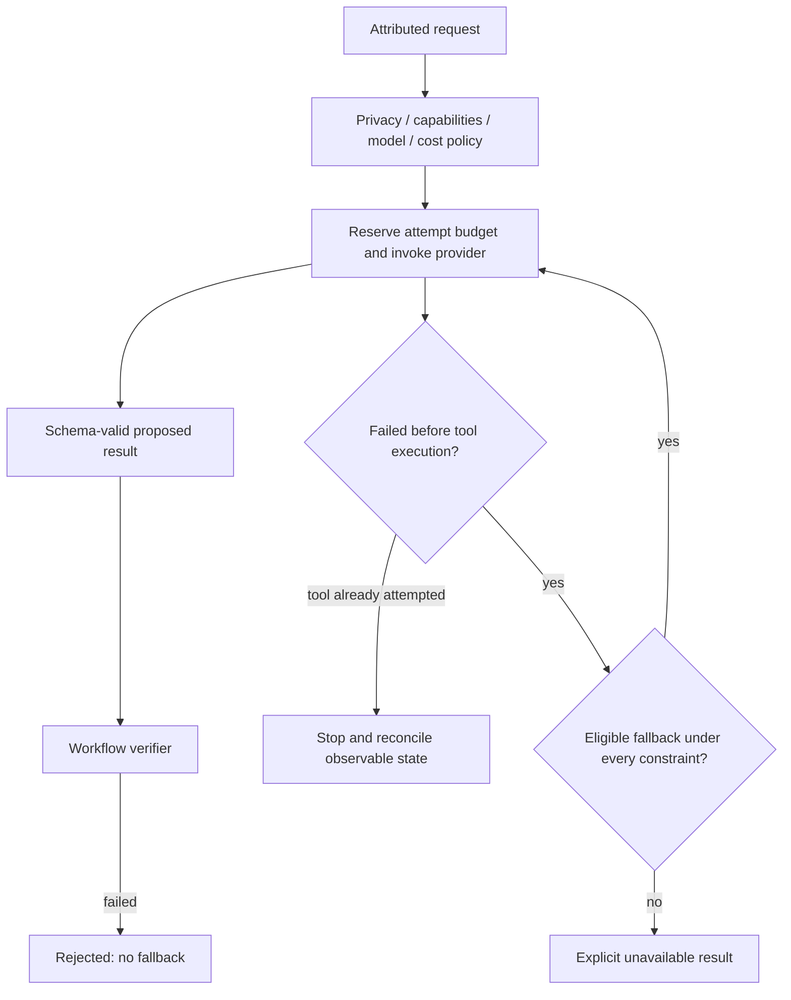

# Provider failure and recovery

Providers fail independently. Domain state is owned by the caller; provider errors contain safe classes/status rather than raw SDK bodies or credentials.

Private/offline/local-residency requests never use cloud fallback. Required provider/model pins cannot silently switch. Unsupported tools, images, unknown capabilities or an unverified strict context limit fail visibly. Cloud fallback requires enable/allow policy, central budget and automatic escalation permission. Daily budget counts attempted calls and is not refunded after a network failure. It is a call ceiling, not a monetary billing guarantee.

Audit failure stops continuation. No decision-plane provider substitutes for another on Jev failure: the result is UNAVAILABLE / REVIEW. A model verdict cannot recover a failed deterministic assertion. The workflow retains the rejected trace and owns repair/retry authorization.

Health checks are separate from inference: SDK/key presence yields no live verdict; cloud model metadata can establish authentication only. The local readiness path checks the same endpoint/model/runtime configuration and runs a bounded structured task before marking tested/available. Failed local health does not trigger a paid cloud check or inference fallback.

To recover, correct the selected provider's server/model/credential configuration, verify health, and explicitly rerun the intended workflow under its current approvals and budget. Toptal's project-owned evidence stores and deterministic offline fallback remain authoritative; provider unavailability cannot fabricate a completed assessment.
