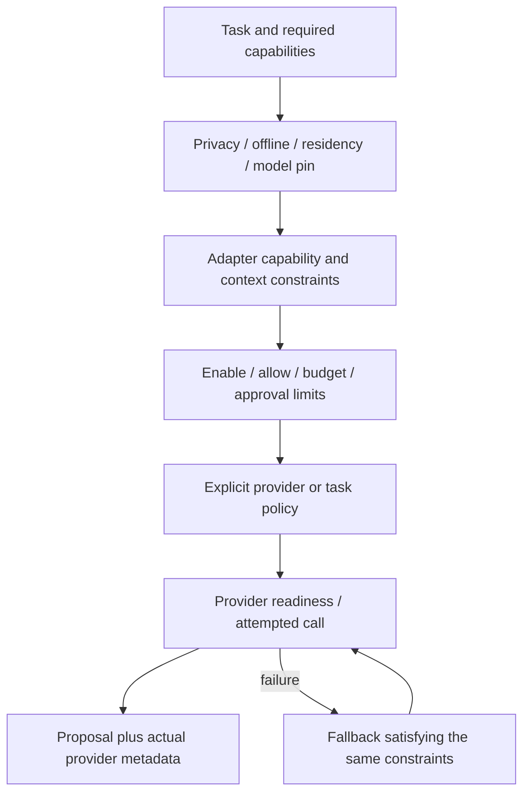

# Inspectable capability routing

The existing `ModelRouter` owns provider selection. The intelligence facade supplies explicit constraints and bounded execution. Jev may assist a workflow with a bounded fuzzy question, but does not select arbitrary agents or grant rights.

General reasoning prefers local Qwen. Coding/SQL/debugging prefer OpenAI when cloud policy permits; architecture critique/document analysis/second opinion prefer Claude. Manual provider selection is inspectable and remains constrained. Local-only/private/offline requests, local residency and free/local cost classes exclude cloud. Cloud calls need enabled and allow flags plus daily budget. Automatic cloud routing/fallback also needs escalation permission. A configured model pin, permitted providers, required tools and strict context limit constrain every candidate. Unknown strict cloud context capacity rejects rather than guessing a model limit.

Latency class is recorded as a preference. It is not a measured service-level guarantee and does not weaken privacy/cost gates. Context comes from verified local runtime metadata or explicit configured provider capacity. A model name alone is not proof of its context/tool support. Health errors do not change scheduler or project state.

| Provider | Generation / structured output | Tools | Bounded decision | Privacy |
|---|---|---|---|---|
| Qwen local | Supported transport | Unsupported until verified locally | No Jev primitives | Loopback local |
| OpenAI | Responses adapter | Native proposals with central allowlist loop | No Jev primitives | Opt-in cloud |
| Claude | Messages adapter | Native proposals with central allowlist loop | No Jev primitives | Opt-in cloud |
| Jev | Unsupported | No tool execution | Choice / Score / Noul | Opt-in cloud |

The registry represents implemented adapter support, not live account/model verification. OpenAI Responses tool flow follows the [official function-calling contract](https://developers.openai.com/api/docs/guides/function-calling). Claude tool flow follows [official client-tool documentation](https://platform.claude.com/docs/en/agents-and-tools/tool-use/define-tools). These APIs propose calls; AI-OS and the workflow decide whether to execute them.

Configuration uses `AI_OS_PROVIDER_QWEN_ENABLED`, `AI_OS_PROVIDER_OPENAI_ENABLED`, `AI_OS_PROVIDER_CLAUDE_ENABLED`, and `AI_OS_PROVIDER_JEV_ENABLED`. Legacy provider enable variables remain compatibility inputs. Cloud ALLOW flags and budget are additional safeguards, not inferred from a key. Provider-specific SDKs are optional server dependencies. Daily ledger accounting is attempted calls; usage metadata remains attributable by actual provider/model. No monetary ceiling or currency conversion is claimed.

Fallback is recorded. It is disabled when a required pin/constraint prohibits switching, after deterministic rejection, after audit failure, and after tool execution when replay could change state. Read [failure behavior](provider-failure.md) before integrating mutating tools.
