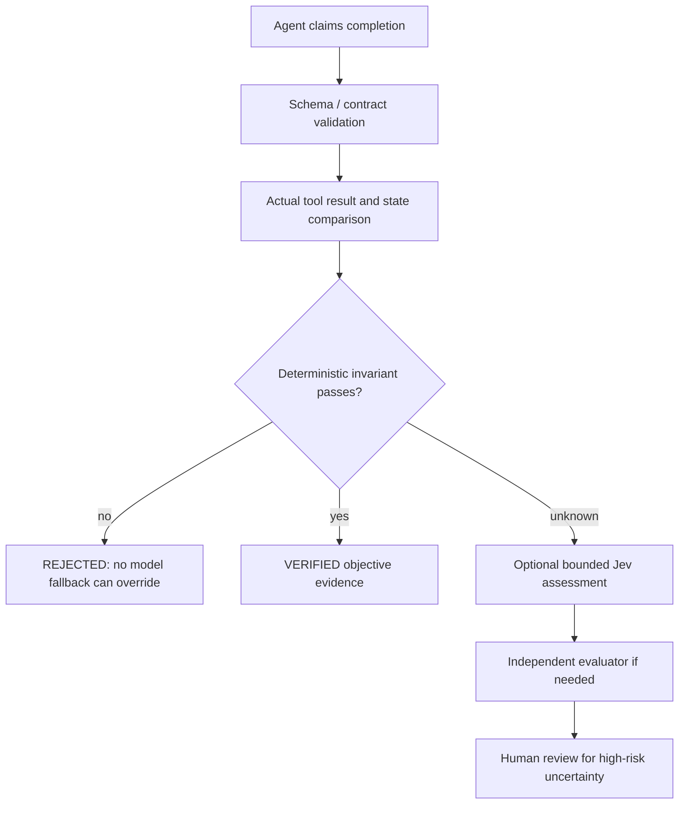

# Verification coordination

Generative output is a proposal. A provider completing a response proves only that a response was returned. A workflow must establish execution success from real tools and observable state.

Priority is deterministic checks, schema/contract validation, observable state, bounded Jev judgment where appropriate, independent generative assessment where necessary, and human review for risk/uncertainty. Deterministic checks remain active when optional model review is disabled.

The critical regression constructs a real isolated SQLite table with **700 committed records**. A stub agent claims “Completed successfully” for a task requiring **1,000**. The workflow reads `COUNT(*)`, compares it with the approved expectation and rejects. Rejection stops fallback; Jev is unnecessary. The test neither writes learner data nor spends an inference call.

Tools are supplied by the consuming workflow with least privilege. Their argument schemas and permissions are checked before execution. High-risk approval comes from trusted workflow/human input. Models cannot create approval or add tools. A successful mutation needs idempotency and a post-state verifier. After a tool failure or uncertain mutation, do not retry the whole action through another provider: retain the trace and require workflow reconciliation.

The independent helper examines implementation separately and uses adversarial probes. Passing unit/stub tests proves local contracts and policy behavior. It does not prove live provider reasoning quality, network reliability, production security, customer outcomes or learner mastery.

The [pre-upgrade audit](../audits/workspace-architecture-2026-10-04.md) separately found AE Lab's publication predicate can trust a known wrong model output. The new intelligence boundary does not change that existing domain predicate. That defect remains open and must not be hidden behind provider tests.
