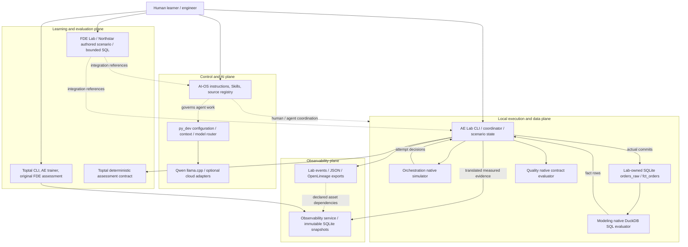

# Workspace architecture audit — 2026-10-04

Independent, read-only audit of the **pre-upgrade baseline** requested in the [architecture brief](</Users/key/.codex/attachments/420b107a-7810-4ba1-a001-f7cfbfcdd4b0/Pasted text.txt>). Concurrent, subsequently authorized AI-OS provider and analytics upgrades are outside this report. A baseline finding is not a verdict on that later implementation.

Evidence includes source/configuration inspection, retained test logs, native engine experiments, SQLite state, exported assertions, and traces. No product fixes were made. Post-probe hashing confirmed all **591 sampled project source files and 120 saved learner/state files unchanged**: [preservation evidence](/Users/key/_AI-OS/docs/audits/evidence/2026-10-04/preservation-after-probes.json). This is sampled preservation evidence, not a recursive proof that every ignored artifact is unchanged.

## 1. Executive verdict

You have built a useful local engineering and learning environment: a shared instruction/model boundary, independent domain laboratories, a real consumer integration in AE Lab, and separate learner assessment systems. You have **partially integrated components**, rather than one universally coordinated execution architecture.

The most convincing integrated behavior is AE Lab's native failure/repair exercise: actual local writes, native SQL evaluation, native quality gates, immutable observability snapshots, and deterministic objective checks cooperate successfully. The native orchestrator supplies simulated attempt decisions; AE Lab executes the writes. FDE Lab supplies a separate business-discovery simulation with an executable SQL exercise. Its customer deployment and adoption results are authored simulation evidence.

Three material weaknesses prevent a coherent trust/recovery claim: AE Lab can label a known incorrect model output trusted; the original Toptal FDE HTTP surface accepts unauthorized local mutations; and separate orchestration backfill executions reuse event identities. Broken renamed-project references also prevent the baseline's normal verification commands from being reproducible. No production-readiness claim is supported.

## 2. Actual architecture

Solid arrows show inspected execution/import relationships. Dashed arrows show reasoning, policy, or declared metadata rather than a deployed data pipeline.

The shared runtime has no repository tool executor or general workflow scheduler. Its model boundary cannot execute project repairs by itself. Inspected project application imports do not establish a live `py_dev` migration; the FDE verification script's references to those package names check isolation rather than invoke them.

Entrypoint evidence: [AE coordinator](</Users/key/_AI-OS/projects/AE Lab/lab/core.py:21>), [native orchestration adapter](</Users/key/_AI-OS/projects/AE Lab/lab/adapters/workers/orchestration.ts:8>), [FDE engine](</Users/key/_AI-OS/projects/FDE Lab/lab/engine.py:45>), [Toptal assessment app](</Users/key/_AI-OS/projects/Toptal-Testing System/app/main.py:15>), [Toptal AE app](</Users/key/_AI-OS/projects/Toptal-Testing System/apps/api/main.py:11>), [Observability facade](</Users/key/_AI-OS/projects/Data Observability System/src/data_system_map/__init__.py:9>).

## 3. System ownership matrix

| Capability | Primary owner | Consumers / actual boundary | Duplication or ambiguity |
|---|---|---|---|
| Context, provider selection, model-call policy | AI-OS `py_dev` | Explicit model-boundary callers; agent instruction layer | Existing Toptal provider surfaces remain independent |
| Dependencies, retry eligibility, partitions | Orchestration simulator | Its UI; AE Lab worker | Simulator owns decisions/counts, not actual commits |
| Business writes and retry-safe order state | AE Lab warehouse | AE Lab coordinator | Load implementation belongs to the consumer; orchestration cannot prove its idempotency |
| Grain, SQL execution, exact expected rows | Modeling engine | Modeling UI; AE Lab adapter | AE Lab owns fixtures/oracle; native engine owns evaluation |
| Contracts and validity assertions | Quality engine | Quality UI; AE Lab adapter | Quality PASS is scoped to supplied rules; it does not imply golden-row equivalence |
| Publication/trust decision | AE Lab coordinator | Recorded dashboard eligibility | Confirmed ambiguity: model failure is ignored by the trust decision |
| Snapshot lineage, incidents, impact | Observability service | Standalone UI, Toptal map, AE Lab | AE Lab supplies declared graph topology; service does not observe row movement |
| Metric meaning | Each authored project scenario/model | Revenue exercises and assessment tasks | Similar revenue concepts serve different contracts; no shared semantic authority established |
| Learner progress and assessment | Each learning application | Local stores and explicit tutor/evaluator interfaces | Separate AE/FDE/Toptal state is intentional; no common mastery claim justified |
| Verification | Deterministic project checks plus agent Verify | Root and project workflows | Baseline root fixture names and Modeling environment are stale |
| Local HTTP authorization | Each exposed application | Browser clients | Original Toptal FDE app has no effective request boundary |

## 4. Dependency and coupling assessment

AE Lab's consumer-owned workers preserve domain ownership and avoid merging incompatible environments. They deliberately invoke sibling Python environments and TypeScript source. Their [path resolver](</Users/key/_AI-OS/projects/AE Lab/lab/adapters/bridge.py:21>) supports environment overrides, but defaults rely on sibling directory names, `.venv/bin/python`, source layout, and installed `tsx`. This is a working local integration with incomplete release/packaging boundaries.

The Modeling worker imports `data_modeling_lab.engine.ModelingEngine` and its contracts directly; the Toptal worker imports `training.models` and deterministic enforcement. These are file-level native APIs. They are **not evidence of a private underscore-method call or a circular dependency**. No reverse dependency or source mutation was found in the inspected AE adapters.

One cross-domain infrastructure dependency is concrete: [Toptal's AE API](</Users/key/_AI-OS/projects/Toptal-Testing System/apps/api/main.py:11>) imports `install_local_boundary` from `data_system_map.api.boundary`. A trainer should not depend on Observability's HTTP implementation for its own authorization. Promote an explicit stable infrastructure contract or keep the policy implementation within the consuming app; do not move either application's business state into AI-OS.

The empty `projects/Data Quality System` directory has no executed owner. The working quality system is `projects/data-quality-contracts-system`. Naming claims are not separate capabilities. Other registered projects, including n8n material, were inventoried but no external workflow execution was authorized or verified.

## 5. AI-OS assessment

The baseline provides a real configuration/model boundary and an instruction-driven operating system for engineering work. It does **not** implement an autonomous control plane spanning every project. Its responsibility is defensible when described that way.

The shared runtime checks requested tools against workflow authorization and rejects tool execution because no executor exists. The model router validates structured output and allows workflow-owned deterministic rejection to terminate a response. Reasoning effort does not grant side-effect authority. Optional cloud calls, fallback, and review are policy/budget constrained. These controls apply to that runtime; they cannot establish authorization or correctness for independent project applications.

The expected intent → plan → validate → execute → observe → verify → record lifecycle is implemented by project/agent workflows, not a single universal durable state machine. AE Lab records scenario transitions and observations; FDE records submissions, tutor reviews, executable evidence, and hashes; Toptal owns its own sessions. A model-only declaration of success cannot replace those checks.

Baseline evidence: [root tests: 76 run, six errors](/Users/key/_AI-OS/docs/audits/evidence/2026-10-04/core-tests.txt), [bounded checker](/Users/key/_AI-OS/docs/audits/evidence/2026-10-04/core-checker.json). The checker passed catalog/mirror/configuration/control-separation checks but reported **AUD-006: local Qwen health or identity could not be verified**, because the loopback endpoint was unavailable. That is a verification gap, not proof of a provider implementation defect. No paid/cloud call or live model-quality evaluation was performed.

## 6. End-to-end order trace

The native experiment used seed 42, a pinned 1,000-order fixture, and an isolated profile. All native adapters remained active. The sandbox denied `tsx` CLI's IPC socket, so the diagnostic launcher used the same installed TypeScript loader through `node --import`; native engine logic was unchanged. [Archived diagnostic harness](/Users/key/_AI-OS/docs/audits/evidence/2026-10-04/ae_native_trace.py), [complete trace](/Users/key/_AI-OS/docs/audits/evidence/2026-10-04/ae-native-order-trace.json).

| Transition | Owner, schema and state | Validation / lineage / failure behavior |
|---|---|---|
| Fixture → loader input | AE Lab; order ID, customer ID, status, decimal amount, currency, timestamp; pinned JSON/SHA-256 | Source fingerprint checked; deterministic seeded source; no external ingestion/freshness measurement |
| Attempt plan → actual commits | Native simulator decides attempts; AE coordinator/SQLite executes them | Transient failure schedule allows two attempts; actual committed rows are measured separately |
| Raw → fact | Native Modeling engine; bounded key-co-located batches; DuckDB SQL | Golden rows, schema, grain and multiplicity checked; actual fact parent is `loaded_orders` |
| Fact → quality | Native Quality engine; typed contract/rules; complete key groups per bounded shard | Uniqueness, null/schema, completed status, USD and shard-volume checks; gate applies to these rules |
| Fact → revenue | Native model result plus Lab decimal aggregation; USD completed-order gross revenue | Expected revenue comes from pinned source; no separately deployed semantic service |
| Evidence → incident/impact | Lab translates measurements to dbt-shaped metadata; Observability owns immutable snapshots | Recorded model/test evidence and declared dependencies support incident/impact traversal |
| Revenue → business output | AE Lab records potential revenue and eligibility/trusted flag | Dashboard is a simulated consumer; current trust gate omits model correctness |

Baseline revenue was **USD 53,945.00**. O0001 has a stable business key across the writes and exact row comparisons. Provenance reaches the source fixture, executed SQL, evaluator assertions, database, run, and snapshot. Freshness remains `NOT_MEASURED`.

The graph is not observed physical lineage. [Observability worker](</Users/key/_AI-OS/projects/AE Lab/lab/adapters/workers/observability.py:14>) authors `orders_raw → stg_orders → int_orders_enriched → fct_orders → revenue`; native fact results instead report `loaded_orders` as their parent. Only fact/test execution nodes are emitted into the imported snapshot. [Provenance explicitly discloses](</Users/key/_AI-OS/projects/AE Lab/lab/adapters/workers/observability.py:136>) that dependencies are declared, not observed row movement. Therefore “where did this number come from?” is answerable for the **bounded fixture/SQL computation**, while every pictured intermediate asset is not an independently executed pipeline stage.

## 7. Failure and recovery trace

| Phase | Actual committed rows / retries | Revenue | Model / quality | Publication |
|---|---:|---:|---|---|
| Baseline | 1,000 | USD 53,945.00 | PASS / PASS | ELIGIBLE |
| Partial write then full append retry | 700 → 1,700 | USD 91,448.50 | FAIL / FAIL | BLOCKED |
| Upsert repair and retry | 1,000 → 1,000 | USD 53,945.00 | PASS / PASS | ELIGIBLE |
| Repeated verification retry | 1,000 → 1,000 | USD 53,945.00 | PASS / PASS | ELIGIBLE |

The corrupted phase's scheduler reports SUCCESS because execution retry completed. Quality identifies 700 duplicate extras; Modeling fails; Observability reports the affected executive dashboard. Native recovery enforces the business key, restores exact golden raw/fact rows, and passes all eight verification checks, including unchanged repeated output, partial-write retry safety, and preserved historical failure evidence. This establishes recovery for the authored scenario, not arbitrary production crashes or distributed commit protocols.

**Silent corruption:** the diagnostic harness performed a genuine successful warehouse write then changed O0001 by +100 cents, preserving keys/types/counts. Native Modeling failed `expected_output`; native Quality passed all supplied rules; Observability opened an incident. Nevertheless, AE Lab recorded **USD 53,946.00 as trusted and publication ELIGIBLE**, against expected USD 53,945.00. [Silent probe](/Users/key/_AI-OS/docs/audits/evidence/2026-10-04/ae-silent-corruption.json). This is an actual trust-label failure inside the Lab's recorded output; no external dashboard publication was attempted.

Separate recovery evidence also found backfill replay identity collisions: a failed historical partition and its successful replay shared one run ID and **25 event IDs, two with different payloads**. [Native reproduction](/Users/key/_AI-OS/docs/audits/evidence/2026-10-04/orchestration-identity-collision.json).

## 8. Verification matrix

Statuses describe the audited scope; a scoped PASS is not whole-system acceptance.

| Dimension | Status | Evidence / practical limit |
|---|---|---|
| System boundaries | PARTIALLY VERIFIED | Independent stores/adapters; file-layout and HTTP-helper coupling remain |
| Responsibility ownership | PARTIALLY VERIFIED | Domain engines distinct; output trust ownership fails model/quality reconciliation |
| Dependency hygiene | PARTIALLY VERIFIED | No sampled AE dependency cycle; stale editable environment and file-level coupling |
| Contracts | PARTIALLY VERIFIED | Native typed/bounded contracts exercised; no universal integrated contract |
| AI-OS control flow | PARTIALLY VERIFIED | Config/schema/authority tests; no project-wide tool/execution control plane |
| Data correctness | FAILED | Silent wrong output labeled trusted |
| Orchestration | PARTIALLY VERIFIED | Native retry scenario passes; separate backfill execution identity collides |
| Modeling | PARTIALLY VERIFIED | Native SQL assertions work; isolated suite 47 PASS, seven browser tests PASS; normal environment broken |
| Quality | VERIFIED | Scoped native uniqueness/schema/status/currency gates catch declared duplicate fault; amount oracle belongs to Modeling |
| Observability | PARTIALLY VERIFIED | Native snapshots/incidents/impact exercised; freshness and observed physical lineage absent |
| Lineage | PARTIALLY VERIFIED | Executed fact parents retained; adapter graph is declared topology |
| Idempotency | PARTIALLY VERIFIED | Exact upsert recovery verified for AE order fixture; no universal guarantee |
| Failure isolation | PARTIALLY VERIFIED | Temporary profiles and pinned failure snapshots preserved; production isolation untested |
| Deterministic verification | FAILED | Root normal suite has six resolver errors; normal Modeling test environment fails before collection |
| Security | FAILED | Original Toptal FDE app accepts hostile Host/Origin mutations without token/cookie |
| Reproducibility | FAILED | Normal verification commands broken after project renames; isolated source execution succeeds |
| AE Lab | PARTIALLY VERIFIED | 46 tests PASS plus native failure/recovery; silent trust gate fails |
| FDE Lab | VERIFIED | Scoped local acceptance: 245 assertions across 133 CLI commands; deployment/customer outcomes simulated |
| Toptal evaluation | PARTIALLY VERIFIED | Toptal + Observability combined suite 152 PASS; deterministic contracts exercised; live AI assessment quality unverified |
| Learning effectiveness | UNVERIFIED | Mechanisms/gates tested; no longitudinal learner or independent transfer outcome study |
| Maintainability | PARTIALLY VERIFIED | Small domain components, adapters and conservative scope; stale names/environments and coupling need repair |
| Production readiness | FAILED | No demonstrated operational deployment/control plane; confirmed trust/security/recovery defects |

Retained [AE test log](/Users/key/_AI-OS/docs/audits/evidence/2026-10-04/ae-tests.txt), [Toptal/Observability test log](/Users/key/_AI-OS/docs/audits/evidence/2026-10-04/toptal-observability-tests.txt), [FDE acceptance](/Users/key/_AI-OS/docs/audits/evidence/2026-10-04/fde-cli-checks.json), [Modeling isolated tests](/Users/key/_AI-OS/docs/audits/evidence/2026-10-04/modeling-pytest-isolated.log), [Modeling browser checks](/Users/key/_AI-OS/docs/audits/evidence/2026-10-04/modeling-e2e-isolated.log). A prior orchestration verifier reported 37 tests/build/nine browser tests passing; this report's independent orchestration experiment proves the narrower identity-collision finding and does not promote an unretained broad log into new evidence.

## 9. Prioritized findings

### P0 — Known wrong model output is labeled trusted (confirmed)

- **Problem/evidence:** [AE `core.py:123`](</Users/key/_AI-OS/projects/AE Lab/lab/core.py:123>) sets eligibility and trust only from `quality.gate_open`. The native silent probe produces model FAIL, quality PASS, incorrect revenue, an incident, and trusted=true.
- **Root cause:** Publication conflates passing selected validity rules with the full output correctness contract.
- **Impact:** Recorded business output certifies a value already disproved by deterministic model evidence. Impact is local/simulated in the audited Lab.
- **Smallest correct fix:** Require applicable model/metric/quality evidence to pass before trusted eligibility; carry rejection reasons and the exact run/artifact identity.
- **Verify:** Reproduce single-value and equal-and-opposite corruption; preserve native quality PASS where appropriate, but block trust whenever required exact-model checks fail. Keep correct recovery eligible.

### P1 — Original Toptal FDE app has no effective local mutation boundary (confirmed)

- **Problem/evidence:** [Original app middleware](</Users/key/_AI-OS/projects/Toptal-Testing System/app/main.py:46>) adds response headers without validating request Host/Origin/token. [Pause endpoint](</Users/key/_AI-OS/projects/Toptal-Testing System/app/main.py:117>) accepts a form-compatible POST. [Isolated probe](/Users/key/_AI-OS/docs/audits/evidence/2026-10-04/toptal-local-mutation-security.json): hostile Host creation 201, list/resume 200, foreign-Origin form pause 200; no cookie/auth token; zero provider calls.
- **Root cause:** Loopback binding and browser response headers are treated as sufficient protection for an exposed stateful application.
- **Impact:** Reachable local requests can inspect/change assessment state. Host acceptance creates a DNS-rebinding attack prerequisite; form-compatible mutation permits cross-origin state changes when an ID is known. A full remote-browser exploit was not performed.
- **Smallest correct fix:** Enforce allowed hosts, same-origin mutation policy, and an unguessable local-session mutation token at this app boundary; preserve deliberate local CLI access separately.
- **Verify:** Hostile hosts and foreign origins rejected; missing/wrong token rejected; authorized same-origin workflow passes. Check the original FDE surface independently from the AE trainer surface.

### P1 — Backfill replay reuses execution/event identities (confirmed)

- **Problem/evidence:** [Backfill ID construction](</Users/key/_AI-OS/projects/Data Orchestration System/src/engine/backfill.ts:77>) derives run IDs solely from workflow/partition/mode; [event IDs](</Users/key/_AI-OS/projects/Data Orchestration System/src/engine/simulator.ts:47>) add sequence. Failed→successful replay produced 25 overlapping IDs and two contradictory payloads.
- **Root cause:** Logical work identity and distinct execution identity are the same field.
- **Impact:** Exported failure/recovery traces cannot safely be merged, deduplicated, or correlated by those IDs. This is demonstrated in the simulator export, not a production telemetry backend.
- **Smallest correct fix:** Supply a distinct execution ID or caller-owned deterministic invocation/attempt identity, retaining workflow+partition as stable logical keys.
- **Verify:** Repeat the retained failed-partition replay and assert disjoint execution/event IDs plus explicit linkage to the same logical partition.

### P1 — Renamed-project references break normal verification (confirmed)

- **Problem/evidence:** Root [baseline test log](/Users/key/_AI-OS/docs/audits/evidence/2026-10-04/core-tests.txt) has six errors resolving removed `Toptal-Testing`/`Northstar` names. Modeling's [native pytest launcher](/Users/key/_AI-OS/docs/audits/evidence/2026-10-04/modeling-pytest.log) points to deleted `Data Modeling Lab System`; [module invocation](/Users/key/_AI-OS/docs/audits/evidence/2026-10-04/modeling-pytest-module.log) cannot import the relocated package. Isolated source-path tests pass 47/47.
- **Root cause:** Directory changes did not migrate fixture project identities, interpreter launchers, and editable-install mappings together.
- **Impact:** A normal checkout/environment cannot reproduce the claimed baseline checks; source logic and environment failures are conflated.
- **Smallest correct fix:** Align fixtures/registered project identities, or define explicit safe aliases where compatibility is intended; rebuild Modeling's environment from its current lock/package path.
- **Verify:** Run the documented commands without diagnostic PYTHONPATH overrides; test valid names and rejection of unknown/path-traversal names. Compare preserved learner data before/after.

### P2 — Integration boundaries depend on sibling implementation layout (confirmed architectural limitation)

- **Evidence/root cause:** [AE bridge paths](</Users/key/_AI-OS/projects/AE Lab/lab/adapters/bridge.py:26>) and Toptal's Observability HTTP-helper import bind release behavior to implementation files/environments.
- **Impact:** Moving/renaming/releasing one project can break another without an explicit compatibility contract; the environment failures above demonstrate that this concern is practical.
- **Smallest correct fix:** Establish and test narrow exported/versioned interfaces for actually reused capabilities. Remove the trainer's dependency on an Observability-specific HTTP implementation.
- **Verify:** Contract checks from installed packages or explicitly resolved roots; unavailable/incompatible interfaces fail visibly before mutation.

### P2 — Diagram lineage exceeds executed pipeline stages (confirmed coverage limitation)

- **Evidence/root cause:** Authored asset chain includes staging/intermediate nodes absent from recorded execution results; native fact parents are `loaded_orders`. Producer/provenance already disclose declared metadata.
- **Impact:** Reading graph arrows as runtime movement overstates diagnosis precision.
- **Smallest correct fix:** Preserve disclosure and make declared versus executed edges/nodes visible where consumed, or build an executed graph from returned native parents. No column-lineage platform is justified by this exercise.
- **Verify:** The trace/UI identifies which stages actually executed, which were declared, and which have no freshness observation.

No P3 finding is manufactured. Missing live Qwen health remains a verification gap.

## 10. What should be removed or consolidated

Retain the independent domain engines, consumer-owned integration adapters, SQLite state, bounded SQL execution, and separate learner evidence. Each supports an exercised requirement. The lab scale does not justify a distributed queue, cache, cluster, or vector store.

Consolidate only the generic controls already repeated in real use: safe local HTTP mutation policy, invocation identity, and narrow integration contracts. Preserve distinct business/assessment rules. Remove stale aliases, launcher references, and empty-directory confusion after confirming compatibility needs. Treat test scaffolding names as test-owned fixtures rather than permanent assumptions about business projects.

Keep AE and FDE Labs separate: AE trains deterministic component failures; FDE trains ambiguity, requirements, tradeoffs, and customer evidence. Merge them only through explicit evidence/artifact interfaces if actual practice requires it. Consolidating all learner stores would currently add migration and ownership risk without a demonstrated need.

## 11. What is actually missing

The demonstrated missing capabilities are a complete trusted-output predicate, unique execution identity across reruns, effective local mutation protection, and reproducible project/environment resolution. Those are corrections to existing behavior.

To claim a coherent cross-system architecture, one verified contract must connect model/quality evidence, metric definition, provenance, publication decision, and consumer output for the same artifact/run. The current AE exercise shows most of that path but fails the trust predicate and uses declared intermediate lineage. No evidence supports adding Kafka, Kubernetes, Spark, microservices, a new governance platform, or more agents.

Live provider health/identity, real scheduler/worker operation, external deployment recovery, customer adoption outcomes, and independent learner transfer remain unverified. They should be tested only when the intended usage needs those claims.

## 12. Learning architecture assessment

Mechanically, the environment supports see → understand/predict → do → break → diagnose → fix → recall. It does not prove that the learner can transfer the reasoning independently.

AE Lab's declared exercise checks exact prediction/diagnosis/recall fields and records that free-text reasoning and broader mastery are unassessed. The repair is an authored policy switch performed by the Lab after supported diagnosis. This teaches retry/write semantics but does not establish independent implementation ability. Automated-demo exposure cannot earn its local mastered state.

FDE Lab requires saved framing, requirements, design, evaluation, debugging, and business-impact reasoning; [reviews require tutor identity and an evidence note](</Users/key/_AI-OS/projects/FDE Lab/lab/engine.py:236>). Its [SQL workspace](</Users/key/_AI-OS/projects/FDE Lab/lab/engine.py:283>) requires the learner to write the repair; [deployment rechecks the artifact hash and replay](</Users/key/_AI-OS/projects/FDE Lab/lab/engine.py:339>). Evidence-release dependencies and [explicit solution requests](</Users/key/_AI-OS/projects/FDE Lab/lab/engine.py:391>) preserve normal CLI discovery. These are pedagogical boundaries, not protection from a learner reading scenario source files.

The authored components and prompts permit movement from business to architecture, component, runtime, and SQL code. Actual infrastructure deployment/adoption stays simulated. Reset archives previous evidence rather than silently replacing it. Toptal objective checks provide useful assessment mechanisms; live AI interviewer judgment and long-term competency measurement were not verified in this audit.

Highest-value practice: complete an unfamiliar order/revenue task, write the implementation yourself, inject a fault, defend the first corrupting boundary, and demonstrate exact recovery and transfer without solution exposure.

## 13. Production readiness

| Readiness level | Status | Assessment |
|---|---|---|
| LEARNING READY | PARTIALLY VERIFIED | Most local learning mechanisms work; guard against the silent trust-label error and overstated mastery |
| LOCAL DEVELOPMENT READY | PARTIALLY VERIFIED | Source suites work in isolated environments; normal root/Modeling verification needs repair |
| DEMO READY | PARTIALLY VERIFIED | Bounded demos work; disclose simulated scheduler/customer outputs, declared lineage and trust defect |
| PILOT READY | FAILED | No real customer/operational pilot demonstrated; material local authorization and output correctness defects |
| PRODUCTION READY | FAILED | No evidenced production architecture, operational recovery/authorization model, or complete trusted-output contract |

An FDE command called `deploy` simulates an authored pilot; it is not evidence that the ecosystem is pilot-ready.

## 14. Minimum remediation plan

**FIX FIRST → Fix the trusted-output decision and protect exposed local mutation endpoints.** These are concrete correctness/security failures. Verify against the retained native corruption and hostile-request probes.

**FIX SECOND → Restore reproducible checks and distinct execution identities.** Repair project/environment references; repeat failed-partition replay with trace IDs that preserve both executions. Keep source-state preservation checks.

**FIX THIRD → Tighten one real order-to-output integration and then practice.** Use explicit model/quality/metric provenance for a shared publication decision; disclose declared lineage. Validate a second unfamiliar task and independent learner transfer before building more infrastructure.

## 15. Principal Architect recommendation

**HARDEN, then STOP BUILDING AND PRACTICE.** Existing components earn their place through concrete local requirements. The weaknesses are in the last-mile trust boundary, request authorization, execution identity, and reproducibility. Broad consolidation would obscure useful domain and learning boundaries; more infrastructure would not repair these demonstrated failures.

Once the bounded corrections pass independent verification, use the existing environment to perform unfamiliar discovery, SQL implementation, failure diagnosis, exact recovery, and customer reasoning. Integrate further only when repeated practice demonstrates a specific missing contract or manual burden.

## 16. Five recall questions

1. Who decides retries, and who actually commits order rows?
2. Which evidence connects a revenue value to its source orders?
3. What must pass before an output can be marked trusted?
4. How do you distinguish a failed execution from its successful replay?
5. What business evidence would you request before changing an AI model?
