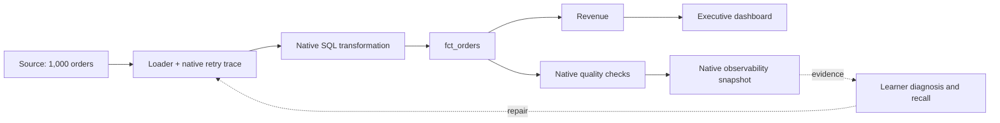

# Analytics Engineering Lab

A local laboratory connecting five existing projects through consumer adapters.
Phase 1 teaches one **MUST KNOW** concept: safe retries after a partial write.
It executes `ORCH-IDEMPOTENCY-001`; the larger scenario catalog remains future work.

The Lab owns fixtures, failure injection, its SQLite warehouse, learning state,
event correlation and evidence exports. Existing systems retain their own logic.
Sibling source files, service data and learner records are preserved.

## Start

Use Python 3.11+, `uv`, and the existing sibling runtimes. No API key, Docker,
cloud account or additional service is required for this slice.

```sh
uv sync --extra dev
uv run lab systems
uv run lab scenarios
uv run lab learn ORCH-IDEMPOTENCY-001
```

The same CLI runs as `python -m lab` inside the environment. The default state
directory is `.lab` in this project. Put `--state-dir PATH` before the command
to use an isolated profile, including for demonstrations and tests.

`lab systems` reports the runtime paths. If a sibling is not installed, follow
its own setup instructions:

| Existing project | Native setup |
|---|---|
| Data Orchestration System | `npm ci` in that project; Node 22.12+ |
| Data Modeling System | `uv sync --extra dev` in that project |
| data-quality-contracts-system | `make setup` in that project |
| Data Observability System | Follow its README's Python environment setup |
| Toptal-Testing System | Reuse its `.venv/bin/python`; the chosen evaluation modules require only Python 3.11+ |

Adapters fail with an actionable error if a runtime is unavailable. Configure
locations with `AE_LAB_MODELING_ROOT`, `AE_LAB_QUALITY_ROOT`,
`AE_LAB_OBSERVABILITY_ROOT`, `AE_LAB_TESTING_ROOT`, or
`AE_LAB_ORCHESTRATION_ROOT`. Python adapters also accept the corresponding
`AE_LAB_<SYSTEM>_PYTHON` executable override. Defaults are siblings of this project.

## The exercise

The guided session follows this order:

**ORIENT → PREDICT → RUN → OBSERVE → DIAGNOSE → FIX → VERIFY → RECALL → CONNECT**

It asks for a prediction before execution and a diagnosis before repair. One
focused diagram, one fault and one fix keep the causal chain visible. Answers
and intermediate state persist so the session can resume.

For a first attempt, start with `learn` before reading the walkthrough below.
The automated demonstration uses supplied answers and records assisted evidence.

```sh
uv run lab --state-dir .lab-demo demo
```

The scenario's fixed seed is 42. Its independent source reference contains
1,000 completed USD orders with total revenue **53,945.00**. The injected attempt
commits 700 orders, then crashes. A full append retry leaves 1,700 rows and
revenue **91,448.50**. The extra 700 rows contribute **37,503.50**.

The orchestrator can finish successfully while the data violates its contract.
The quality result and native model assertions expose the duplicate order keys.
Observability records measured corruption and the affected executive dashboard.
The corrupt revenue is visible as potential impact; the failed quality gate
marks publication blocked and the declared dashboard output untrusted.

Repair first removes historical duplicate rows, then enforces `order_id`
uniqueness and uses an upsert. Verification compares complete recovered data to
the independent source, checks quality and metric reconciliation, inspects the
recovered observability evidence and repeats the load to prove retry safety.



## Commands and evidence

| Command | Purpose |
|---|---|
| `lab systems` | Inspect the five configured integration boundaries |
| `lab scenarios` | Show the single authored Phase 1 scenario |
| `lab learn ORCH-IDEMPOTENCY-001` | Start or resume the guided learning loop |
| `lab run ORCH-IDEMPOTENCY-001` | Execute baseline and injected failure |
| `lab inspect RUN_ID` | Inspect saved evidence and transitions |
| `lab lineage ASSET` | Walk upstream through the declared architecture |
| `lab diagnose RUN_ID ...` | Submit structured diagnosis selections |
| `lab fix RUN_ID` | Apply the authored loader repair |
| `lab verify RUN_ID` | Run machine-verifiable recovery criteria |
| `lab progress` | Show local exercise and evidence status |
| `lab reset ORCH-IDEMPOTENCY-001` | Start a fresh exercise while retaining evidence |
| `lab demo` | Execute an explicitly assisted walkthrough |

Use `lab COMMAND --help` for arguments. Run directories contain the Lab-owned
warehouse, saved execution evidence, canonical events, native adapter evidence,
and healthy/failed/recovered Mermaid diagrams. Each run also has its own native
`observability.sqlite`; the profile root contains `state.sqlite`. The source
fixture is pinned by SHA-256, and changing it stops execution instead of changing
the expected result. Inspect these files instead of relying only on printed status.

```sh
uv run lab progress
uv run lab learn ORCH-IDEMPOTENCY-001 --resume RUN_ID
uv run lab inspect RUN_ID --json
uv run lab lineage executive_dashboard --mode failed
```

`FAIL_AFTER_ROWS=700` or `lab run ORCH-IDEMPOTENCY-001 --fail-after-rows 700`
reproduces the authored failure. `--seed` changes fixture amounts reproducibly.
The published row and revenue walkthrough above uses the default 700-row
failure and seed 42; learner prediction questions retain that authored contract.

States are explicit:

`READY → BASELINE → FAULT_INJECTED → FAILED → DIAGNOSING → REMEDIATED → VERIFIED → MASTERED`

`VERIFIED` means recovery checks passed. `MASTERED` is a bounded local label for
this exercise's verified recovery plus successful diagnosis and concept recall.
Guided and repeated exposure remain recorded qualifications. Automated demos
cannot earn `MASTERED`, including when resumed for recall. No local label updates
Toptal's canonical learner mastery or certifies senior readiness.

Re-running verification suspends any previous `VERIFIED` or `MASTERED` result
and records a transition back to `REMEDIATED`. Current checks must pass before
the run becomes `VERIFIED` again; prior acceptance cannot conceal a failed or
interrupted recheck.

## Engineering boundary

- The native orchestrator owns retry eligibility and attempt ordering. The Lab
  commits real SQLite writes from that trace; the native simulator does not execute them.
- Native modeling runs real DuckDB SQL and assertions in complete key groups of
  at most 180 rows. Its built-in deduplication path is bypassed with an authored
  `loaded_orders` projection so corrupt writes remain visible.
- Native quality evaluates every row in complete order-key groups of at most
  200 rows. No duplicate key may be split between checks.
- Native observability imports adapter-generated dbt-shaped metadata from real
  measurements. No dbt command runs. Lineage is declared; staging/intermediate
  nodes are conceptual aliases of the single native candidate transformation.
- Native Toptal authoritative enforcement evaluates authored structured fields.
  Free-text reasoning, transfer and broad mastery remain unassessed.

This is a local, single-user lab. No production connector, scheduler deployment,
live BI application, general SQL execution service or later scenario family is included.
Freshness is reported as `NOT_MEASURED`; this exercise does not establish a
freshness SLA or simulate a source outage.

## Checks and design records

```sh
uv run pytest -q
```

Tests use isolated Lab profiles. Contract tests invoke genuine sibling runtimes;
missing dependencies fail visibly. Test results and the completed demonstration
are recorded separately after execution; this README defines the intended checks.

See [system inventory](docs/system-inventory.md), [architecture](docs/architecture.md),
[idempotency](docs/concepts/idempotency.md), and [architecture decisions](docs/adr/001-canonical-event-contract.md).

Phase 1 is independently [verified](docs/verification.md): 46 tests passed, with
18 native execution probes and six interruption/resume probes. The saved
[demonstration](docs/phase1-results.md) shows the measured failure and recovery.
See the [created-file manifest](docs/files-created.md) for implementation scope.
