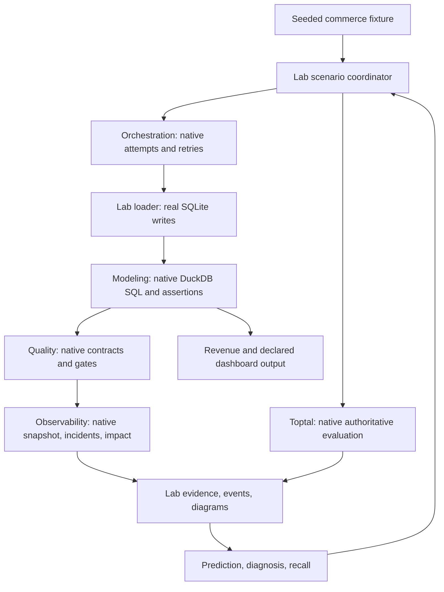
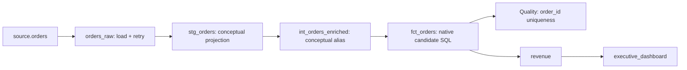
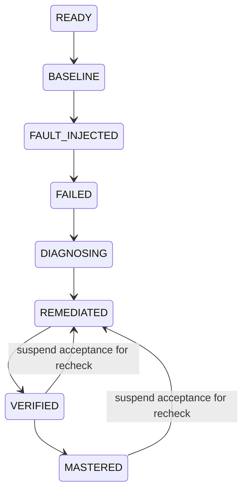

# Phase 1 architecture

One Python CLI coordinates five bounded native interfaces. The Lab owns the
scenario and evidence; each existing project owns its engine. This implements
`ORCH-IDEMPOTENCY-001` before adding another concept.

## Data and lineage

`orders_raw` and `fct_orders` are real Lab warehouse tables. The native modeling
candidate is one SQL query over `loaded_orders`, preserving duplicates. The
staging/intermediate nodes explain architectural roles; they are declared
aliases, with no claim that separate dbt models were materialized. The dashboard
is a declared consumer of measured revenue, rather than a live BI connection.

To answer “where did this number come from?”, walk from dashboard to revenue,
fact rows, loader output and independent source reference. Quality is a check
on that path; it does not transform rows.

## Explicit interfaces

| Adapter | Native responsibility | Lab responsibility |
|---|---|---|
| Orchestration | Eligibility, dependency/state transitions, ordered attempts | Author transient crash; execute loader writes from native trace |
| Modeling | Execute SQL, evaluate frozen grain/key/golden rows, calculate native metric | Supply actual loaded rows and independent reference; aggregate bounded results |
| Quality | Evaluate contracts/rules and publication gate | Pack entire key groups; aggregate complete coverage and native events |
| Observability | Normalize snapshots, preserve provenance, derive incidents/impact | Translate measured evidence to its supported artifact interface; isolate DB |
| Testing | Native Question/Evaluation types and authoritative failure enforcement | Author exact structured checks; retain assistance and unassessed explanations |

Protocols live in `lab/contracts.py`. Consumer workers execute in each sibling's
existing runtime. Paths are configurable; missing dependencies are errors.
No sibling source edits, reverse dependency or duplicate rule engine is required.

AE owns the composed publication decision. A scoped Quality OPEN gate alone
does not certify output. The current phase must also have successful execution,
native Modeling PASS (including exact-row evidence), materialized rows equal to
that certified rowset regardless of order, complete expected row coverage and
exact pinned-source revenue reconciliation. Missing/unknown/failed
evidence blocks both publication and dashboard trust, with rejection reasons
retained in `publication_rejections`. Prior phases cannot substitute for current
receipts. Freshness remains NOT_MEASURED for this authored exercise.

The bounded native interfaces impose real limits: modeling batches contain at
most 180 rows, quality batches at most 200. Every occurrence of an order key
stays in the same batch. A key group exceeding a limit fails closed. Partitioning
is valid here because the authored projection, uniqueness and revenue sum are
independent across order keys; it is not a generic strategy for window functions
or arbitrary joins.

## State, recovery and evidence

The Lab stores resumable run documents and warehouses under its selected state
directory. Baseline, fault, recovery and rerun evidence remain inspectable.
Adapter infrastructure errors retain available evidence without pretending the
pipeline recovered. A completed check cannot silently stand in for a new run.
`state.sqlite` resides at the profile root; each run has its own warehouse and
native `observability.sqlite`. The stored source fixture is SHA-256 pinned;
changed fixture bytes stop execution, preserving the independent oracle.

The first faulty attempt commits 700 rows. The retry appends all 1,000 rows.
Repair atomically cleans historical duplicate rows and installs a unique index;
subsequent writes update or insert by `order_id`. Verification must establish
data equality, uniqueness, metric reconciliation, passing native evidence,
downstream recovery and an unchanged repeated load.

Local `MASTERED` records narrow concept recall after verified recovery. It
carries assistance/exposure qualifications and never modifies canonical Toptal
records. An automated demonstration remains assisted and cannot earn `MASTERED`
even after a later resumed recall. A recheck explicitly suspends a previous
`VERIFIED` or `MASTERED` state to `REMEDIATED` with a reason. Failed or interrupted
checks retain that suspended status; only new passing checks restore `VERIFIED`.

Canonical events include run/scenario correlation, system, asset, status,
metadata and direct upstream assets. Timestamps follow a reproducible logical
scenario timeline. The optional OpenLineage-style projection maps the parent
run/job and datasets; internal observations are not fabricated independent task
runs. No collector or complete OpenLineage conformance is claimed.
Incident openings and resolutions correlate native incident identity to the
original opening event. Only actual observed transitions emit these events;
a healthy baseline emits no fictitious incident resolution.

## Implementation scope

| Files | Responsibility |
|---|---|
| [contracts.py](../lab/contracts.py), [scenarios.py](../lab/scenarios.py) | Typed interfaces, stable scenario and acceptance contract |
| [core.py](../lab/core.py), [store.py](../lab/store.py) | Coordination, legal transitions, suspended acceptance and saved run documents |
| [warehouse.py](../lab/warehouse.py), [fixtures.py](../lab/fixtures.py) | Real partial writes, safe repair and reproducible independent source |
| `lab/adapters/` and its `workers/` | Consumer translations invoking five original native engines |
| [telemetry.py](../lab/telemetry.py) | Canonical envelopes, evidence exports and Mermaid/OpenLineage-style projections |
| [cli.py](../lab/cli.py), [learning.py](../lab/learning.py) | Guided nine-step exercise and inspection commands |
| `tests/unit`, `tests/contract`, `tests/integration`, `tests/e2e` | Isolated logic, genuine native boundaries, full recovery and CLI behavior |

These files belong to AE Lab. No sibling engine implementation or canonical
learner record is replaced. Verification results are recorded after the independent
checks complete, rather than inferred from this implementation map.

## Material limits

- The orchestrator is a deterministic simulation engine; Lab database writes
  are real. Its declared native output counts are not actual warehouse counts.
- Native modeling's original narrative feedback can refer to its three-order
  demonstration. The Lab uses execution/assertion evidence and its own fixture
  explanations; generalizing that sibling narrative is deferred.
- Observability artifacts truthfully identify their adapter producer and no
  dbt execution. Declared lineage is not observed row-level movement; cause
  remains uncertain until the authored learner diagnosis supplies separate evidence.
- Structured field checks do not evaluate prose reasoning or cross-scenario
  transfer. The grader is local and visible, with no answer-key security claim.
- Freshness is explicitly `NOT_MEASURED`; this retry scenario establishes data
  recovery rather than freshness/SLA behavior.
- Local SQLite and subprocess boundaries target one user. Concurrent multi-user
  sessions, runtime version packaging, general transformations and deployment
  remain later engineering work.

Decisions: [events](adr/001-canonical-event-contract.md),
[adapters](adr/002-adapter-boundary.md), [warehouse](adr/003-local-warehouse.md),
[states](adr/004-scenario-state-model.md), [lineage](adr/005-lineage-integration.md).
