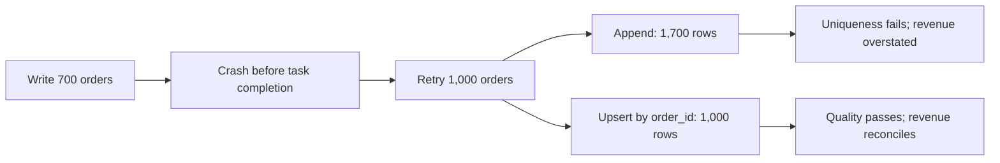

# Idempotency — MUST KNOW

**WHAT** Repeating an operation has the same intended effect as performing it once.
For this loader, the same source orders must retain one current row per `order_id`.

**WHY** A successful write can be followed by a crash before the caller records
success. Retrying delivery is normal; repeated business effects require protection.

**WHERE** The orchestrator decides to retry. The write boundary enforces the
stable identity. Incremental models and overlapping backfills need the same property.

**FAILURE** The first attempt's rows survive. A naïve full retry adds them again.
The task succeeds while the data and metric remain wrong.

**SIGNAL** Compare source count, actual count, duplicate keys and revenue.
For seed 42: 1,000 expected rows become 1,700; revenue 53,945.00 becomes
91,448.50. A successful pipeline status alone cannot establish data correctness.

**FIX** Repair historical duplicates; enforce a unique business key; update or
insert consistently by that key. Then validate complete data and repeat the load.
An upsert does not automatically repair duplicates already present in a table.

**INTERVIEW** “The orchestrator provides retries. My sink makes them safe using
a stable order identity, a uniqueness constraint and transactional upsert. I
verify the failure window by retaining a partial write, retrying, checking rows
and revenue, and running the repaired load again.”

**RECALL** Reconstruct source → loader/retry → fact → quality → metric → dashboard.
Explain why retry success can coexist with corrupt data, where stable identity
must be enforced, and what evidence proves the next retry is safe.

This scenario proves a narrow local write contract. External side effects,
concurrent updates, ordering/version conflicts and changing source history need
their own contracts and tests.
