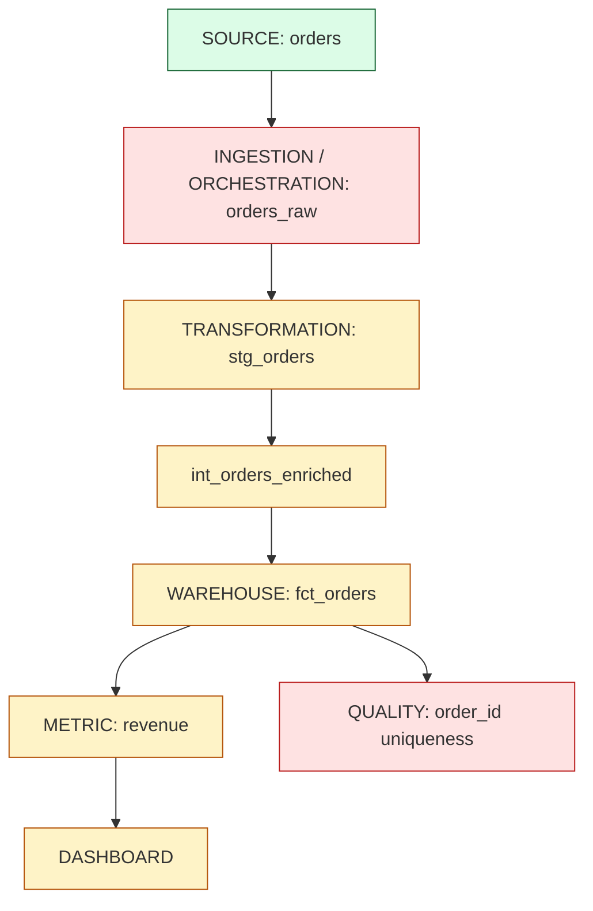
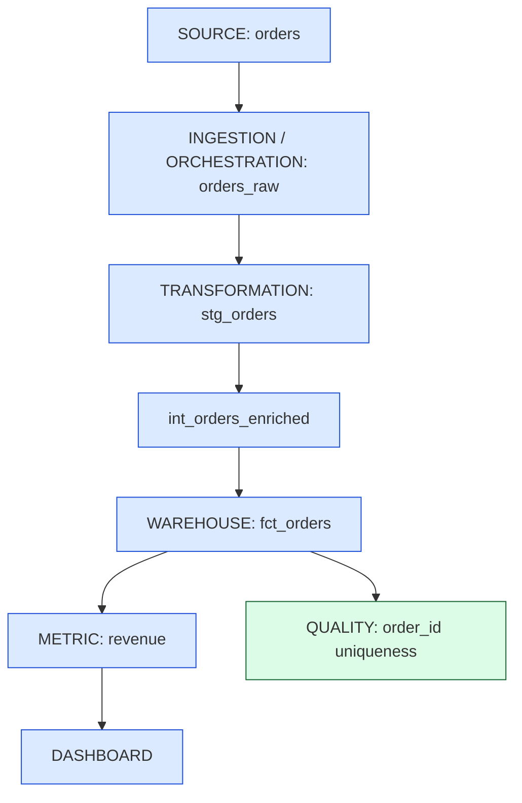

# Phase 1 completed demonstration

Executed 2026-10-03. Run `0d0e510e-1120-4d8b-9044-54ed6aa7b35d`. This is an automated demonstration;
no learner mastery was awarded. [Console evidence](demonstration.log),
[independent verification](verification.md), [test log](verification-probes/pytest.txt).

## Observed results

| Evidence | Healthy baseline | Injected append retry | Repaired retry and repeat |
|---|---:|---:|---:|
| Source orders | 1,000 | 1,000 | 1,000 |
| Warehouse/fact rows | 1,000 | 1,700 | 1,000 |
| Extra duplicates | 0 | 700 | 0 |
| Revenue (USD) | 53,945.00 | 91448.50 | 53945.00 |
| Orchestration | SUCCESS | SUCCESS | SUCCESS |
| Native modeling / quality | PASS / PASS | FAIL / FAIL | PASS / PASS |
| Publication | ELIGIBLE | BLOCKED | ELIGIBLE |
| Current incident | None | fct_orders, dashboard impact | None |

Freshness is **NOT_MEASURED**. Failed revenue is a measured potential business error;
the quality gate blocks its publication. The dashboard is a declared consumer.

## Failure architecture

Green means healthy, red means failed, amber means downstream impact. The native
modeling query preserves loaded duplicates so the failure remains visible. Staging
and intermediate names describe roles in that query, rather than separate physical models.

## Recovery architecture

Blue marks the recovery path. Upsert alone cannot remove historical duplicates:
the Lab first reconciles the existing target and enforces the stable order key.
The next partial write leaves 1,000 rows; the complete retry also leaves 1,000.

## Machine evidence

- PASS — `root_cause_resolved`
- PASS — `data_corrected`
- PASS — `quality_checks_pass`
- PASS — `models_correct`
- PASS — `downstream_recovered`
- PASS — `rerun_safe`
- PASS — `partial_write_retry_safe`
- PASS — `historic_failure_preserved`

The full native results, SQL, quality events, pinned snapshots, canonical JSONL,
fixture, warehouse and state remain in `.lab/demo/0d0e510e-1120-4d8b-9044-54ed6aa7b35d/`.
The source fixture is pinned by SHA256. A later failed check suspends previous
acceptance; interrupted fixes and checks resume without awarding stale completion.

## What this teaches

Execution success and data correctness answer different questions. The orchestrator
can retry successfully while a loader repeats committed data. A stable key plus
safe writes prevents the corruption; quality detects it; lineage connects it to
untrusted revenue; observability retains failure and recovery evidence.

Reconstruct this path from memory: `SOURCE → LOAD → MODEL → QUALITY → METRIC → BI`.

## Recall

1. Why did a successful retry still produce incorrect revenue?
2. Why must historical duplicates be repaired before declaring an upsert recovery?
3. What evidence would prove the next retry is safe, beyond a green task status?

## Next scenario

Fanout join at order grain: one order joined to multiple items repeats its amount.
This is a recommendation only; it was not implemented in Phase 1.
