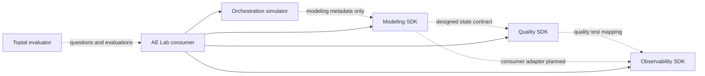

# System inventory — Phase 0

Inspected 2026-10-03 before implementation. All paths below are siblings of AE Lab.
No existing system was modified. Existing unrelated workspace changes were preserved.

## Compatibility matrix

| System | Purpose | Inputs | Outputs | Execution interface | Telemetry interface | Dependencies | Integration risk |
|---|---|---|---|---|---|---|---|
| Data Orchestration System | Deterministic schedules, dependencies, retries, partitions | WorkflowDefinition, RunOptions | SimulationRun, attempts, output counts | TypeScript src/engine/index.ts createRun/simulate | orchestration-event-v1 transitions | Node ≥22.12, tsx | Simulator tracks counts, does not execute SQL or writes; Lab must execute real fixture writes from attempts |
| Data Modeling System | SQL transformations, declared grain, golden-row validation, decimal Revenue | ModelingEngine(fixture, expected), BuildRequest | BuildResult, ModelDefinition, metric, assertions | Python data_modeling_lab engine SDK; /api/build | modeling-lab-v1 transformations and tests | Python ≥3.11, DuckDB, SQLGlot, Pydantic | 200-result-row limit; built-in staging deduplicates source versions, unsuitable for hiding corrupt loads |
| data-quality-contracts-system | Contracts, assertions, publication eligibility | ValidateRequest, Dataset, DataContract | ValidationBundle, gates, quality events | quality_system.engine.validate_bundle; /api/validate | quality-event-v1, observability_test mapper | Python ≥3.11, Pydantic, FastAPI, PyYAML | 200 rows per dataset; uniqueness requires entire key groups in one batch |
| Data Observability System | Immutable lineage snapshots, incident evidence, impact traversal | dbt-shaped manifest/run_results/catalog/sources | data-map-v1 snapshots, incidents, impact | data_system_map.create_service + import_dbt; /api/map | measured observations + test results | Python ≥3.11, SQLite, Pydantic, FastAPI | No generic event ingestion; adapter must declare provenance and never imply actual dbt execution |
| Toptal-Testing System | Questions, evaluation, conservative evidence | Question, Evaluation, DeterministicReport | Evaluation with authoritative check enforcement | training.models + training.deterministic SDK | deterministic_results; broader training DB | Chosen surface Python stdlib; broader FastAPI/OpenAI/SQLAlchemy/DuckDB | Not packaged; narrow objective checks cannot certify free-text reasoning or general mastery |

## Detailed interfaces

### Orchestration

- Root: `../Data Orchestration System`; guidance and `docs/architecture.md` inspected.
- Entrypoints: `src/engine/index.ts`, `simulator.ts`, `types.ts`, `backfill.ts`.
- Commands: `npm ci`, `npm test`, `npm run build`, `npm run test:e2e`, `npm run check`; UI `npm start` at loopback 8078.
- Configuration: `package.json`, authored workflow schedule/timezone/pools/retry policy; eight native task states.
- Schemas: `contracts/scenario.schema.json`, `execution-event.schema.json`; scenario-v1/event-v1.
- Storage: browser-memory sessions, exported evidence JSON; engine is pure and deterministic.
- Tests: tsx/node:test and Playwright. Installed node_modules and Node 24 available.
- Runtime: no Docker, cloud, AI, real scheduler or warehouse. Failed attempts do not materialize native output counts.
- Boundary: Lab consumes attempts to perform actual local writes; native simulator owns retry eligibility.

### Modeling

- Root: `../Data Modeling System`; guidance, README, architecture and engine inspected.
- Entrypoints: `data_modeling_lab.ModelingEngine`, contracts, fixtures, API; constructor accepts project-owned fixture and oracle.
- Commands: `uv sync --extra dev`, `uv run pytest`, `make check`, `make contracts`; `uv run python scripts/run.py` loopback 8075.
- Configuration: pyproject/uv.lock, fixture/expected JSON; API `/api/scenario`, `/grain`, `/staging`, `/join`, `/build`, `/metric`, `/contracts`.
- Contracts: modeling-lab-v1; decimal money strings, explicit grain and primary key; actual SQL parents.
- Storage: isolated in-memory DuckDB connection per operation; browser session only.
- Tests: pytest/httpx and Playwright, frontend TypeScript/build. Installed .venv available.
- Runtime: no Docker/dbt/cloud/LLM; SQL external access disabled, bounded time/memory/output.
- Boundary: Lab supplies loaded-order tables and independent golden rows in bounded batches; native BuildResult SQL execution/evaluation reused. Source-version deduplication must not conceal duplicate ingestion.

### Quality

- Root: `../data-quality-contracts-system`; guidance, integrations, engine/contracts inspected.
- Entrypoints: `quality_system.engine.validate_bundle`, `adapters.contract_from_modeling`, `observability_test`, API create_app.
- Commands: `make setup/run/check/contracts/check-dbt`; `uv run python scripts/run.py` loopback 8082.
- Configuration: pyproject/uv.lock; optional dbt_lab profiles/project; no runtime credentials.
- Contracts: data-contract-v1, validation-result-v1, quality-event-v1, quality-gate-v1, quality-bundle-v1; strict Pydantic; <=200 rows/dataset, <=20 datasets.
- API: health/contracts/scenarios, validate, preview, compatibility, adapters/modeling and observability, dbt/GX export.
- Events: dataset/rule/status/severity/expected/actual/failure_count/total_rows/timestamp/run_id/fingerprint and bounded evidence samples.
- Storage: immutable fixture JSON and browser memory; stateless SDK; optional isolated DuckDB dbt lab.
- Tests: pytest, frontend build, Playwright; optional positive/negative dbt checks. Installed .venv available.
- Boundary: validate every row using complete order-key groups; aggregate native evidence and fail closed. No incident/scoring logic here.

### Observability

- Root: `../Data Observability System`; guidance, README, migration/service/engine contracts inspected.
- Entrypoints: `data_system_map.create_service(path, seed_demo=False)`, `import_dbt(system_id,name,manifest,run_results,catalog,freshness)`.
- Commands: make test/lint/build/check-demo/test-e2e; standalone API/UI loopback 8002.
- Configuration: OBSERVABILITY_DB and OBSERVABILITY_WEB_DIST; Lab passes its own absolute DB path explicitly.
- Contracts: data-map-v1; dbt manifest v7–v12/run-results v6 supported subset; observations in `meta.data_system_map.observations`.
- API/outputs: systems/snapshot/graph/node/relation/impact/changed_nodes/incidents/investigate/explain/query under /api/map.
- Storage: SQLite WAL, immutable content-hash snapshots and atomic imports; application_id 0x444D4150, user_version 1.
- Tests: pytest/httpx/DuckDB and Playwright; installed Python .venv available.
- Boundary: adapter-produced artifacts honestly labeled as Lab evidence; native engine owns incidents/impact. Root-cause location can remain unknown/inferred. No generic event ingest, column lineage, SLA or AI engine.

### Testing

- Root: `../Toptal-Testing System`; guidance, README, training/models and deterministic evaluation inspected.
- Entrypoints: typed Question/Criterion/Evaluation/Outcome/Mode and enforce_authoritative_results; broader FastAPI trainer and CLI.
- Commands: `make dev` / `Start-AE-Trainer.command` (8001), `python -m training.cli`, original FDE UI (8000).
- Configuration: AE_TRAINER_DB, TRAINING_DB, EVALUATOR_PROVIDER/local Qwen settings and opt-in OpenAI.
- Storage: broader application uses SQLite/SQLAlchemy/Alembic and canonical assessment Markdown registers; Lab never writes those.
- Tests: pytest, frontend typecheck and Playwright; optional Darwin sandbox for existing SQL exercises.
- Dependencies: chosen evaluation dataclasses/enforcement need only Python stdlib; broader requirements files include FastAPI/OpenAI/Pydantic/SQLAlchemy/DuckDB.
- Boundary: Lab-authored exact structured answers, native authoritative enforcement; prose recorded but unassessed. Lexical fallback is not correctness evidence; no claim of canonical Toptal mastery.

## Current relationships and proposed boundary

Dashed edges describe existing designed interfaces, not a pre-existing live end-to-end pipeline.
The smallest viable Lab is one Python CLI, local SQLite state/warehouse, deterministic fixtures,
five consumer-owned subprocess adapters and one scenario. Native runtime environments are reused;
paths are configurable. No sibling reverse dependency, sibling data mutation, distributed service,
or large scenario catalog is required.
