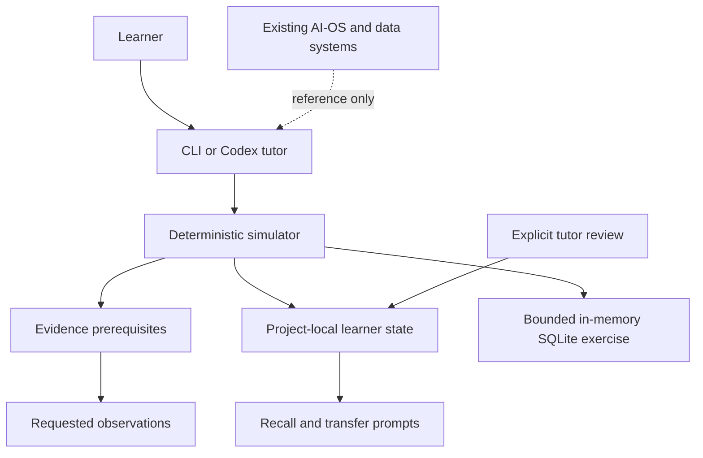

# Architecture



`lab/contracts.py` validates the scenario graph. `lab/scenarios/northstar.json` owns synthetic customer facts, stakeholder topic replies, prerequisites, component explanations, recall prompts, and instructor-only truth. `lab/engine.py` chooses one topic per question, releases only eligible evidence, records learner reasoning, and checks phase gates. `lab/exercise.py` provides the broken model, reproducible rows, and a Python oracle independent of submitted SQL. `lab/store.py` locks and atomically saves the state; reset archives prior state and workspace. `lab/cli.py` exposes commands and a shell.

Normal output is assembled from explicit public fields, never a serialization of the whole scenario. Unknown/locked evidence returns no artifact text. Diagrams and box explanations describe the present architecture and generic runtime behavior; they do not disclose causes. The optional `solution` command is an explicit learner request and is logged.

```text
NEW → DISCOVERY → SCOPED → DESIGNING → PROTOTYPING
 → EVALUATING → HARDENING → DEPLOYING → OPERATING
 → MEASURING → RETROSPECTIVE → MASTERED
```

The learner drives discovery. Framing, requirements, design, evaluation, readiness, debugging, measurement, and explanation require saved submissions and attributed tutor reviews. Coding and replay checks require executed results. The deployment gate checks the same artifact hash and reruns replay tests. The rollout is a synthetic local event.

Concept progress stores evidence references, not a percentage. Exposure is automatic; understanding and transfer require explicit assessment. Mastery requires executable debugging evidence and at least two distinct reviewed transfer prompts for that concept. Reassessed developing evidence blocks mastery. Scenario completion requires two concepts with this evidence; broader FDE competence remains unproven.

The matcher recognizes configured whole words and phrases, not arbitrary customer questions. A Codex or human tutor handles semantic questioning and evaluates free-text submissions. Reviews are local attestations, not authenticated credentials. Source access can bypass learning gates; this project does not claim adversarial confidentiality.

No runtime import, shared credentials, database, or execution bridge to siblings exists. References and ownership routing live in `integrations/registry.json`.
