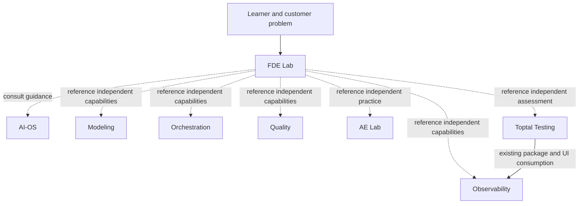

# Existing systems and FDE boundaries

Initially inspected read-only on 2026-10-03; the AE Lab entry was refreshed on
2026-10-04 against its now-present README, CLI, contracts, adapter and Makefile.
**Verified** below means the named directory,
documentation, command definition and public interface were found in source.
No sibling application, test suite or model endpoint was run for this inventory.
Commands are manual reference instructions, not FDE startup steps.

FDE owns customer simulations, disclosure, learner decisions, local exercises and
its own progress. AI-OS supplies shared engineering guidance and optional reasoning
controls. Each sibling continues to own its domain truth and project state.
The [registry](../integrations/registry.json) is descriptive data; it grants no
execution authority and installs no dependencies.

Dashed arrows are FDE reference paths, not live connections. The solid relationship
already belongs to Toptal and Observability; FDE does not recreate it.

| System | Verified ownership and surface | FDE reference use | Important limit |
|---|---|---|---|
| [AI-OS](../../../README.md) | Shared architecture, Skills and `py_dev` runtime/model router | Consult problem-framing, implementation and verification guidance; explain model control boundaries | Existing apps have independent runtimes. Shared runtime has no tool executor. FDE does not change provider configuration. |
| [Data Modeling System](../../Data%20Modeling%20System/README.md) | Grain, keys, joins, bounded SQL, transformations, metric definitions; `data_modeling_lab.ModelingEngine`, `modeling-lab-v1` | Open a focused modeling exercise when the learner has identified a data-design question | Modeling defines desired state; its graph is not collected runtime lineage. It owns no learner scores or incidents. |
| [Data Orchestration System](../../Data%20Orchestration%20System/README.md) | Deterministic TypeScript simulation; `src/engine/index.ts`; `orchestration-event-v1` and `orchestration-scenario-v1` | Study dependencies, attempts, partitions and retry behavior | Simulator does not execute SQL, schedule production jobs or write a warehouse. Modeling metadata conversion is implemented; live sibling wiring is deferred. |
| [Data Quality & Contracts System](../../data-quality-contracts-system/README.md) | `quality_system.engine.validate_bundle`, stateless `/api/validate`, explicit contract/data/time inputs, fail-closed publication eligibility | Compare a declared assumption with deterministic evidence | Main app publishes no real mart. UNKNOWN remains unknown. Bounded educational datasets are not a production validator. |
| [Data Observability System](../../Data%20Observability%20System/README.md) | `data_system_map.create_service`, immutable metadata snapshots, dbt artifact ingestion, graph/incident/impact evidence, `/api/map` | Inspect recorded evidence and separate observations from inferred causes | Uploaded SQL is inert; column lineage, SQL analysis and live warehouse connections remain unavailable. Dependency impact alone does not prove wrong output values. |
| [AE Lab](../../AE%20Lab/README.md) | Guided `lab` CLI, `ae-lab-v1` contracts, local warehouse/store and subprocess adapters for five sibling systems | Refer to its focused analytics exercise when the learner identifies that capability | README and CLI are now present. The workflow requires installed sibling runtimes; FDE did not execute it or adopt its learner evidence. |
| [Toptal-Testing System](../../Toptal-Testing%20System/README.md) | Separate browser assessment, terminal training and SQL trainer; its own evidence policy and canonical assessment records | Use a separate independent assessment after FDE practice | FDE does not write its scores, records or mastery. Prose training checks cannot certify executable SQL/code correctness. |

Run each command from that system's project root, after following its own setup
instructions. Command definitions were checked in source; runtime success is untested.

| System | Manual launch reference | Existing check reference |
|---|---|---|
| AI-OS | `python3 -m py_dev status --brain qwen` reports configuration | `python3 -m py_dev check` requires the configured local runtime |
| Modeling | `make run` → loopback port 8075 | `make check`; `make contracts` regenerates contracts |
| Orchestration | `npm run build`, then `npm start` → loopback port 8078 | `npm run check` |
| Quality | `npm --prefix web run build`, then `make run` → loopback port 8082 | `make check`; optional `make check-dbt` |
| Observability | `make dev` → loopback port 8002, after `make setup` | `make test`, `make lint`, `make build`, `make check-demo`, `make test-e2e` |
| AE Lab | `uv sync --extra dev`, then `uv run lab learn ORCH-IDEMPOTENCY-001`; `uv run lab systems` reports native runtimes | `uv run pytest -q` or `make check`; not executed for this inventory |
| Toptal Testing | `make dev` → SQL trainer on loopback port 8001; its README documents separate assessment/training launchers | `make test`, `make lint`, `npm --prefix apps/web run build`, `make test-e2e` |

Future artifact adapters are **proposed**, not installed. A concrete adapter would
live in FDE, accept an explicitly selected serialized contract, validate its version
and retain source/run/time provenance. FDE would own disclosure and local progress;
the producer would retain its truth engine. Unknown fields remain unknown. Different
projects' fixture meanings and metric definitions must be reconciled explicitly.
No shared credential store, automatic launch, reverse dependency or cross-project
learner-state write is part of this first slice.

Source inspection also found existing consumer-owned AE Lab subprocess adapters.
Those belong to AE Lab; their presence is not evidence that FDE has connected them
or that the AE Lab end-to-end workflow has passed verification.

Use each project's own launcher/environment. Both projects currently use a Python
package named `lab`; installing them together in one environment is unsupported.
