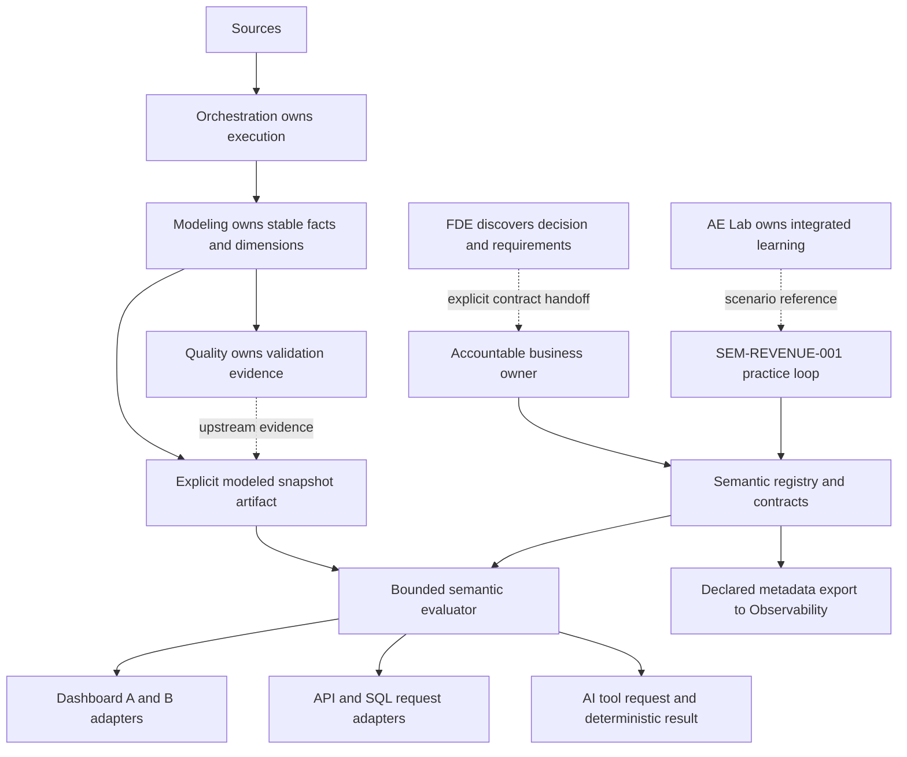

# Actual Phase 1 architecture

The working runtime is `semantic/core.py`: JSON catalog loading, contract validation, immutable business meaning per version, sequential lifecycle transitions, dependency/asset cycle checks, bounded snapshot evaluation, lineage and human explanation. `semantic/scenario.py` owns only local practice disclosure and evidence. `semantic/cli.py` exposes these capabilities. `adapters/artifacts.py` exports typed, explicitly synthetic artifact interfaces.

## Entity, dimension, measure and metric

Order is a business entity; `order_id` is its canonical identifier. Customer uses `customer_id` and Product uses `product_id`. A source version must be resolved by Modeling before this input. Email, guest checkout and CRM account IDs cannot silently replace Customer identity.

Date is computed from the selected metric event time in its named reporting timezone. Channel belongs to Order. Region belongs to Customer and category belongs to Product; both use the current modeled snapshot in this slice. One product per Order is an explicit limitation. Multi-product attribution must be approved as a different contract instead of multiplying an Order total across items.

`gross_order_value` and `refund_amount` are additive integer-cent facts at Order grain. `order_count` contributes one per eligible Order. These measures become metrics only when a contract fixes business purpose, owner, population, recognition time, allowed slices, unit and version. `active_customers` counts distinct canonical IDs across eligible orders; counts across dimensions may overlap and must not be blindly added.

## Time and recognition

The bundled synthetic owner chooses fulfillment time, America/Chicago, Gregorian reporting dates, fulfilled USD orders and fulfillment-cohort refund restatement through the snapshot `as_of`. This is an authored exercise choice, not a recommended universal revenue rule. Created, paid, shipped and refund dates serve other decisions. Fiscal calendars, cash/refund-date reporting and historical region/category require additional explicit contracts.

Requests use a half-open local-date interval. Naive timestamps are rejected; events later than snapshot `as_of` cannot be treated as available evidence. Refund rows are already aggregated by Modeling and must carry the same snapshot cutoff. The evaluator does not ingest events, deduplicate versions or resolve refund identities.

## Governance and versioning

Contracts have exactly the fields in `contracts/semantic-metric.schema.json`. The structural schema is complemented by executable `Registry` checks of formula/aggregation/measure bindings, dimensions, lineage, dependency compatibility, lifecycle and accountable approval. Critical identity, grain and time metadata cannot be missing.

New versions enter as PROPOSED. `Registry.transition()` advances exactly one step through REVIEWED → APPROVED → ACTIVE → DEPRECATED. Owner evidence must cover the contract meaning fingerprint. Every bundled approval has scope `synthetic_scenario`; no endpoint can claim production approval.

`Registry.register()` forbids overwriting any existing metric/version. Semantic revisions preserve prior definitions, reference `previous_version`, record a change note, effective date, compatibility and named consumer migration. Changes to executable meaning require a new major version. Consumers pin an explicit version; default lookup fails when multiple active versions would be ambiguous. The registry/library is local and does not provide enterprise access control or an authenticated approval service.

## Consumer contract and explainability

`semantic-query-v1` accepts metric ID/version, declared consumer, local date window and allowed dimensions. It rejects caller formulas, SQL and business-definition overrides. Dashboard, API, SQL and AI labels all route to one evaluator over one contract and snapshot. The local SQL interface is a structured semantic request, not a warehouse SQL execution adapter.

Every result includes exact integer values, a formatted amount/count, accountable owner, grain, event field, timezone, calendar, window, snapshot cutoff and definition/catalog/source fingerprints. AI is demonstrated as deterministic tool consumption; no language model chooses a canonical meaning or generates warehouse queries.

Lineage is declared source → staging → modeled asset → measure → metric dependency → consumer. It is not measured freshness or proof of operational success. Observability receives UNKNOWN operational status until its own evidence exists.

## Learning disclosure and evidence

Opening shows only the two totals and recorded technical status. The learner records an initial question/prediction; artifact prerequisites gate formulas, owner and policies. Diagnosis needs the health, model, row, dashboard, owner, time and identity artifacts. Prose stays unassessed.

The design template retains discovered owner prose but blanks the executable meaning choices. A proposal must match the authored owner decision including business-definition prose. The fixture owner cannot approve changed learner meaning; a new owner-approved scenario contract is required. Implementation applies sequential governance in a scenario-local registry. Verification compares five consumers and rejects formula overrides, fanout, owner omission and time-field drift. Recall remains unanswered and unassessed. Sessions use atomic replacement, an exclusive write lock and optimistic state fingerprints to preserve concurrent evidence.
