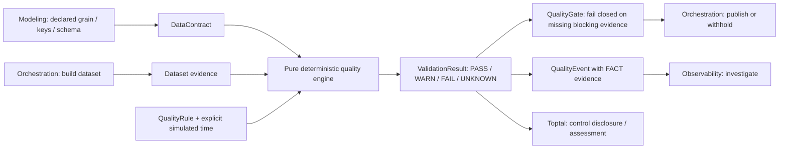

# Data Quality & Contracts System — first vertical slice

Approved scope is the user's pasted brief, particularly its twenty first-slice
criteria and five controlled failures. Phase 0 evidence is in `system-audit.md`.

## Components

- Python package `quality_system`: strict provider-neutral Pydantic contracts,
  pure engine, fixture/corruption functions, compatibility analysis and adapters.
- Loopback FastAPI: stateless scenario and validation endpoints; generated OpenAPI.
- React application: contract → predict → run → evidence → break → fix → verify.
  Five quality levels, compact profile, visual gate flow, row evidence, builder,
  small compatibility/reconciliation/test-type explanations and integration export.
- Optional local dbt/DuckDB lab: real model contracts, source/model generic tests,
  one custom generic test, singular business assertion and native unit test.
  Core runtime does not require dbt. GX is an optional mapping design.
- pytest and Playwright; exactly one independent verifier, reused for repairs.

## Truth and gate policy

Every run takes explicit data, rules, contract and timezone-aware clock. No random
data, wall-clock comparisons, LLM decisions or floating-point money. Evidence is
FACT; consequences are labeled HYPOTHESIS where not directly observed. UNKNOWN
means missing/unsupported evidence and is never PASS. Empty row predicates are
UNKNOWN (not a claim of business validity); a separate volume rule enforces data
arrival. Duplicate evidence reports both extra rows and every affected row.

Severity is INFO/WARNING/CRITICAL and is separate from blocking. A failed warning
expectation produces WARN; a critical expectation produces FAIL. Any breached
blocking expectation, including WARN or UNKNOWN, prevents publication. Missing,
duplicate, stale or mismatched validation evidence cannot open a gate. Contract
primary keys compile to uniqueness AND not-null checks. Schema checks compare
declared observed types/nullability plus every actual row, not just metadata.

Money uses finite decimal strings and exact Decimal arithmetic. Freshness is data
arrival time, distinct from a task's completion time. Reconciliation explicitly
subtracts refunded returns from captured payments, then applies absolute OR
relative tolerance with a documented zero-baseline rule. Compatibility is policy
based; tightening nullability needs data proof, and optional additions can break
strict consumers. Unique keys support declared grain; they do not prove semantic
row meaning.

Column presence is separate from nullability. Making an existing required column
optional is BREAKING (`presence_relaxed`): future producers may omit a column
promised to existing consumers. A complete current sample cannot preserve that
future guarantee. Optional-addition policy applies to new columns, not this loss
of an existing obligation; optional→required remains BREAKING too.

## Deferred scope

No transformations, generic graph/lineage engine, scheduling, monitoring, incidents,
assessment scoring, AI chatbot, ML anomalies, streaming, cloud or production work.
No universal quality score. Persistence and arbitrary SQL execution are deferred.
The fixed teaching flow is an authored explanation of the same fixture, not fresh
validation of upstream source/staging models. The gate controls a simulated mart
publication; actual orchestration execution belongs to its sibling.
