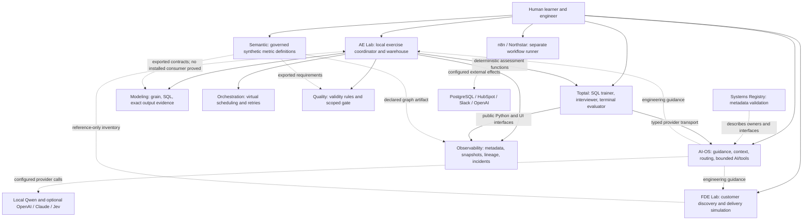

# Architecture validation — Step 2

Date: **2026-10-04, Asia/Seoul**. Workspace: `/Users/key/_AI-OS`.

Scope: judge the implemented system boundaries, responsibilities, contracts, state and learning design. This report builds on [Step 1][discovery], the root guidance, system map and ten registry entries. It does not implement recommendations or certify production readiness.

## Executive Architecture Verdict

**The overall separation is defensible, but several decisions turn incomplete evidence into stronger claims than it supports. Keep the specialist systems; repair those decisions.**

All ten registered systems have a concrete purpose. The Registry and Validation Harness is shared supporting infrastructure, not an eleventh application. Modeling, Orchestration, Quality and Semantic are bounded educational engines. Observability is a reusable artifact and graph engine. AE Lab integrates native engines; FDE Lab is a standalone customer-engagement simulator; Toptal contains three assessment modes. n8n is a separate workflow stack with configured external effects.

The clearest responsibility failure is **AE Lab's publication decision**: passing Quality's selected validity rules is treated as sufficient proof of trustworthy output, even when Modeling has already disproved that output. Quality should own its rule verdict; the consuming workflow must combine all required evidence before publishing a trust claim. A fresh native probe reproduced this failure.

The most concerning security boundary is **Toptal's original interview HTTP app**. In an isolated application test, hostile-host requests could create/list/resume sessions and a cross-origin form request could pause a session without an authorization token. This is a server-side boundary failure; no real browser attack or production compromise was attempted.

Other confirmed problems are weak lexical grading counted as independent learner success, reused backfill execution/event identities, a Quality compatibility omission, accepted random SQL sampling, and a stale Modeling installation. These do not justify replacing the architecture.

The supplied mental model incorrectly suggests that AI-OS runs every project, that Semantic and Observability form a mandatory serial pipeline, and that FDE/AE results automatically enter Toptal mastery. None of those relationships is implemented. Previous AI-generated prompts are not retained as implementation provenance, so this audit cannot reliably attribute a defect to a particular prompt. It can identify the mistaken architectural assumptions and the code that embodies them.

Evidence labels distinguish **confirmed problem**, **likely risk**, **optimization** and **speculative concern**. Priority reflects consequence in this local environment: P0 covers the demonstrated false output-trust and HTTP security boundaries; P1 covers major evidence, compatibility and reproducibility failures. No live external provider, CRM, Slack, production database or deployment was exercised. No saved learner records or credential values were inspected.

Exactly one independent verifier was started for each of Modeling, Orchestration and Quality, as their local guidance requires, using the requested Astra/max configuration. They produced probes and preliminary results, then stopped at a workspace credit limit. The primary audit inspected their saved evidence and directly completed/replayed the critical AE, Quality and Orchestration probes. This is not a claim that three complete independent audit sign-offs were obtained.

## Actual Architecture Diagram

Solid arrows below mean **consumer calls/imports implementation**. Dotted arrows denote guidance, artifact references or configured external boundaries. They are not all data-flow arrows.



Within AE's actual execution, the sequence is:

```text
AE pinned fixture + native Orchestration attempt plan
    → AE-owned SQLite writes
    → native Modeling output + assertions
    → native Quality rules
    → Observability import of measured evidence and declared dependencies
    → AE publication/trust decision ← currently ignores Modeling failure
```

Semantic supplies business definitions when a workflow explicitly adopts its contracts. Observability examines evidence across the workflow; it is not the final authority that makes a business number correct. Toptal is a separate assessment consumer, not a mandatory last stage for every lab. [Map][map] · [AE bridge][bridge] · [AE coordinator][ae-core] · [Semantic exports][semantic-exports] · [FDE integrations][fde-integrations]

## Responsibility Matrix

Labels apply to the stated responsibility, not to every behavior of an entire system. Similar exercises are not automatically duplicated ownership.

| System | Should own | Actually owns | Should not own | Classification / overlap judgment |
| --- | --- | --- | --- | --- |
| AI-OS | Shared engineering context, capability/configuration policy, AI routing, bounded coordination, verification policy | Skills, source routes, model transports, budgets, typed requests, caller-authorized tools and verification callbacks | Business transformations, metric definitions, scheduler engines, scenarios, learner grading policy | **CLEAR** shared boundary. Universal project execution coordination is not implemented; not an unowned production requirement. |
| Modeling | Analytical grain, transformations, joins and model evidence | DuckDB fixture transformations, explicit grain/key declarations, exact-row oracle, join/fanout explanations, local metric exercises | Scheduling, generic monitoring, cross-project mastery, enterprise metric approval | **CLEAR** domain. Local teaching metrics do not duplicate Semantic governance. Determinism has a defect. |
| Orchestration | Dependency decisions, execution attempts, retries, partitions/backfills | Pure virtual-time engine, worker/pool constraints and simulated output counts | Business SQL, production writes, quality or learner scoring | **CLEAR** ownership; replay identity is defective. AE owns the real writes. |
| Quality | Contract validity, assertions, compatibility and scoped gate evidence | Schema/key/null/relationship/range/freshness/volume/reconciliation checks; event and gate envelopes | Transformations, metric ownership, incident handling, final publication of another system's output | **CLEAR** validity ownership. Compatibility has an omission. Calling its local gate a complete output certificate is **MISPLACED** in AE. |
| Observability | Recorded executions, measurements, lineage, incidents, impact and metadata storage | Reusable artifact parser, immutable snapshots, graph/API/UI and evidence-based investigations | Warehouse execution, canonical metric formulas, learner scoring/disclosure policy | **CLEAR** generic ownership. Shared HTTP protection is also housed here; it deserves an explicit reusable infrastructure boundary if retained. |
| Semantic & Metrics | Business entities/dimensions/measures/metrics, owners, versions, time and currency meaning | Bounded catalog, synthetic approval lifecycle, exact snapshot evaluation, artifact exports, local practice | Ingestion, general quality engine, scheduler, real customer approvals | **CLEAR** within synthetic scope. Embedded practice is intentional, not a competing universal learning engine. |
| AE Lab | Scenario/failure injection, local warehouse, adapters, evidence composition and teaching | Five native adapters, source oracle, actual SQLite writes, progress and publication label | Reimplementing sibling engines, writing canonical Toptal mastery, production connectors | Integration ownership **CLEAR**; output trust evidence is **MISPLACED/AMBIGUOUS** because selected Quality PASS substitutes for all required evidence. |
| FDE Lab | Customer questioning, requirements/tradeoffs, executable exercise, tutor reviews and engagement progress | Gated authored scenario, learner SQL, incident/replay exercise, simulated pilot/adoption evidence | Real deployment, sibling state, automatic correctness judgment of free text | **CLEAR**. Its SQL oracle serves independent assessment of a customer exercise; it is not a new general Modeling service. |
| Toptal | Assessment, disclosure, objective execution where available, assistance and mastery evidence | Separate SQL trainer, browser interviewer and terminal training; consumer-owned map policy | Generic observability implementation or shared provider transport | **CLEAR** application ownership. Lexical coverage is **MISPLACED** as independent reasoning evidence. No common cross-mode mastery ledger is proved. |
| n8n / Northstar | Lead workflow, deterministic routing, side-effect claims and recovery policy | Native nodes, embedded AI schema, PostgreSQL ledger definitions, CRM/Slack effects | Educational Orchestration engine, other projects' accounts/state | **CLEAR** separate operational stack; live deployment/credentials are unverified. |
| Registry + Validation Harness | System metadata and navigation/check definitions | Ten YAML records and a nonexecuting registry validator; four future validation directories | Business contracts copied from projects, runtime state, application orchestration, blanket certification | **CLEAR** metadata owner. Cross-system invariant enforcement is **UNOWNED** at the aggregate level today; existing project tests cover portions. |

No entire system is classified **DUPLICATED**: the inspected implementations have distinct purposes or evidence scopes. Responsibilities for learner progress are local and separate; a unified mastery claim is neither implemented nor justified. [Registry boundary][registry-readme] · [Intelligence facade][intelligence] · [Modeling assertions][model-eval] · [Quality gate][quality-gate] · [Observability service][obs-service] · [FDE engine][fde-engine] · [Toptal grading][trainer-grade]

## Dependency Graph

| Important relationship | Classification | Reason / qualification |
| --- | --- | --- |
| AE → Modeling | **VALID** ownership; **QUESTIONABLE** packaging | Native public engine/contracts through a consumer-owned subprocess. Source-path injection bypasses a broken editable installation, so adapter success and normal app reproducibility differ. |
| AE → Orchestration | **VALID** ownership; **QUESTIONABLE** packaging | Imports the public TypeScript engine through sibling `tsx`; receives simulated attempt decisions, does not transfer warehouse ownership. |
| AE → Quality | **VALID** | Passes a typed contract/data/rules to the native evaluator. The invalid promotion of its result to full trust is in AE's consumer logic. |
| AE → Observability | **VALID** | Calls public `create_service`, passes an explicit per-run database and disables demo seeding. |
| AE → Toptal deterministic checks | **VALID** | Uses declared reusable evaluation types/functions; leaves Toptal learner state untouched. AE owns its exercise answers and rubric. |
| Toptal → Observability | **VALID** API ownership; **QUESTIONABLE** environment coupling | Public facade/router/context/UI exports; editable Python dependency, direct UI source alias and default shared metadata path require coordinated checkout setup. |
| Toptal → AI-OS | **VALID** | Current interviewer/evaluator wrappers delegate transport to `ParsedModelClient`; domain prompts and grading stay in Toptal. The old audit's separate-client finding is superseded. |
| Modeling artifact → Orchestration | **VALID**, serialized only | Adapter preserves model references and dependency structure without executing SQL or claiming idempotency. |
| Modeling artifact → Quality; Quality event → Observability representation | **VALID** declared adapter designs | No autonomous continuously running pipeline established. Producer/consumer version coverage remains bounded. |
| Semantic artifacts → Modeling / Quality / Observability / AE / FDE | **VALID** declared purposes; installed use **UNKNOWN** | Exports explicitly say `live_connection:false`. Names do not prove active consumers. |
| FDE → sibling reference inventory | **VALID**, nonexecuting | `execution_enabled:false`; no runtime ownership implied. |
| AI-OS → Qwen / OpenAI / Claude / Jev | **VALID** policy design; live readiness **UNKNOWN** | Deterministic gates and optional providers are present; no live provider was probed here. |
| n8n → PostgreSQL / HubSpot / Slack / OpenAI | **VALID** intended workflow; deployed outcomes **UNKNOWN** | Definitions and offline checks exist; live migrations, account access and recovery are unverified. |
| Quality PASS → AE “trusted output” | **INVALID** inference | Fresh probe: native Model FAIL and incorrect revenue coexist with trusted=true. This is not a package dependency cycle. |

The seven direct registered software dependencies are acyclic: AE has five outgoing edges; Toptal has two; no inspected provider imports its consumer back. Artifact lineage cycles and software dependency cycles are different concerns. No evidence-supported private graph/repository import by Toptal was found; the focused consumer contract test passed. [Bridge][bridge] · [Orchestration bridge][orch-bridge] · [Consumer contract test][toptal-obs-test] · [UI alias][ui-alias] · [Provider client][parsed]

## Boundary Violations

1. **False trust at AE's consumer boundary (A-01, P0).** The coordinator stores `model_status` and expected revenue, then sets publication/trust solely from `quality["gate_open"]`. The stronger verification function later combines model, data, quality and recovery evidence; the publication predicate does not. [Publication predicate][ae-publication] · [Later verification][ae-verify]
2. **Missing HTTP request authority in the original Toptal app (A-02, P0).** Response security headers are installed, but request Host/Origin/token validation is absent on the session routes. The newer trainer's boundary does not protect a separately created app. [Original app][interview-http] · [Trainer boundary][trainer-http]
3. **Assessment evidence crosses its own strength boundary (A-03, P1).** Low-confidence lexical evaluation is retained as such, but persistence uses only PASS and absence of recorded assistance to increment independent-success credit. [Lexical evaluator][lexical] · [Credit policy][training-credit]
4. **Execution history lacks distinct replay identity (A-04, P1).** A partition's failed run and successful replay reuse the same run ID and conflicting event IDs. [Backfill identity][backfill] · [Event identity][orch-event]
5. **Compatibility drops a producer obligation without reporting a change (A-05, P1).** Required-to-optional column presence is omitted from comparison, although validation changes from BLOCKED to OPEN for the same missing-column dataset. [Compatibility comparator][compatibility]
6. **Deterministic query boundary admits sampling (A-06, P1).** The allowlist rejects nondeterministic functions but does not reject sampling syntax. [SQL guard][model-sql]

The checked cross-project imports are not arbitrary private-file reach-through. Most go through explicitly named public surfaces. Relative source paths and environment injection remain operational coupling (A-07/A-08), not proof that engines should be merged. No unexplained sibling learner-state write or production mutation was observed.

## Contract Assessment

“Explicit” means a declared typed/schema/interface contract exists; it does not mean that every compatible version or failure case is proved. The outer subprocess JSON summaries are less formal than the native contracts they wrap.

| Producer → consumer | Interface / schema / version | Failure and retry behavior | Owner / classification |
| --- | --- | --- | --- |
| Modeling → AE | Python `BuildRequest` / `BuildResult`, `modeling-lab-v1`; worker returns rows and evaluations | Native validation/SQL failure is surfaced; bridge times out at 90s or rejects nonobject JSON. No bridge auto-retry. | Modeling owns engine; AE owns translation. **EXPLICIT CONTRACT** native, **IMPLICIT CONTRACT** outer dict shape. |
| Orchestration → AE / UI | `src/engine/index.ts`, execution-event/scenario JSON schemas, `orchestration-event-v1` | Invalid graph/inputs reject; simulator owns retry eligibility and attempts; 30s AE subprocess timeout. Replay identity is defective. | Orchestration owns truth; AE executes writes. **EXPLICIT CONTRACT**, incomplete identity semantics. |
| Quality → AE | Typed data/rule/result/gate bundle, `quality-event-v1` / `quality-gate-v1`; run/fingerprint/time binding | Missing, duplicated, UNKNOWN or mismatched required evidence blocks. Adapter faults abort; no automatic bridge replay. | Quality owns scoped verdict, AE owns final use. **EXPLICIT CONTRACT** native; composed trust **IMPLICIT CONTRACT** and wrong. |
| Quality contract version → consumer compatibility decision | `CompatibilityRequest`, `contract-compatibility-v1` | BREAKING/REVIEW/COMPATIBLE; no migration is performed. Required-presence relaxation is silently omitted. | Quality. **EXPLICIT CONTRACT**, with A-05. |
| AE → Observability | Measured evidence translated to dbt-shaped artifacts; normalized `data-map-v1`; explicit isolated DB | Worker validates phase/evidence; import normalizes before atomic commit; invalid import cannot replace prior snapshot. Hash-addressed snapshots preserve history. | AE owns measurements/translation; Observability owns generic storage. **EXPLICIT CONTRACT** for this adapter. |
| Observability → Toptal | Public `create_service`, `MapContext`, canonical map routes and exported UI; `data-map-v1` | Safe errors, bounded uploads, atomic imports; learner policy remains a server-side consumer hook. Shared-profile policy needs clearer operational documentation. | Observability schema/API; Toptal disclosure and investigation store. **EXPLICIT CONTRACT**. |
| Toptal checks → AE | Public `training.models` / `training.deterministic`; deterministic report plus AE-owned policy version | Authoritative failures override claimed pass; no provider or canonical learner-state write in the worker. | Toptal common functions; AE objective scenario policy. **EXPLICIT CONTRACT** in source, no independent package compatibility negotiation. |
| AI-OS → Toptal AI consumers | `ParsedModelClient`, caller-owned Pydantic output type; installed editable package | Pinned provider/model and central budget; malformed/unavailable output fails; conversation recovery reserves a second call. Output validation proves schema, not grading accuracy. | AI-OS transport; Toptal rubric/evaluation. **EXPLICIT CONTRACT** in typed code; version rollout policy incomplete. |
| AI-OS tools → project handlers | `IntelligenceRequest`, `ToolDefinition`, result/trace; no versioned wire protocol required for current local callers | Whole batch validated before calls; mutation needs workflow approval and verifier; failure after writes is uncertain; durable dedupe belongs to handler. | Shared coordination / project authority split. **EXPLICIT CONTRACT**. |
| Semantic → intended consumers | `semantic-integration-v1`, modeled snapshot/query/result/metric versions; `live_connection:false` | Explicit version and declared consumer required; unsafe grain/meaning rejects. No external retry or live write. | Semantic meaning; consumer transformations/quality/monitoring remain local. **EXPLICIT CONTRACT** artifact; deployed acceptance **UNKNOWN**. |
| FDE ↔ siblings | `fde-integrations-v1` reference inventory, execution disabled | No runtime operation to retry. | FDE. **NO CONTRACT** for a live execution link because none exists or is currently required; explicit reference metadata does exist. |
| n8n ↔ external services | Workflow nodes, embedded strict AI schema, PostgreSQL event/effect keys | Bounded read/update retries; create-once then outcome reconciliation; ambiguous Slack result recorded unknown, not blindly resent. | Northstar process owns policy; vendors own APIs. **EXPLICIT CONTRACT** for local schema/policy; live account/version behavior **UNKNOWN**. |
| Registry → engineering agent | YAML metadata required fields/local paths/system names | Validator returns nonzero on malformed references; never executes listed commands. | AI-OS. **EXPLICIT CONTRACT** for metadata, **NO CONTRACT** claiming all applications pass. |

Important missing contract content is narrow: a complete AE trust predicate, distinct execution versus partition identity, complete compatibility-change coverage, evaluator-strength requirements for learner credit, and a documented supported integration environment. No new centralized contract repository is needed. Link and test the owning projects' existing interfaces. [AE protocols][ae-contracts] · [Quality gate][quality-gate] · [Observability API][obs-api-doc] · [AI tool contract][intelligence] · [Northstar recovery][northstar-arch]

## State Ownership

| Persistent or operational state | Owner / location | Classification and assessment |
| --- | --- | --- |
| Shared context, source routes, interview checkpoints | AI-OS private state directory; project-scoped context under selected project | **CLEAR OWNER**. Model context is not the durable record; explicit confirmed-context writes are separate. |
| Cloud and Jev budgets, audit/run/intelligence traces | AI-OS configurable paths, generally `~/.config/py-dev` | **CLEAR OWNER**. Durable budget reservations use file locking and atomic replacement; tool replay cache is only per invocation and does not replace workflow-owned durable dedupe. |
| Modeling fixture/golden files; browser/DuckDB state | Modeling project; runtime memory | **CLEAR OWNER**. No persistent learner DB in inspected engine. Environment caches are rebuildable prerequisites. |
| Orchestration browser history, partitions and exported event evidence | Orchestration project/UI | **CLEAR OWNER**, but evidence identity is **UNSAFE** for deduplicating distinct replay histories (A-04). No production scheduling database exists. |
| Quality contracts/rules/fixtures, optional dbt artifacts | Quality project; ephemeral validation memory and project output directories | **CLEAR OWNER**. The audit did not run the artifact-writing dbt command. |
| Generic metadata snapshots and current-system pointer | Observability SQLite, normally its `data/observability.db` | **SHARED INTENTIONALLY** with Toptal's default map profile. Schema/application-ID guards, immutable snapshots and atomic writes exist. Multiple app access is not ownerless storage. Simultaneous-use and backup policy are not fully verified. |
| AE metadata copies and warehouses | AE `.lab/state.sqlite`, per-run fixture/warehouse/baseline/observability DB and exports | **CLEAR OWNER**. Native worker receives AE's explicit DB; default sibling learner profiles are not used. Concurrent commands against one AE record were not stress-tested. |
| Semantic catalog and scenario state | Semantic project catalog/snapshots and `state/SEM-REVENUE-001.json` | **CLEAR OWNER**. Local synthetic governance; write lock plus stale-read detection/atomic replace. Crash recovery of an abandoned lock was not tested. |
| FDE progress, learner SQL and reset archives | FDE `progress/` or explicit state directory | **CLEAR OWNER**. File locking, atomic state writes and archive-on-reset preserve project work. Tutor names are local attestations, not authenticated credentials. |
| Toptal SQL, interviewer, terminal and map-investigation records | Separate project SQLite files plus assessment Markdown | **CLEAR OWNER** at project level. The modes do not prove a unified competency ledger; lexical credit policy is unsound. Original interview records have an **UNSAFE access boundary** (A-02). |
| n8n runtime, TLS material and external event/effect data | Project n8n bind mount, Docker TLS volume; configured PostgreSQL and vendor records | **CLEAR OWNER** in definitions; physical external deployment/administration **AMBIGUOUS** from inspected evidence. HubSpot is declared CRM record owner, PostgreSQL event/effect owner. |
| Registry YAML and audit reports | Shared `systems-registry/` | **CLEAR OWNER**. No application or learner data is copied into the registry. |

Separate SQLite databases are justified by independent exercises and isolation. Sharing Observability's generic metadata is supported through its public engine; it is not evidence that Toptal may edit Observability's tables directly. No authoritative cross-system cache, queue or vector store was found or required by this inspected scope. [Budget][budget] · [Skill state][skill-state] · [Metadata transactions][obs-store] · [Shared profile][toptal-map] · [AE store][ae-store] · [FDE store][fde-store] · [Semantic state][semantic-state] · [n8n Compose][compose]

## Duplication

| Area examined | Evidence-based judgment |
| --- | --- |
| Retries | Orchestration simulates task retries; AE demonstrates write behavior; AI-OS handles bounded provider recovery; n8n reconciles external effects. These are different failure domains. Do not merge them into one retry engine. |
| Provider clients | Current Toptal delegates to AI-OS; its prompt/schema wrappers remain appropriate. n8n's native OpenAI node belongs to a different execution stack. No remaining duplicated Python transport implementation was demonstrated at this boundary. |
| Scenario engines and learner progress | AE has one integration exercise; FDE has one customer-engagement simulation; Semantic has metric practice; Toptal evaluates several modalities. Similar phases do not establish identical responsibilities. Cross-lab certification is not implemented. |
| Evaluation | Modeling's exact output, Quality's supplied rules, Semantic's governed calculation and SQL trainer's hidden test cases prove different claims. The real problem is promoting weak or partial evidence, not having multiple evaluators. |
| Semantic definitions | Modeling teaches gross completed-order revenue; Semantic has versioned synthetic definitions; FDE's customer contract is explicitly distinct. No contradictory shared production definition was proved. Do not replace customer-specific contracts with a similarly named demo metric. |
| Lineage and logs | Producer events, declared graph edges, imported immutable snapshots and assessment evidence have different owners. Keep provenance distinctions; do not infer physical row movement from declared dependencies. |
| Configuration and adapters | Consumer adapters are warranted. Repeated source-layout assumptions are a maintenance obligation (A-08); environment overrides do not make an installed package portable. |
| Schemas and workflow copies | Orchestration exported schemas matched source schema objects in the probe. Both Northstar workflow-copy pairs were byte-identical. Generated representations are intentional duplication, not evidence of drift. |
| HTTP protection | The trainer reuses an Observability-owned helper, while the original interviewer installs only response headers. This is inconsistent coverage, not two equivalent implementations to merge blindly. Repair the missing boundary first. |

No supported recommendation to combine all labs, databases, metric calculators or engines follows from this audit. [Provider migration][parsed] · [Semantic export policy][semantic-exports] · [FDE boundary][fde-architecture] · [HTTP helper][http-boundary]

## AI OS Assessment

AI-OS is a **shared engineering and intelligence control layer**, with an instruction-driven workflow and a bounded callable runtime. It is not an always-running controller that owns every application's lifecycle. That is a valid design for this workspace.

| Lifecycle stage | Actual mechanism | Limit |
| --- | --- | --- |
| INTENT | Human/agent request, Skill resolution, typed caller request | No universal intent record spans every independent CLI/app. |
| PLAN | Engineering guidance and model planning capability; project-owned plans | A model plan is advisory; there is no general durable DAG of approved plans. |
| VALIDATE | Schema/capability/privacy/cost limits; workflow tool allowlist and supplied approvals | Caller code supplies authority. The library is not an OS sandbox against its own trusted caller. |
| EXECUTE | Bounded `IntelligenceService` tool handlers; other applications run their own deterministic engines | Legacy `AIOSRuntime` and the typed Toptal client do not imply general project tool execution. |
| OBSERVE | Provider audit, request/run/system IDs, tool traces and project measurements | Metadata omits arbitrary prompts/arguments; this is not business observability. |
| VERIFY | Optional workflow verifier; mutating tools require observed-state verifier | No verifier produces a proposal, not verified success. Per-call dedupe does not survive process restart. |
| RECORD | Event sink and project-owned durable state | Failed telemetry causes unavailable/uncertain result; recovery ownership remains with the workflow. |

The inspected runtime does not collapse “model said done” into verified success. It validates a batch before calling handlers, requires authorized and approved mutation tools, stops fallback after effects, and returns uncertainty when an effect cannot be reconciled. `DecisionService` checks deterministic failures before optional Jev, returns REVIEW when confidence/policy is insufficient, and does not use a generative fallback to overrule hard failure. Existing root tests: **119 passed**. [Intelligence][intelligence] · [Tool completion][intelligence-verify] · [Decisions][decisions] · [Root tests][root-tests]

Important AI uses were inspected as follows:

| Use | Appropriate authority boundary | Assessment |
| --- | --- | --- |
| Shared Qwen/OpenAI/Claude reasoning, planning, code and explanations | Generative proposal; software and workflow validators retain truth | Sound design in inspected paths; live quality/availability unverified. |
| Optional Jev choice/score/probability questions | Bounded judgment after deterministic checks; workflow policy/human authority retained | Present, optional, not proved adopted by each project. Do not require a paid call for an equality or schema check. |
| Toptal original interview and terminal semantic evaluator | Structured rubric judgment for open-ended responses | Appropriate class of AI use; typed JSON is not proof of correct grading or answer withholding. No live calibration claim is made. |
| Toptal offline fallback | Literal rubric coverage only | **A-03:** cannot establish causal reasoning, but still increments independent credit. This is weak deterministic text matching being promoted to semantic judgment. |
| AE objective checks / SQL trainer / Modeling / Quality / Semantic | Deterministic execution and assertions | No LLM is used to compare exact rows/counts or to certify these checks. |
| FDE tutoring | Human/Codex questions and attributed rubric review; deterministic engine does not call a model | Appropriate if tutor actually reads the learner's answer. The audit created no tutor attestations. |
| n8n language extraction | Strictly shaped advisory prose interpretation, followed by deterministic validation and routing | Offline tests support the boundary. External execution and account policy remain unverified. |

The registry's contract list omits some real AI-OS typed contracts; this is metadata incompleteness, not absence of runtime controls. AI-OS should not absorb any of the domain engines to make the diagram look centralized.

## Data Systems Assessment

### Modeling

Representative grain is explicit:

| Asset | What one row represents | Evidence / boundary |
| --- | --- | --- |
| `raw_orders` | One source order version | Learner must declare source-version grain. |
| `stg_orders` | Latest normalized version of one order | Window selection by order ID and update/version ordering; key checks support the declaration. |
| `completed_orders` / `fct_orders` | One completed logical order | Declared `order` grain and `order_id`, exact schema/row/key/value/relationship evidence. |
| `order_items` | An order's individual line item | Joining order amounts to multiple items can repeat the order-level measure. Join tooling exposes cardinality and contribution. |
| AE `orders_raw` / `fct_orders` | One synthetic order is intended; the injected append fault repeats that key | AE owns actual loader state. Native Modeling evaluates the supplied loaded rows against the pinned source. |
| Semantic modeled inputs | One order; one aggregate refund per order; one customer/product dimension member | Semantic rejects unsafe grain and expects transformations/aggregation already performed upstream. |

The Modeling probe confirmed safe rows pass, fanout fails, a changed value fails exact output, and offsetting wrong rows still fail even when their sum matches. The local metric result explicitly warns that matching a sum is insufficient to certify a fact. This is a good separation of claims. **A-06** remains: unseeded sampling is accepted and makes identical builds disagree. **A-07** remains: the installed environment points at a deleted directory. Incremental loading, production warehouse execution and backfill coordination are deferred; their absence is not a responsibility violation. [Model SQL/grain][model-transform] · [Exact assertions][model-eval] · [Metric scope][model-metric] · [Modeling architecture][model-architecture]

The independent verifier also explored a custom fixture with extremely large integer cents and observed a one-cent staging conversion loss. That is an additional numeric-range limitation in the constructor seam, outside the authored fixture/API input scope validated here. This report does not extend the successful small-fixture checks into a claim of arbitrary-range exact money support. Define and verify supported ranges before accepting external custom fixtures; no production financial exposure is established.

### Orchestration

The simulator owns schedule eligibility, dependency states, eight task states, retry attempts/delays, partition planning, worker/pool limits and backfill recovery. It uses virtual time, not a production scheduler. The serialized Modeling adapter preserves grain/materialization/dependency metadata, omits executable SQL and leaves task idempotency unknown. A UTC midnight-crossing probe preserved the older partition date separately from execution time.

Retrying a task can duplicate business state when the task's writer appends after a partial commit. Orchestration cannot prove a caller's side effect safe from a task-success status or metadata flag. AE's exercise correctly demonstrates this distinction. Explicit replacement of successful partitions rejects append workflows. **A-04** concerns a different defect: replays reuse execution identities even when results differ. Existing engine tests passed **37**; five authored scenario envelopes and **129** events satisfied their schemas. A valid schema did not catch the identity collision. [Backfill][backfill] · [Simulator][orch-event] · [Serialized adapter][orch-modeling]

### Quality

Quality correctly answers whether data meets supplied constraints. Its gate binds evidence to rule, run, input fingerprint, execution timestamp, target, severity, blocking policy and expected assertion. Ten synthetic evidence mutations/missing/duplicate cases all blocked. Running one passing rule from a larger required bundle still blocked publication. Changing contract version changed the input fingerprint. The existing suite passed **94** tests.

Its freshness, volume and financial reconciliation rules are validity checks against declared inputs and thresholds. Observability consumes the resulting evidence; it owns monitoring and impact, not a second independent rule implementation. Copying a supplied semantic description into a contract does not make Quality the business-definition owner.

**A-05** is a real compatibility defect: `required=True → False` for an existing column is not included in the changes list. The same data lacking that column moves from BLOCKED to OPEN, while compatibility reports COMPATIBLE with no changes. Versioning does not compensate for an omitted compatibility rule. [Quality rules][quality-compile] · [Gate][quality-gate] · [Compatibility][compatibility]

### Observability

Observability owns artifact provenance, execution/test evidence, optional freshness artifacts, normalized statuses, immutable snapshots, incidents and downstream graph impact. It preserves invocation IDs and flags mismatched artifact invocations. Missing evidence remains unknown; imported SQL is shown as metadata and never executed. Seven focused storage/public-boundary tests passed; three Toptal consumer contract checks passed.

The AE adapter correlates native measurements with its run and snapshot, but authors some intermediate graph relationships. It explicitly labels lineage as declared dependencies, not observed row movement. AE freshness is `NOT_MEASURED`. There is no demonstrated live log collector, continuously running alert service or complete column lineage engine. These are scope limits, not reasons to rewrite the current engine. Comparing imported actual/expected values and following impact is appropriate monitoring behavior; Observability does not invent the underlying business definition. [DBT ingestion][obs-dbt] · [Service][obs-service] · [Provenance][ae-obs-provenance]

### Semantic & Metrics

The system exists and has a valid distinct purpose. Its catalog declares entities, dimensions, measures, business/technical owners, metric versions, currency, filters, time field, timezone/calendar and refund attribution. Requests choose an explicit governed definition and consumer; callers cannot insert a new formula into a query. Catalog checks reject cycles, incompatible dependencies and meaning changes within an existing version. Evaluation uses bounded modeled snapshots and exact integer cents. Four metric contracts validated; **36 tests passed**.

The catalog is deliberately small and hard-coded to its first synthetic domain. That is acceptable for its declared slice, not evidence of a generic enterprise semantic platform. Its owner approvals are authored simulation records. Exported consistency across named dashboard/API/AI/SQL consumers is local fixture evaluation, not proof that external applications use it. Modeling's gross-revenue exercise and FDE's separate customer definition should not be overwritten merely because both use the word revenue. [Semantic governance][semantic-core] · [Evaluation][semantic-eval] · [Exports][semantic-exports]

### n8n / Northstar

This is actual workflow-definition infrastructure, separate from the learning simulator. Atomic event claims, effect ledger keys, bounded retries, create-once reconciliation and unknown notification outcomes are concrete requirements supporting PostgreSQL and native nodes. The structured AI step does not select final permissions, scores or retry policy. The structural validator and behavior checks passed against 15 synthetic fixtures. These scripts do not exercise a real database transaction or vendor API. n8n/SearXNG/sandbox services are defined, but no current running-state or external readiness verdict follows. [Workflow policy][northstar-arch] · [Ledger schema][northstar-db] · [Offline behavior tests][northstar-tests]

## AE Lab Assessment

AE is an integration and teaching lab, not a demonstrated production data platform. It owns synthetic input, intentional failures, actual local writes, native adapter translation and correlated evidence. This is an appropriate reason to keep it separate from the engines.

The guided CLI asks for a prediction before execution, presents measured evidence, asks for a diagnosis before repair, requires deterministic verification before recall and prevents an automated demonstration from becoming local mastery. The repair is a prescribed policy choice applied by the lab; this teaches the retry mechanism but does not prove the learner can independently implement a repair. Local `MASTERED` is explicitly narrow and is not written into Toptal's canonical learner record. [Guided flow][ae-learning] · [State/answer gates][ae-answer]

The trust defect was reproduced using unmodified native adapters and a temporary warehouse subclass that first performs the normal real SQLite write, then changes one synthetic amount by 100 cents. The pinned reference, native Modeling/Quality engines, Observability import and publication predicate were unchanged.

| Probe | Rows / duplicate extras | Revenue / expected | Native model | Native quality | Incident | AE output |
| --- | --- | --- | --- | --- | --- | --- |
| Clean control | 1,000 / 0 | 53,945.00 / 53,945.00 | PASS | PASS; all five shard gates OPEN | None | ELIGIBLE, trusted=true |
| Wrong amount with valid keys/types | 1,000 / 0 | 53,946.00 / 53,945.00 | FAIL: exact expected output | PASS; all five shard gates OPEN | One; dashboard impacted | **ELIGIBLE, trusted=true** |

This proves a local trust-label correctness failure, not an actual external publication. Quality is not failing to enforce a rule it was never given. AE is failing to require its already available Modeling result. A total-only repair would also be inadequate: offsetting wrong rows can preserve an aggregate. Require all applicable model, rule and governed-metric evidence for the same artifact/run; do not move Modeling's oracle into Observability. [Trust predicate][ae-publication] · [Native Modeling worker][ae-model-worker] · [Quality worker][ae-quality-worker]

## FDE Lab Assessment

FDE trains more than long-form answers. It implements a gated progression from customer discovery through requirements, design, learner SQL, evaluation, hardening/debugging, a simulated deployment, pilot measurement and retrospective. Free text is recorded as pending tutor review; literal keyword matching is only a bounded customer-topic selector. Twenty-seven existing tests passed.

The practical sequence includes evidence citations, explicit tradeoff rubrics, editable learner code, independent fixture mutations, an injected incident, a tested artifact hash, re-execution before the simulated pilot, and separately reviewed recall/transfer prompts. Mastery requires executable debugging evidence and two distinct reviewed transfer prompts for a concept. A later developing review can reopen progress. [FDE gates][fde-gates] · [Build/test/deploy][fde-build] · [SQL boundary][fde-sql] · [Review/transfer][fde-review]

Deployment, adoption and customer results are authored simulation evidence. They do not establish operational release skill or measured business impact with a real customer. Tutor review is a trust boundary: a named reviewer and note are required, but the CLI cannot prove the reviewer read the answer. That is an explicit local teaching assumption, not a reason to add authentication infrastructure to this single-user simulator. No instructor-only solution or reference SQL is reproduced in this report.

## Toptal Assessment

The three modes need separate judgments:

| Mode | Strong separation | Weakness / limit |
| --- | --- | --- |
| SQL trainer | Runs submitted SQL against visible and hidden fixtures; compares schema/types/rows; records assistance; previously exposed exercises do not earn new independent credit; explanation quality explicitly remains unassessed | Platform-specific sandbox and test cases bound the claim. Passing SQL is not proof of senior judgment. |
| Browser interview | One current question, server-owned private rubric, structured judgments, assistance accumulation, withheld intermediate rubric updates | Free-form interviewer text relies partly on model instruction; live leakage/calibration unverified. Original HTTP boundary fails (A-02). |
| Terminal adaptive training | Deterministic authoritative failures override LLM grades; provider metadata/fallback mode retained; diagnostic follow-ups do not inflate credit | Offline keyword scoring can pass contradictory answers, then persistence counts them as independent successes (A-03). Domain/constraint substitutions keep the same rubric and are weaker than demonstrated transfer to a materially new problem. |

The isolated lexical probe used an invented audit question with two required principles. An answer explicitly dismissing both principles contained the rubric words. The result was PASS, score 1.0, `lexical_conservative`, confidence low; persistence increased `independent_successes` to 1 and the stored progress value to 0.12. This did **not** immediately produce MASTERED and did not touch actual learner records. The defect is that weak evidence enters the same independent-credit path at all. [Literal matching][lexical] · [Authoritative checks][deterministic] · [Persistence][training-credit]

Hints/solutions are intentional explicit requests, with assistance tracked in the SQL trainer. Toptal's map assessment pins a snapshot and suppresses guided explanations through server-side hooks; query parameters cannot turn them back on in the passed consumer test. Repo owners can still read local exercise source; these learning gates are not intended as hostile multi-user exam security. No observed learner answer leakage is alleged without a live trace. [Trainer disclosure][trainer-disclosure] · [Map contract tests][toptal-obs-test]

## Security Boundary Findings

**A-02 — VALIDATED VULNERABILITY at the original interview server's request boundary.** Protected assets are session state and learner assessment records. The affected entrypoints are session creation/listing/pause/resume and other original-app session routes. An actor able to deliver requests to the running local service encounters no Host allowlist, Origin check or mutation token. Response CSP/frame/cache headers do not authorize incoming requests. A configured synthetic app accepted hostile Host creation (201), list (200), resume (200), and a cross-origin form-encoded pause (200); PAUSED state was persisted. Zero provider calls, no cookies and no authorization headers were used. The probe ran in-process with temporary SQLite, not against a live port. Browser private-network restrictions, actual DNS rebinding delivery and real-world exploitation remain untested. [Original HTTP app][interview-http]

Other inspected controls and limits:

| Surface | Evidence / architecture judgment |
| --- | --- |
| AI model/tool execution | Workflow supplies handlers/allowlists/approvals; no arbitrary shell tool is created by a model response; mutations need a verifier. No OS sandbox guarantee is implied for a trusted Python caller. |
| AE subprocesses | Fixed executable/worker argv, no shell interpolation; paths are locally configurable and inherit process environment. These are trusted local processes, not isolated hostile-code sandboxes. Production credentials should not be needed for synthetic workers. No credential exfiltration was observed. |
| Modeling | Read-only SQL allowlist, bounded in-memory DuckDB, disabled external access and execution limits. Sampling is a determinism defect, not a demonstrated file/network escape. |
| FDE | In-memory SQLite with authorizer, query-only mode, safe functions and resource limits. Deployment command produces a simulated event. |
| SQL trainer | macOS sandbox, minimal subprocess environment, temporary filesystem, bounded execution; unsupported hosts fail unavailable. No real warehouse credential path in the runner. |
| Observability and trainer API | Shared Host/Origin/token checks and upload limits exist. Imported SQL is metadata only. Original interview app is not covered by this installer. |
| n8n | Loopback editor binding and required environment secret references; runner is explicitly privileged and receives `.env`, with a shared TLS volume. This is a substantial trust assumption for optional instance-AI execution. No container escape, exposed secret value or external exploit was tested. Review least privilege before exposing it beyond its current local setup. |
| Secrets and accounts | Values were not read. No cloud inference, external write, webhook delivery, SQL migration or permission change was performed. The offline workflow regex scan is not a comprehensive secret audit. |

No additional validated vulnerability is claimed from these untested possibilities. The n8n runner finding is **DEFENSE-IN-DEPTH / scope clarification**, not a proved exploit. [Tool boundary][intelligence] · [SQL sandbox][sql-runner] · [HTTP boundary helper][http-boundary] · [Compose permissions][compose]

## Complexity Findings

| Component | Concrete requirement | Judgment |
| --- | --- | --- |
| Separate data engines | Teach/test different truths and failure domains, reused through explicit adapters | Justified. No microservice deployment is required simply because folders are called systems. |
| AE subprocess adapters | Reuse different Python/TypeScript runtimes without merging dependencies | Justified mechanism; installed-environment assumptions need repair. Replacing them with network services is not justified. |
| Separate learner databases | Preserve independent modes, scenarios and history | Justified. A single database would create new coupling without an approved common evidence model. |
| Observability snapshots and graph | Preserve past failure evidence and inspect impact | Justified; immutable history is useful even in a local lab. |
| Shared AI facade/router/decision service | Central privacy, budgets, transport and bounded execution policy | Justified; optional Jev is not a prerequisite for deterministic checks. |
| FDE stdlib engine and Semantic bounded catalog | Local evidence-gated practice without infrastructure | Small, explicit implementations fit the stated slice. Do not generalize them preemptively. |
| n8n support services | Compose explicitly enables instance-AI/search/sandbox features | Northstar's deterministic lead flow does not by itself prove these are needed. Actual human use of instance-AI is unverified. Candidate optional simplification, not authorized deletion. |
| Registry YAML / generated schemas / workflow copies | Navigation, external contract artifacts and n8n mount format | Legitimate representations; consistency checks are preferable to parallel hand-maintained truth. |
| Repeated dead paths and stale editable install | No current requirement needs references to a removed directory | **ACCIDENTAL COMPLEXITY**, demonstrated by Modeling startup/test failure and stale navigation. |
| Hypothetical queues, vector databases, more agents or microservices | No concrete requirement established by this audit | Do not add them. Their absence is not a missing architectural layer. |

The narrowest useful simplification is reducing hidden checkout/setup assumptions and obsolete references. No evidence supports deleting a whole registered system. Three audit verifiers were used only because project guidance explicitly required them; this does not recommend a permanent multi-agent runtime.

## Architectural Invariants

These are proposed rules for Step 3/4, not newly implemented tests. Several already have partial project coverage.

| Rule that should always hold | Proposed executable evidence and owner |
| --- | --- |
| A trusted output must have all applicable required checks passing for the same artifact/run; missing/failed evidence blocks | AE native clean, wrong-value and offsetting-wrong-row cases; test publication independently of later recovery verification. |
| A mutation request must cross the application's own authorization boundary | Original Toptal app: hostile Host, cross-Origin form/JSON, missing/invalid token fail; normal authorized user flow still works. |
| Independent learner credit must be supported by assessment capable of evaluating the claimed skill | Toptal: contradictory keyword answer remains unassessed/no independent credit; objective checks remain authoritative; assisted/repeated work is distinguished. |
| Distinct executions have distinct identities; retries retain a parent relationship without overwriting history | Orchestration: failed run and recovery share partition but not run/event IDs; preserve both payloads. |
| Contract comparison must enumerate every acceptance-affecting change | Quality: required↔optional, nullability, type/precision, keys, meaning and rules; compare acceptance of old/new consumer fixtures. |
| Same supported deterministic input produces the same verdict | Modeling: reject unseeded sampling; define any allowed seeded behavior and supported numeric range; retain fanout/exact-row negative cases. |
| One owner controls each state format; labs never silently use another lab's learner or production profile | Existing isolated-profile tests plus file/path sentinels; shared Observability profile declared and generic only. |
| AI output/schema validity is not observed success; probabilistic judgment cannot override hard failure | Existing AI-OS fake-provider tests plus caller acceptance checks; failed verifier and post-write uncertainty remain visible. |
| Consumer links use public interfaces and label artifact-only, declared and measured evidence honestly | Existing AST/contract tests; version compatibility and provenance checks at actual AE/Toptal boundaries, not a universal service mesh. |

Step 3 should define these acceptance criteria and their owning tests in a small remediation plan. Step 4 can implement focused regressions and fixes. Do not replace the current project checks with a new all-purpose validation framework.

## Verification Matrix

Statuses are scope-specific and use the requested vocabulary. A VERIFIED row means the stated bounded claim is supported; it does not certify every future use.

| Dimension | Status | Evidence / limit |
| --- | --- | --- |
| Architecture boundaries | **PARTIALLY VERIFIED** | Specialist imports/state mostly separated; false trust and original HTTP boundary violate important edges. |
| System ownership | **PARTIALLY VERIFIED** | Ten defensible owners plus registry infrastructure; partial validation and lexical coverage promoted into stronger claims. |
| Dependency hygiene | **PARTIALLY VERIFIED** | Seven acyclic registered code edges; public consumer checks pass; source-layout coupling and broken Modeling install remain. |
| Contracts | **FAILED** | Quality compatibility omits changed guarantee; execution identity collides; typed schemas alone miss both. |
| State ownership | **PARTIALLY VERIFIED** | Explicit owners and intended shared metadata; no foreign learner writes in probes. Replay evidence/access safety fails; broad concurrency/backup unverified. |
| AI-OS design | **PARTIALLY VERIFIED** | 119 root tests and bounded checker support policy/authority; not a universal durable project lifecycle, no live provider validation. |
| Modeling | **FAILED** | Core row/fanout tests work; sampling violates determinism; normal installation cannot resolve package correctly. |
| Orchestration | **FAILED** | 37 tests and schema/time/adapter probes pass; distinct recovery events collide. |
| Quality | **FAILED** | 94 tests and gate controls pass; required-to-optional compatibility verdict is wrong/incomplete. |
| Observability | **VERIFIED** | Scoped public API, immutable snapshots, declared lineage and incident/impact behavior: 7 focused tests and 3 consumer checks. Live monitoring unverified. |
| Semantic layer | **VERIFIED** | Four synthetic contracts validate; 36 tests cover bounded governance/evaluation/practice. No deployed consumer or real approval claim. |
| AE Lab | **FAILED** | Native wrong output is still trusted; control and isolated state verified in same probe. |
| FDE Lab | **VERIFIED** | Bounded gated simulator/SQL/tutor architecture, 27 tests. Real delivery and learner outcome unverified. |
| Toptal | **FAILED** | Original HTTP boundary and terminal independent-credit policy fail. SQL/map protections should be preserved. |
| Deterministic verification | **FAILED** | Available checks are substantial, but omitted acceptance rules, random input behavior and ignored failures undermine broader claims. |
| Security boundaries | **FAILED** | Original Toptal request boundary reproduced. No full penetration test or cloud/container security verdict. |
| Learning effectiveness | **UNVERIFIED** | Mechanisms exist; no longitudinal learner/independent transfer outcomes inspected. A-03 weakens existing evidence. |
| Registry metadata | **VERIFIED** | Current validator: ten systems pass. It does not execute application checks. |
| Production release readiness | **NOT APPLICABLE** | No production candidate or release acceptance scope was supplied. |

### Checks actually executed for Step 2

Commands run from the named project root unless noted. Temporary scripts and profiles stayed under `/tmp`; logs are working evidence, while the observations are recorded here. No durable product tests were added.

| Check | Observed result |
| --- | --- |
| Root `PYTHONDONTWRITEBYTECODE=1 python3 -m unittest discover -s tests -q`, state/audit paths redirected to temporary directory | **119 tests, OK**. Fake/injected provider tests; not live cloud success. |
| Root `PYTHONDONTWRITEBYTECODE=1 python3 skills/audit/scripts/check.py` | Exit 0. AUD-001/002/003/004/005/008/009/010 passed. **AUD-006: verification gap — live Qwen endpoint was not probed.** |
| Root `systems-registry/.venv/bin/python systems-registry/scripts/validate_registry.py` | Ten systems passed. |
| Modeling `.venv/bin/pytest` | Exit 126; launcher references removed `Data Modeling Lab System` directory. Temporary source bootstrap used for bounded engine checks, without repairing installation. |
| Modeling existing selected engine tests via source bootstrap | **21 passed, 12 deselected**; safe/fanout/exact-row probe plus accepted sampling gave differing outcomes. |
| Orchestration `node --import tsx --test tests/*.test.ts` equivalent loader invocation | **37 passed**. Original npm/tsx launcher initially hit sandbox IPC EPERM; this was an execution-environment limitation, not an engine defect. |
| Orchestration build with `--outDir` pointing into `/tmp` | Passed; no production service launched. |
| Orchestration temporary `probe.ts`, replayed by primary audit with installed loader | Five scenario schemas / 129 events valid; eight task states; midnight/partition test passed; **25 repeated IDs, 2 conflicting event payloads**. |
| Quality existing pytest suite, saved independent-verifier log | **94 passed**. Primary audit inspected the log and separately reran the gate/compatibility probe. |
| Quality temporary `quality_probe.py`, executed by primary audit | Ten evidence mutation/absence controls BLOCKED; partial rule selection BLOCKED; version changed fingerprint; **required-to-optional reported COMPATIBLE with no changes** despite changed acceptance. |
| AE temporary `native_probe.py`, executed by primary audit with all native adapters | Clean control passed; wrong-amount output remained trusted despite native Model FAIL and incident. Initial probe used an unsupported phase and was corrected to the existing baseline phase before this successful result. |
| Observability `.venv/bin/python -m pytest -q -p no:cacheprovider tests/observability_tests/test_boundary.py tests/observability_tests/test_service.py` | **7 passed**. |
| Toptal `.venv/bin/python -m pytest -q -p no:cacheprovider tests/data_map/test_observability_contract.py`, import DB redirected to `/tmp` | **3 passed**. |
| Semantic `python3 -m semantic validate`; `python3 -m unittest discover -s tests -q` | Four metric contracts PASS; **36 tests, OK**. |
| FDE `python3 -m unittest discover -s tests -q` | **27 tests, OK**; temporary profiles. |
| n8n `node northstar-leadops/scripts/validate.mjs`; `node northstar-leadops/scripts/test-behavior.mjs` | 46 main / 7 error nodes, 15 fixtures; structural and executed Code-node behavior checks passed. No live effects. |
| Toptal temporary `security_probe.py` | Hostile Host create/list/resume 201/200/200; cross-origin pause 200 and persisted PAUSED; no provider calls. |
| Toptal temporary `lexical_probe.py` | Contradictory synthetic answer PASS, low confidence; independent successes +1. No actual learner evidence altered. |

The Audit checker is finite and does not certify all permission paths or project workflows. Browser E2E suites, live Qwen/cloud/Jev tasks, n8n accounts, production data, concurrent writers across applications, and actual learner effectiveness remain unverified. Earlier audit logs are context, not silently relabelled as checks run in this step.

Working reproduction artifacts are in `/tmp/aios-step2-architecture-8qtl4xim/` (HTTP and lexical probes, root/native logs), `/tmp/aios-modeling-step2.m3Cgcb/` (Modeling probe and test logs), `/tmp/orchestration-step2-verify.FzjKnC/` (backfill/schema probe and build/test logs), and `/private/tmp/aios-quality-architecture-20261004/` (Quality and native AE probes/results). These temporary directories are not durable project interfaces. At final report validation, all seven recorded critical source-file hashes still matched the versions used by the probes; all 70 source references resolved to existing files and valid line numbers.

## P0 Findings

### A-01 — AE certifies output already rejected by Modeling

**Confirmed problem; required correction.** Component: AE coordinator. Contract: a trusted output must satisfy its applicable model and quality evidence. At [core.py:123][ae-publication], Quality gate status alone determines trust. The clean/wrong-value native comparison above demonstrates the violation, with pinned reference unchanged and no mocked engine verdict.

Consequence: the local lab records an incorrect revenue value as trusted/eligible and teaches the wrong distinction between validity and correctness. No real dashboard was published. Correction direction: one explicit, fail-closed consumer decision combining required model/quality/metric evidence for the exact run/artifact; preserve individual verdicts and rejection reasons. Verify both wrong total and wrong rows with unchanged total, plus successful recovery.

### A-02 — Original Toptal interview app lacks incoming-request protection

**Confirmed problem; required correction.** Component: original interview HTTP app, not the newer SQL trainer. Contract: local session/learner mutations must be authorized by the application. [Session routes][interview-routes] accept hostile Host/Origin requests without token/cookie validation; isolated reproduction persists the mutation.

Consequence: an actor able to reach this running local service can manipulate interview state; further browser-delivery and provider-spend paths were not exercised. Correction direction: cover the original app's entire request surface with an appropriate local Host/Origin/mutation authorization policy and retain normal UI behavior. Merely adding response headers or protecting the other app is insufficient.

## P1 Findings

| ID | Confirmed problem / evidence | Consequence and required correction direction |
| --- | --- | --- |
| **A-03** | Terminal lexical PASS increments independent credit regardless of low confidence/evaluation mode. Synthetic contradiction reproduced. [Evaluator][lexical] · [Persistence][training-credit] | Learner records can overstate independent reasoning. Keep literal coverage as practice/diagnostic evidence; require an appropriate assessed or objective basis before credit. Do not replace exact SQL checks with an LLM. |
| **A-04** | Backfill replay IDs derive from workflow/partition/mode; event IDs restart from sequence 1. Failed/successful histories share 25 IDs, two with conflicting payloads. [Backfill][backfill] · [Events][orch-event] | Consumers cannot safely deduplicate/correlate both histories. Separate partition identity, execution identity and retry relationship; preserve deterministic replay when explicitly requested. No actual external log overwrite was performed. |
| **A-05** | Required column becoming optional yields COMPATIBLE / no changes, while missing-column data changes BLOCKED→OPEN. [Comparator][compatibility] | Existing consumers can lose a promised field under a falsely empty change report. Enumerate both directions of acceptance-affecting changes and require explicit compatibility policy/consumer proof. No production schema migration was executed. |
| **A-06** | SQL guard accepts unseeded sampling; 18 identical `USING SAMPLE 50%` builds produced nine empty FAIL and nine complete PASS results in the saved probe. [Guard][model-sql] | A supposedly deterministic exercise can change result/verdict with identical input. Reject unsupported sampling or define deterministic semantics. A passing sample contained the correct rows; this finding does not claim a wrong row set passed exact comparison. |
| **A-07** | Modeling's normal executable and editable package mapping still reference a deleted directory; direct pytest launcher fails before tests. [Project setup][model-package] · [Stale documented root][model-architecture] | Ordinary startup/test instructions are not reproducible even though AE source injection can execute the engine. Recreate the owning project's installation against its current path and verify normal commands; do not add another permanent path workaround. |

## P2 Findings

| ID | Classification | Evidence and correction direction |
| --- | --- | --- |
| **A-08 — implicit supported checkout/environment** | **Likely risk**, with A-07 demonstrating one consequence | AE defaults to sibling `.venv`/`tsx` and injects paths; Toptal aliases Observability UI source and installs AI-OS by relative path. Document the supported layout and version/environment expectations and exercise actual consumer entrypoints. A package split or service rewrite is not prescribed. [Bridge][bridge] · [UI alias][ui-alias] |
| **A-09 — registry/navigation coverage** | **Confirmed metadata problem** | Empty test categories hide existing contract tests; AI-OS typed contracts/event state and some Semantic docs are omitted; Modeling/n8n/shared testing navigation retains nonexistent physical paths. Update references to existing owners/checks after higher-priority behavior fixes. Registry validation already passes because it cannot detect omitted facts. [Discovery recommendations][discovery] · [Testing links][testing-guidance] · [Northstar guidance][northstar-guidance] |
| **A-10 — transfer evidence is narrower than scenario variation** | **Likely learning risk** | AE repair is a prescribed choice; terminal generation changes domain/constraints while preserving the rubric and may extend family labels. These are useful practice mechanisms, not proof of independent implementation or materially different transfer. Require a separate learner-produced transfer artifact before making a broader competence claim. FDE already has explicit reviewed transfer gates. [AE guide][ae-learning] · [Question variation][question-generation] · [FDE reviews][fde-review] |

## P3 Findings

No additional confirmed defect needs a P3 label. Two **optimizations** are conditional: make the shared HTTP helper's infrastructure ownership more explicit when fixing A-02, and make n8n's search/sandbox support optional if actual use shows that instance-AI is unnecessary. Neither justifies creating another framework or deleting current functionality without a requirement check. Shared Observability metadata also merits a short simultaneous-use/backup policy if both applications are used together regularly; current ownership is not ambiguous.

## What Should Be Removed

- Remove the implication that a scoped Quality PASS alone means a fully trusted output.
- Remove independent mastery credit derived solely from lexical coverage.
- Remove obsolete directory references and stale installed launchers through a normal project-local environment repair.
- Remove diagrams or claims of live Semantic/FDE/Toptal handoffs that only have artifact/reference support.
- Consider disabling optional n8n instance-AI support services only after establishing they are unused; no usage evidence currently authorizes deletion.

Do **not** remove whole systems, isolated project databases, consumer-owned adapters, independent exact-row checks, FDE's exercise oracle, or customer-specific metric definitions. Do not merge AE and FDE into one Python environment: both currently use the module name `lab` and depend on isolation.

## What Is Missing

The missing pieces are specific acceptance rules and evidence, not additional layers: composed output trust; request protection on the original interview app; a minimum evidence standard for independent learner credit; replay-safe execution identity; complete contract-change comparison; reproducible normal Modeling setup; and regression checks for the demonstrated failures.

A supported cross-project environment/compatibility policy and more precise registry test links would improve maintenance. Runtime acceptance of every Semantic export, live external readiness, operational backup/concurrency behavior and measured learning transfer remain unverified; implement only those needed by an approved next use case.

The overall learning loop is present but uneven:

| Learning stage | Implemented mechanism | Remaining evidence limit |
| --- | --- | --- |
| SEE / UNDERSTAND | Diagrams, bounded explanations, evidence inspection, FDE tutor review | Exposure or reading does not prove understanding. |
| PREDICT | AE prediction before execution; Semantic prediction before investigation | Prediction is recorded, not automatic mastery. |
| DO | Modeling/SQL trainer queries, FDE learner-edited SQL, Semantic learner contract | AE's prescribed repair alone does not prove implementation skill. |
| BREAK / DIAGNOSE | AE native failure, FDE incident, evidence-only map assessment | Tutors must allow learner reasoning before revealing a cause. |
| FIX | FDE executable correction and replay checks; AE policy change | Scope remains the authored local fixture. |
| RECALL | AE objective recall, FDE reviewed prompts, terminal scheduling, Semantic recorded answers | Lexical credit must be separated from demonstrated reasoning. |
| TRANSFER | FDE distinct reviewed prompts; SQL trainer distinct exercises and delayed evidence | No longitudinal learner study or real project delivery was inspected. Reworded scenarios alone are insufficient. |

AI doing too much thinking is primarily a **tutoring-use risk**: supplying a diagnosis, SQL repair or approved architecture before the learner attempts it would defeat these gates. The report found a concrete evidence-policy defect in terminal grading, not proof that every tutor interaction is overhelpful. Preserve server-side withholding and explicit assistance records.

## Recommended Remediation Order

The **three highest-priority fixes**, in order, are:

1. **Protect the original Toptal interview HTTP boundary (A-02).** Verify unauthorized Host/Origin/token cases and normal authorized behavior in an isolated profile.
2. **Make AE output trust require all applicable same-run correctness evidence (A-01).** Preserve native individual verdicts; test wrong values and offsetting wrong rows.
3. **Stop lexical fallback from awarding independent learner credit (A-03).** Retain useful practice feedback while withholding unsupported assessment claims.

Next, repair backfill execution identities (A-04), Quality compatibility coverage (A-05), and Modeling's deterministic query/environment boundaries (A-06/A-07). Then address the bounded environment/navigation/transfer improvements. Preserve the successful specialist interfaces and tests throughout; no architectural rewrite is indicated.

**Exactly one recommended next step:** create a Step 3 remediation plan for the two P0 boundaries, with explicit regression acceptance criteria and owning files, before implementing fixes.

This Step 2 task created only this report as a persistent workspace deliverable. Temporary probes and test/build output were used for evidence; no product code, registry, contract, learner record or infrastructure configuration was intentionally changed.

### Source references

[discovery]: </Users/key/_AI-OS/systems-registry/audits/discovery-audit.md:1>
[map]: </Users/key/_AI-OS/SYSTEMS.md:1>
[registry-readme]: </Users/key/_AI-OS/systems-registry/README.md:1>
[bridge]: </Users/key/_AI-OS/projects/AE Lab/lab/adapters/bridge.py:21>
[orch-bridge]: </Users/key/_AI-OS/projects/AE Lab/lab/adapters/orchestration.py:6>
[ae-core]: </Users/key/_AI-OS/projects/AE Lab/lab/core.py:65>
[ae-publication]: </Users/key/_AI-OS/projects/AE Lab/lab/core.py:120>
[ae-verify]: </Users/key/_AI-OS/projects/AE Lab/lab/core.py:195>
[ae-contracts]: </Users/key/_AI-OS/projects/AE Lab/lab/contracts.py:67>
[ae-store]: </Users/key/_AI-OS/projects/AE Lab/lab/store.py:16>
[ae-learning]: </Users/key/_AI-OS/projects/AE Lab/lab/cli.py:42>
[ae-answer]: </Users/key/_AI-OS/projects/AE Lab/lab/core.py:157>
[ae-model-worker]: </Users/key/_AI-OS/projects/AE Lab/lab/adapters/workers/modeling.py:8>
[ae-quality-worker]: </Users/key/_AI-OS/projects/AE Lab/lab/adapters/workers/quality.py:13>
[ae-obs-provenance]: </Users/key/_AI-OS/projects/AE Lab/lab/adapters/workers/observability.py:104>
[intelligence]: </Users/key/_AI-OS/py_dev/intelligence.py:23>
[intelligence-verify]: </Users/key/_AI-OS/py_dev/intelligence.py:163>
[decisions]: </Users/key/_AI-OS/py_dev/decisions.py:137>
[parsed]: </Users/key/_AI-OS/py_dev/providers/parsed.py:74>
[budget]: </Users/key/_AI-OS/py_dev/budget.py:45>
[skill-state]: </Users/key/_AI-OS/py_dev/skill_state.py:19>
[root-tests]: </Users/key/_AI-OS/tests/test_intelligence.py:46>
[model-transform]: </Users/key/_AI-OS/projects/Data Modeling System/services/modeling-engine/src/data_modeling_lab/engine.py:23>
[model-eval]: </Users/key/_AI-OS/projects/Data Modeling System/services/modeling-engine/src/data_modeling_lab/engine.py:239>
[model-metric]: </Users/key/_AI-OS/projects/Data Modeling System/services/modeling-engine/src/data_modeling_lab/engine.py:281>
[model-sql]: </Users/key/_AI-OS/projects/Data Modeling System/services/modeling-engine/src/data_modeling_lab/sql.py:53>
[model-package]: </Users/key/_AI-OS/projects/Data Modeling System/pyproject.toml:1>
[model-architecture]: </Users/key/_AI-OS/projects/Data Modeling System/docs/architecture.md:1>
[backfill]: </Users/key/_AI-OS/projects/Data Orchestration System/src/engine/backfill.ts:51>
[orch-event]: </Users/key/_AI-OS/projects/Data Orchestration System/src/engine/simulator.ts:44>
[orch-modeling]: </Users/key/_AI-OS/projects/Data Orchestration System/src/engine/modeling.ts:11>
[quality-compile]: </Users/key/_AI-OS/projects/data-quality-contracts-system/src/quality_system/engine.py:36>
[quality-gate]: </Users/key/_AI-OS/projects/data-quality-contracts-system/src/quality_system/engine.py:315>
[compatibility]: </Users/key/_AI-OS/projects/data-quality-contracts-system/src/quality_system/compatibility.py:26>
[obs-service]: </Users/key/_AI-OS/projects/Data Observability System/src/data_system_map/service.py:31>
[obs-store]: </Users/key/_AI-OS/projects/Data Observability System/src/data_system_map/repository.py:14>
[obs-dbt]: </Users/key/_AI-OS/projects/Data Observability System/src/data_system_map/adapters/dbt.py:202>
[obs-api-doc]: </Users/key/_AI-OS/projects/Data Observability System/docs/api.md:1>
[http-boundary]: </Users/key/_AI-OS/projects/Data Observability System/src/data_system_map/api/boundary.py:13>
[toptal-map]: </Users/key/_AI-OS/projects/Toptal-Testing System/apps/api/data_map.py:73>
[ui-alias]: </Users/key/_AI-OS/projects/Toptal-Testing System/apps/web/vite.config.ts:4>
[toptal-obs-test]: </Users/key/_AI-OS/projects/Toptal-Testing System/tests/data_map/test_observability_contract.py:12>
[interview-http]: </Users/key/_AI-OS/projects/Toptal-Testing System/app/main.py:16>
[interview-routes]: </Users/key/_AI-OS/projects/Toptal-Testing System/app/main.py:96>
[trainer-http]: </Users/key/_AI-OS/projects/Toptal-Testing System/apps/api/main.py:21>
[trainer-grade]: </Users/key/_AI-OS/projects/Toptal-Testing System/trainer/services/training.py:190>
[trainer-disclosure]: </Users/key/_AI-OS/projects/Toptal-Testing System/trainer/services/training.py:220>
[sql-runner]: </Users/key/_AI-OS/projects/Toptal-Testing System/trainer/execution/sql.py:54>
[lexical]: </Users/key/_AI-OS/projects/Toptal-Testing System/training/evaluation.py:13>
[deterministic]: </Users/key/_AI-OS/projects/Toptal-Testing System/training/deterministic.py:33>
[training-credit]: </Users/key/_AI-OS/projects/Toptal-Testing System/training/persistence.py:385>
[question-generation]: </Users/key/_AI-OS/projects/Toptal-Testing System/training/generation.py:27>
[semantic-core]: </Users/key/_AI-OS/projects/Semantic & Metrics System/semantic/core.py:173>
[semantic-eval]: </Users/key/_AI-OS/projects/Semantic & Metrics System/semantic/core.py:324>
[semantic-exports]: </Users/key/_AI-OS/projects/Semantic & Metrics System/adapters/artifacts.py:14>
[semantic-state]: </Users/key/_AI-OS/projects/Semantic & Metrics System/semantic/scenario.py:14>
[fde-integrations]: </Users/key/_AI-OS/projects/FDE Lab/integrations/registry.json:1>
[fde-architecture]: </Users/key/_AI-OS/projects/FDE Lab/docs/architecture.md:1>
[fde-engine]: </Users/key/_AI-OS/projects/FDE Lab/lab/engine.py:9>
[fde-gates]: </Users/key/_AI-OS/projects/FDE Lab/lab/engine.py:266>
[fde-build]: </Users/key/_AI-OS/projects/FDE Lab/lab/engine.py:283>
[fde-sql]: </Users/key/_AI-OS/projects/FDE Lab/lab/exercise.py:304>
[fde-review]: </Users/key/_AI-OS/projects/FDE Lab/lab/engine.py:200>
[fde-store]: </Users/key/_AI-OS/projects/FDE Lab/lab/store.py:23>
[northstar-arch]: </Users/key/_AI-OS/projects/n8n System/northstar-leadops/docs/architecture.md:1>
[northstar-db]: </Users/key/_AI-OS/projects/n8n System/northstar-leadops/db/001_schema.sql:3>
[northstar-tests]: </Users/key/_AI-OS/projects/n8n System/northstar-leadops/scripts/test-behavior.mjs:1>
[northstar-guidance]: </Users/key/_AI-OS/projects/n8n System/AGENTS.md:6>
[compose]: </Users/key/_AI-OS/projects/n8n System/compose.yaml:51>
[testing-guidance]: </Users/key/_AI-OS/architecture/testing.md:7>
