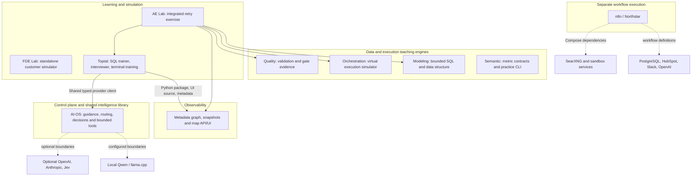

# Discovery audit: current systems and architecture

Inspection date: **2026-10-04 (Asia/Seoul)**. Workspace: `/Users/key/_AI-OS`.
Scope: **Step 1 — discovery and architecture reconstruction only**. This report is a source-grounded snapshot, not a release-readiness verdict or a full architecture critique.

The registry was read first, then entrypoints/manifests, interfaces, representative implementation, test definitions and storage configuration. Searches excluded dependency installations/build output and did not open learner database contents or credential values. No learner answers or instructor solutions are reproduced here. No project services, provider probes, workflow suites, deployments or external integrations were run. Source references below open the inspected file and line.

**Result:** ten registered systems exist, including Semantic & Metrics and the additional n8n/Northstar project. Locations are accurate. The main implemented graph is AE Lab consuming five sibling engines; Toptal consuming Observability **and now AI-OS**. Most data systems are local educational engines; n8n is a distinct workflow runner with external integration definitions. The final registry correctly describes the main paths and direct runtime connections, but remains **incomplete in test categorization, state detail and some documentation**.

**Changes made by this discovery task:** this report only. The discovery did not edit registry fields, source files, contracts, ownership rules or project locations. Concurrent work updated four map/registry files during inspection: `SYSTEMS.md`, `ARCHITECTURE.md`, `registry/ai-os.yaml` and `registry/toptal-testing.yaml` (the last two under `systems-registry/`). The report was refreshed to the final observed values. Shared runtime/model-router documentation was also refreshed by other work. Earlier absence of the Toptal → AI-OS edge is historical evidence, not a remaining correction request.

## Systems Found

| System | Physical root | Exists | Observed responsibility / evidence |
| --- | --- | --- | --- |
| AI-OS | /Users/key/_AI-OS | VERIFIED | [AI runtime], [Typed provider client], [Bounded decisions], [Bounded tool execution]: configuration, transport, typed evaluation, bounded decisions/tool execution, verification coordination and Skills. |
| Data Modeling | /Users/key/_AI-OS/projects/Data Modeling System | VERIFIED | [Modeling execution] executes bounded DuckDB transformations and returns grain, key, fact and metric evidence. |
| Data Orchestration | /Users/key/_AI-OS/projects/Data Orchestration System | VERIFIED | [Orchestration simulator] clones state and advances a bounded virtual-time simulation, including retries/backfills. |
| Data Quality | /Users/key/_AI-OS/projects/data-quality-contracts-system | VERIFIED | [Quality engine] compiles rules, validates data, and returns events and an OPEN/BLOCKED evidence gate. |
| Data Observability | /Users/key/_AI-OS/projects/Data Observability System | VERIFIED | [Observability facade]; [Observability service] implement artifact ingestion, snapshots, graph traversal, incident and impact queries. |
| Semantic & Metrics | /Users/key/_AI-OS/projects/Semantic & Metrics System | VERIFIED | [Semantic core]; [Semantic evaluation] validate governed metric meaning and evaluate bounded synthetic snapshots. [Semantic practice state] also owns an embedded practice scenario. |
| AE Lab | /Users/key/_AI-OS/projects/AE Lab | VERIFIED | [AE coordinator] coordinates a retry-safety exercise with real local warehouse writes, native adapters and learner evidence. |
| FDE Lab | /Users/key/_AI-OS/projects/FDE Lab | VERIFIED | [FDE engine]; [FDE CLI] coordinate evidence-gated customer discovery, tutor decisions and bounded SQL practice. |
| Toptal Testing | /Users/key/_AI-OS/projects/Toptal-Testing System | VERIFIED | [Toptal trainer API]; [Toptal assessment API]; [Toptal evaluator imports] implement distinct SQL trainer, browser interviewer and adaptive terminal modes. |
| n8n / Northstar | /Users/key/_AI-OS/projects/n8n System | VERIFIED | [n8n Compose] defines n8n, SearXNG and sandbox support services; [Northstar workflow] implements deterministic lead intake with structured AI and external side effects. |

All nine requested systems are present; n8n/Northstar makes the registered total ten. `projects/Data Quality System/` and `projects/Sandbox/` are existing empty directories, not additional implemented systems. Quality code is in `projects/data-quality-contracts-system/`. No registered system is MISSING or location-UNKNOWN. Systems outside this workspace were not surveyed.

## Registry vs Reality

Labels are claim-specific: **VERIFIED** means directly supported by the inspected files or recorded mechanical check; **PARTIALLY VERIFIED** means true but incomplete or only partly checked; **STALE** means evidence has overtaken the description; **INCORRECT** would mean a contradicted current claim without a temporal explanation; **UNKNOWN** means this discovery could not establish it. Stale descriptions are not treated as runtime failures. No distinct INCORRECT classification was needed beyond the documented stale claims.

Entry/interface/test verification below establishes that the definition exists and what it calls. It does **not** assert successful startup, test passage, schema compatibility, configured credentials or production readiness. Empty dependency lists use the registry's own meaning: no registered code/runtime edge established, not no third-party packages. Empty consumer lists cannot prove lack of human use.

Every top-level YAML field is compared below; `tests` is expanded into all four nested fields. Claims below match the final reread of each linked YAML. At the initial read, Toptal → AI-OS was missing; concurrent work added it, the new public interfaces, and an AI-OS provider-probe command. Those claims are assessed as supported in the final snapshot.

### AI-OS

Registry: [AI-OS registry].

| Field | Registry claim | Result | Implementation evidence / limit |
| --- | --- | --- | --- |
| name | `ai-os` | VERIFIED | [AI package] establishes the system/package role; the registry name is its stable map ID. |
| purpose | Shared engineering guidance, generative intelligence, bounded decisions, and verification coordination. | VERIFIED | [AI runtime], [Typed provider client], [Bounded decisions], [Bounded tool execution]: configuration, transport, typed evaluation, bounded decisions/tool execution, verification coordination and Skills. |
| owns | `shared configuration and model routing`; `provider transports, generic provider credentials, budgets, and call metadata`; `reusable Skills and engineering guidance`; `systems registry metadata` | VERIFIED | [AI runtime], [Typed provider client], [Bounded decisions], [Bounded tool execution]: configuration, transport, typed evaluation, bounded decisions/tool execution, verification coordination and Skills. |
| does_not_own | `project business logic, credentials, databases, and tests`; `production scheduling and project authorization` | VERIFIED | [AI runtime], [Typed provider client]: caller-supplied domain schemas/validation; projects retain authorization and business state. Verified within these inspected boundaries. |
| path | `.` | VERIFIED | Physical directory exists at /Users/key/_AI-OS. |
| entrypoints | 2 local path(s), as listed in the linked YAML | VERIFIED | [AI CLI]; [Skill sync entrypoint] Definitions inspected; not launched. |
| public_interfaces | 6 local path(s), as listed in the linked YAML | VERIFIED | All six current modules exist; typed provider, intelligence and decision boundaries are now included. [AI runtime]; [Typed provider client]; [Bounded decisions]; [Bounded tool execution] |
| depends_on | `[]` | VERIFIED | No registered sibling runtime imported by the inspected shared boundary. Optional provider SDKs and a local inference runtime are external dependencies. |
| consumed_by | `toptal-testing-system` | VERIFIED | [Toptal interviewer]; [Toptal evaluator imports]; [Toptal shared dependency] prove Toptal imports and installs AI-OS. |
| contracts | `[]` | PARTIALLY VERIFIED | [Typed provider client] and [Bounded decisions] expose typed request/result boundaries even though the list is empty. |
| state_owned | `shared Skill context/source routes`; `provider budget, audit metadata, and run traces` | PARTIALLY VERIFIED | Listed responsibilities are real; intelligence-events.jsonl and the separate Jev budget are omitted. [Shared state]; [Provider budget paths]; [AI events]; [Decision budget] |
| tests.unit | `python3 -m unittest discover -s tests -q` | PARTIALLY VERIFIED | [AI test inventory] The listed discovery command is a mixed suite, not unit-only; separate contract/API/integration tests exist. |
| tests.smoke | `[]` | UNKNOWN | No separately named smoke command recorded; absence of a test category is not proven. [AI test inventory] |
| tests.contract | `[]` | UNKNOWN | No separately named contract command recorded; absence of a test category is not proven. [AI test inventory] |
| tests.integration | `[]` | UNKNOWN | Local scenario/adapter checks exist, but this does not prove a live external integration suite. [AI test inventory] |
| health_check | `python3 -m py_dev ai providers --probe` | PARTIALLY VERIFIED | [AI CLI] and py_dev/provider_health.py define the recorded providers --probe command. It can probe configured local/cloud boundaries; it was not executed here. Definition VERIFIED; readiness UNKNOWN. |
| documentation | 6 local path(s), as listed in the linked YAML | VERIFIED | [Current runtime limits] and [Current intelligence guide] now record Toptal adoption and distinguish legacy runtime from bounded IntelligenceService capabilities. |
| lifecycle | `UNKNOWN` | UNKNOWN | Code and version declarations do not prove operational lifecycle or active human use; retain UNKNOWN. |

### Data Modeling

Registry: [Data Modeling registry].

| Field | Registry claim | Result | Implementation evidence / limit |
| --- | --- | --- | --- |
| name | `data-modeling-system` | VERIFIED | [Modeling package] establishes the system/package role; the registry name is its stable map ID. |
| purpose | Deterministic visual exercises for modeling and SQL transformations. | VERIFIED | [Modeling execution] executes bounded DuckDB transformations and returns grain, key, fact and metric evidence. |
| owns | `grain and key declarations`; `staging, joins, facts, and modeling invariants`; `local exercise metric calculations` | VERIFIED | [Modeling execution] executes bounded DuckDB transformations and returns grain, key, fact and metric evidence. |
| does_not_own | `orchestration and operational monitoring`; `learner assessment and shared business metric governance` | VERIFIED | [Modeling engine] disables external access and uses in-memory fixtures; [Modeling execution] returns modeling evidence without scheduling or assessment policy. Verified within these inspected boundaries. |
| path | `projects/Data Modeling System` | VERIFIED | Physical directory exists at /Users/key/_AI-OS/projects/Data Modeling System. |
| entrypoints | 1 local path(s), as listed in the linked YAML | VERIFIED | [Modeling launch] Definitions inspected; not launched. |
| public_interfaces | 2 local path(s), as listed in the linked YAML | VERIFIED | [Modeling API]; [Modeling execution] |
| depends_on | `[]` | VERIFIED | No registered sibling import found in this implementation; DuckDB, FastAPI, Pydantic, SQLGlot, pytz and Uvicorn are package dependencies. |
| consumed_by | `analytics-engineering-lab` | VERIFIED | [AE Modeling worker] imports ModelingEngine and BuildRequest. |
| contracts | 2 local path(s), as listed in the linked YAML | VERIFIED | [Modeling contracts] defines the source models; docs/contracts.json is an existing exported artifact. Regeneration equality was not tested. |
| state_owned | `synthetic scenarios and golden outputs`; `in-memory exercise and DuckDB execution state` | VERIFIED | [Modeling engine] plus React useState in apps/web/src/App.tsx:38; fixture files and temporary engine memory are distinct. |
| tests.unit | `uv run pytest` | PARTIALLY VERIFIED | [Modeling commands]; [Modeling tests]; [Modeling API tests] The listed discovery command is a mixed suite, not unit-only; separate contract/API/integration tests exist. |
| tests.smoke | `[]` | UNKNOWN | No separately named smoke command recorded; absence of a test category is not proven. [Modeling commands]; [Modeling tests]; [Modeling API tests] |
| tests.contract | `[]` | PARTIALLY VERIFIED | Contract/API boundary assertions exist despite the empty category. [Modeling commands]; [Modeling tests]; [Modeling API tests] |
| tests.integration | `npm --prefix apps/web run test:e2e` | VERIFIED | [Modeling commands]; [Modeling tests]; [Modeling API tests] Command definition found; not run in this discovery. |
| health_check | `null` | UNKNOWN | [Modeling API] defines GET /api/health; endpoint was not contacted. Runtime availability remains UNKNOWN. |
| documentation | 3 local path(s), as listed in the linked YAML | STALE | [Modeling old directory claim] names a directory that does not exist; the YAML path is correct. |
| lifecycle | `UNKNOWN` | UNKNOWN | Code and version declarations do not prove operational lifecycle or active human use; retain UNKNOWN. |

### Data Orchestration

Registry: [Data Orchestration registry].

| Field | Registry claim | Result | Implementation evidence / limit |
| --- | --- | --- | --- |
| name | `data-orchestration-system` | VERIFIED | [Orchestration package] establishes the system/package role; the registry name is its stable map ID. |
| purpose | Deterministic task execution and backfill learning simulator. | VERIFIED | [Orchestration simulator] clones state and advances a bounded virtual-time simulation, including retries/backfills. |
| owns | `task dependency states, retries, and execution events`; `partition backfills and simulated worker/pool budgets` | VERIFIED | [Orchestration simulator] clones state and advances a bounded virtual-time simulation, including retries/backfills. |
| does_not_own | `SQL transformation logic`; `production scheduling, incidents, and learner scoring` | VERIFIED | [Orchestration simulator] contains simulation execution; actual AE warehouse writes occur in [AE coordinator]. Verified within these inspected boundaries. |
| path | `projects/Data Orchestration System` | VERIFIED | Physical directory exists at /Users/key/_AI-OS/projects/Data Orchestration System. |
| entrypoints | 2 local path(s), as listed in the linked YAML | VERIFIED | [Orchestration package]; [Orchestration server] Definitions inspected; not launched. |
| public_interfaces | 2 local path(s), as listed in the linked YAML | VERIFIED | [Orchestration exports]; [Modeling artifact adapter] |
| depends_on | `[]` | VERIFIED | No sibling code/runtime dependency observed. [Modeling artifact adapter] accepts serialized modeling-lab-v1 input; it does not import Modeling. |
| consumed_by | `analytics-engineering-lab` | VERIFIED | [AE TypeScript adapter]; [AE engine import] |
| contracts | 2 local path(s), as listed in the linked YAML | VERIFIED | [Orchestration schema tests] checks scenario/event schemas and artifact conversion; schema files exist. |
| state_owned | `browser-memory runs, outputs, history, and backfill state`; `explicit exported execution evidence` | VERIFIED | [Orchestration session state] stores runs/history in React memory; explicit JSON exports are separate artifacts. |
| tests.unit | `npm test` | PARTIALLY VERIFIED | [Orchestration package]; [Orchestration schema tests] The listed discovery command is a mixed suite, not unit-only; separate contract/API/integration tests exist. |
| tests.smoke | `[]` | UNKNOWN | No separately named smoke command recorded; absence of a test category is not proven. [Orchestration package]; [Orchestration schema tests] |
| tests.contract | `[]` | PARTIALLY VERIFIED | Contract/API boundary assertions exist despite the empty category. [Orchestration package]; [Orchestration schema tests] |
| tests.integration | `npm run test:e2e` | VERIFIED | [Orchestration package]; [Orchestration schema tests] Command definition found; not run in this discovery. |
| health_check | `null` | UNKNOWN | No dedicated engine or service health command found; npm start serves a frontend. Runtime availability remains UNKNOWN. |
| documentation | 3 local path(s), as listed in the linked YAML | VERIFIED | All listed files exist. [Orchestration architecture] |
| lifecycle | `UNKNOWN` | UNKNOWN | Code and version declarations do not prove operational lifecycle or active human use; retain UNKNOWN. |

### Data Quality

Registry: [Data Quality registry].

| Field | Registry claim | Result | Implementation evidence / limit |
| --- | --- | --- | --- |
| name | `data-quality-system` | VERIFIED | [Quality package] establishes the system/package role; the registry name is its stable map ID. |
| purpose | Deterministic data contract and rule validation with publication gate evidence. | VERIFIED | [Quality engine] compiles rules, validates data, and returns events and an OPEN/BLOCKED evidence gate. |
| owns | `data contracts, assertions, and compatibility checks`; `quality events and simulated publication gate eligibility` | VERIFIED | [Quality engine] compiles rules, validates data, and returns events and an OPEN/BLOCKED evidence gate. |
| does_not_own | `transformations and scheduling`; `operational monitoring, incidents, and learner scoring` | VERIFIED | [Quality engine] returns eligibility; it does not publish a mart. [Quality artifact adapters] converts serialized inputs/outputs without sibling imports. Verified within these inspected boundaries. |
| path | `projects/data-quality-contracts-system` | VERIFIED | Physical directory exists at /Users/key/_AI-OS/projects/data-quality-contracts-system. |
| entrypoints | 1 local path(s), as listed in the linked YAML | VERIFIED | [Quality launch] Definitions inspected; not launched. |
| public_interfaces | 3 local path(s), as listed in the linked YAML | VERIFIED | [Quality API]; [Quality engine]; [Quality artifact adapters] |
| depends_on | `[]` | VERIFIED | No registered sibling runtime required by the inspected source. Optional dbt-core/dbt-duckdb run through [Optional dbt execution]; GX remains a design export. |
| consumed_by | `analytics-engineering-lab` | VERIFIED | [AE Quality worker] calls native validate_bundle. |
| contracts | 2 local path(s), as listed in the linked YAML | VERIFIED | [Quality contracts]; [Quality adapter tests] exercise contracts and adapter conversions; OpenAPI is an existing export. |
| state_owned | `versioned contracts, rules, and synthetic fixtures`; `browser-memory rules and validation evidence` | PARTIALLY VERIFIED | Versioned fixtures and browser useState are present; optional [Optional dbt execution] also writes project-owned test artifacts and temporary dbt databases. |
| tests.unit | `uv run pytest` | PARTIALLY VERIFIED | [Quality commands]; [Quality adapter tests] The listed discovery command is a mixed suite, not unit-only; separate contract/API/integration tests exist. |
| tests.smoke | `[]` | UNKNOWN | No separately named smoke command recorded; absence of a test category is not proven. [Quality commands]; [Quality adapter tests] |
| tests.contract | `[]` | PARTIALLY VERIFIED | Contract/API boundary assertions exist despite the empty category. [Quality commands]; [Quality adapter tests] |
| tests.integration | `npm --prefix web run test:e2e` | VERIFIED | [Quality commands]; [Quality adapter tests] Command definition found; not run in this discovery. |
| health_check | `null` | UNKNOWN | [Quality API] defines GET /api/health; not contacted. Runtime availability remains UNKNOWN. |
| documentation | 4 local path(s), as listed in the linked YAML | VERIFIED | All listed files exist. [Quality integration documentation] |
| lifecycle | `UNKNOWN` | UNKNOWN | Code and version declarations do not prove operational lifecycle or active human use; retain UNKNOWN. |

### Data Observability

Registry: [Data Observability registry].

| Field | Registry claim | Result | Implementation evidence / limit |
| --- | --- | --- | --- |
| name | `data-observability-system` | VERIFIED | [Observability package] establishes the system/package role; the registry name is its stable map ID. |
| purpose | Reusable metadata graph, lineage, incident, and impact investigation engine. | VERIFIED | [Observability facade]; [Observability service] implement artifact ingestion, snapshots, graph traversal, incident and impact queries. |
| owns | `artifact ingestion and immutable graph snapshots`; `generic lineage traversal, incidents, API, and map UI` | VERIFIED | [Observability facade]; [Observability service] implement artifact ingestion, snapshots, graph traversal, incident and impact queries. |
| does_not_own | `learner scenarios, scoring, and disclosure policy`; `warehouse SQL execution and live production integrations` | VERIFIED | [Observability facade] exposes a consumer facade; [Observability storage] has generic metadata tables and no learner tables. Verified within these inspected boundaries. |
| path | `projects/Data Observability System` | VERIFIED | Physical directory exists at /Users/key/_AI-OS/projects/Data Observability System. |
| entrypoints | 1 local path(s), as listed in the linked YAML | VERIFIED | [Observability API]; [Observability commands] Definitions inspected; not launched. |
| public_interfaces | 2 local path(s), as listed in the linked YAML | VERIFIED | [Observability facade]; [Observability UI exports] |
| depends_on | `[]` | VERIFIED | No registered sibling runtime imports found. FastAPI/Pydantic/Uvicorn and SQLite support the independent service. |
| consumed_by | `analytics-engineering-lab`; `toptal-testing-system` | VERIFIED | [AE Observability worker] and [Toptal map consumer] / [Toptal UI source alias] implement AE and Toptal consumption. |
| contracts | 2 local path(s), as listed in the linked YAML | VERIFIED | [Observability core schema] and [Observability API schema] |
| state_owned | `generic metadata SQLite database and graph snapshots` | VERIFIED | [Observability storage] and [Observability config] define data/observability.db and OBSERVABILITY_DB. [Toptal shared metadata path] reuses that default from Toptal. |
| tests.unit | `make test` | PARTIALLY VERIFIED | [Observability commands]; [Observability boundary tests] The listed discovery command is a mixed suite, not unit-only; separate contract/API/integration tests exist. |
| tests.smoke | `make check-demo` | VERIFIED | [Observability commands]; [Observability boundary tests] Command definition found; not run in this discovery. |
| tests.contract | `[]` | PARTIALLY VERIFIED | Contract/API boundary assertions exist despite the empty category. [Observability commands]; [Observability boundary tests] |
| tests.integration | `make test-e2e` | VERIFIED | [Observability commands]; [Observability boundary tests] Command definition found; not run in this discovery. |
| health_check | `null` | UNKNOWN | [Observability API] defines GET /api/health. It returns a shallow status before lazy map storage initialization. Runtime availability remains UNKNOWN. |
| documentation | 4 local path(s), as listed in the linked YAML | VERIFIED | All listed files exist. [Observability API documentation] |
| lifecycle | `UNKNOWN` | UNKNOWN | Code and version declarations do not prove operational lifecycle or active human use; retain UNKNOWN. |

### Semantic & Metrics

Registry: [Semantic & Metrics registry].

| Field | Registry claim | Result | Implementation evidence / limit |
| --- | --- | --- | --- |
| name | `semantic-metrics-system` | VERIFIED | [Semantic package] establishes the system/package role; the registry name is its stable map ID. |
| purpose | Business meaning, governed metric definitions, and bounded synthetic snapshot evaluation. | VERIFIED | [Semantic core]; [Semantic evaluation] validate governed metric meaning and evaluate bounded synthetic snapshots. [Semantic practice state] also owns an embedded practice scenario. |
| owns | `metric, entity, dimension, and measure definitions`; `metric governance, query results, explanations, and lineage` | PARTIALLY VERIFIED | [Semantic core]; [Semantic evaluation] validate governed metric meaning and evaluate bounded synthetic snapshots. [Semantic practice state] also owns an embedded practice scenario. |
| does_not_own | `ingestion, warehouse execution, and scheduling`; `general quality, operational monitoring, and AI orchestration` | VERIFIED | [Semantic exports] marks artifact exports live_connection:false; no live warehouse/client connection is implemented there. Verified within these inspected boundaries. |
| path | `projects/Semantic & Metrics System` | VERIFIED | Physical directory exists at /Users/key/_AI-OS/projects/Semantic & Metrics System. |
| entrypoints | 2 local path(s), as listed in the linked YAML | VERIFIED | [Semantic CLI] Definitions inspected; not launched. |
| public_interfaces | 3 local path(s), as listed in the linked YAML | VERIFIED | [Semantic evaluation]; [Semantic exports] |
| depends_on | `[]` | VERIFIED | No registered sibling runtime required in inspected source. [Semantic package] declares no third-party dependencies; local snapshot/artifact interfaces remain explicit. |
| consumed_by | `[]` | UNKNOWN | No installed sibling consumer established. Export targets in [Semantic exports] are artifacts/references, not evidence of calls by those systems. |
| contracts | 3 local path(s), as listed in the linked YAML | VERIFIED | [Semantic core] enforces semantic contract versions; the two referenced JSON Schema files exist. |
| state_owned | `catalog and synthetic snapshot fixtures`; `in-memory catalog lifecycle changes`; `project-local semantic scenario learning state` | VERIFIED | [Semantic practice state] owns state/SEM-REVENUE-001.json and a lock; catalog lifecycle changes are in-memory until a scenario writes its own record. |
| tests.unit | `python3 -m unittest discover -s tests -v` | VERIFIED | [Semantic commands]; [Semantic tests] Command definition found; not run in this discovery. |
| tests.smoke | `[]` | UNKNOWN | No separately named smoke command recorded; absence of a test category is not proven. [Semantic commands]; [Semantic tests] |
| tests.contract | `python3 -m semantic validate` | VERIFIED | [Semantic commands]; [Semantic tests] Command definition found; not run in this discovery. |
| tests.integration | `[]` | UNKNOWN | Local scenario/adapter checks exist, but this does not prove a live external integration suite. [Semantic commands]; [Semantic tests] |
| health_check | `null` | UNKNOWN | No service health endpoint found. The validate CLI checks the bundled catalog; it is not an operational health probe. Runtime availability remains UNKNOWN. |
| documentation | 2 local path(s), as listed in the linked YAML | PARTIALLY VERIFIED | [Semantic README] and docs/architecture.md now exist but are not listed in the YAML. |
| lifecycle | `UNKNOWN` | UNKNOWN | Code and version declarations do not prove operational lifecycle or active human use; retain UNKNOWN. |

### AE Lab

Registry: [AE Lab registry].

| Field | Registry claim | Result | Implementation evidence / limit |
| --- | --- | --- | --- |
| name | `analytics-engineering-lab` | VERIFIED | [AE package] establishes the system/package role; the registry name is its stable map ID. |
| purpose | Guided retry-safety scenario integrating existing local engineering systems. | VERIFIED | [AE coordinator] coordinates a retry-safety exercise with real local warehouse writes, native adapters and learner evidence. |
| owns | `scenario fixtures, failure injection, and evidence correlation`; `local warehouse operations and learning session state`; `consumer-owned sibling runtime adapters` | VERIFIED | [AE coordinator] coordinates a retry-safety exercise with real local warehouse writes, native adapters and learner evidence. |
| does_not_own | `canonical sibling engine logic and Toptal mastery`; `production schedulers, BI, and connectors` | VERIFIED | [AE coordinator] owns fixtures/writes/scoring context; [AE assessment worker] calls Toptal deterministic functions without writing Toptal learner records. Verified within these inspected boundaries. |
| path | `projects/AE Lab` | VERIFIED | Physical directory exists at /Users/key/_AI-OS/projects/AE Lab. |
| entrypoints | 2 local path(s), as listed in the linked YAML | VERIFIED | [AE CLI]; [AE package] Definitions inspected; not launched. |
| public_interfaces | 2 local path(s), as listed in the linked YAML | VERIFIED | [AE contracts]; [AE subprocess bridge] |
| depends_on | `data-modeling-system`; `data-orchestration-system`; `data-quality-system`; `data-observability-system`; `toptal-testing-system` | VERIFIED | [AE subprocess bridge] names five siblings; [AE Modeling worker], [AE Quality worker], [AE Observability worker], [AE assessment worker] and [AE TypeScript adapter] prove the calls. |
| consumed_by | `[]` | UNKNOWN | No other registered system invokes AE Lab in the inspected code. FDE and Semantic offer descriptive references only. |
| contracts | 1 local path(s), as listed in the linked YAML | VERIFIED | [AE contracts] defines the local envelope and adapter protocols; [AE native contract tests] checks actual native calls. |
| state_owned | `isolated .lab profiles and state.sqlite`; `per-run warehouses, observability profiles, and evidence exports` | VERIFIED | [AE state]; [AE coordinator] create state.sqlite, per-run warehouse/baseline/observability SQLite profiles, fixtures and evidence exports under .lab or an override. |
| tests.unit | `[]` | PARTIALLY VERIFIED | tests/unit/test_foundations.py exists. [AE unit tests] |
| tests.smoke | `[]` | UNKNOWN | No separately named smoke command recorded; absence of a test category is not proven. [AE commands]; [AE unit tests]; [AE native contract tests]; [AE integration test]; [AE CLI tests] |
| tests.contract | `[]` | PARTIALLY VERIFIED | Contract/API boundary assertions exist despite the empty category. [AE commands]; [AE unit tests]; [AE native contract tests]; [AE integration test]; [AE CLI tests] |
| tests.integration | `uv run pytest -q` | PARTIALLY VERIFIED | [AE commands]; [AE unit tests]; [AE native contract tests]; [AE integration test]; [AE CLI tests] uv run pytest -q runs unit, contract, integration and CLI tests, not integration alone. |
| health_check | `null` | UNKNOWN | [AE CLI] has a systems inventory command that checks paths/runtimes, not full workflow readiness. Runtime availability remains UNKNOWN. |
| documentation | 3 local path(s), as listed in the linked YAML | VERIFIED | All listed files exist. [AE inventory] |
| lifecycle | `UNKNOWN` | UNKNOWN | Code and version declarations do not prove operational lifecycle or active human use; retain UNKNOWN. |

### FDE Lab

Registry: [FDE Lab registry].

| Field | Registry claim | Result | Implementation evidence / limit |
| --- | --- | --- | --- |
| name | `forward-deployment-engineering-lab` | VERIFIED | [FDE package] establishes the system/package role; the registry name is its stable map ID. |
| purpose | Evidence-gated synthetic customer engagement and local SQL practice. | VERIFIED | [FDE engine]; [FDE CLI] coordinate evidence-gated customer discovery, tutor decisions and bounded SQL practice. |
| owns | `discovery, disclosure, learner decisions, and tutor reviews`; `bounded local SQL exercise and engagement progress` | VERIFIED | [FDE engine]; [FDE CLI] coordinate evidence-gated customer discovery, tutor decisions and bounded SQL practice. |
| does_not_own | `sibling engines, canonical mastery, and shared databases`; `real customer deployment and production incident operations` | VERIFIED | [FDE reference inventory] declares execution_enabled:false; [FDE SQL boundary] evaluates local SQLite fixtures. No sibling runtime import found. Verified within these inspected boundaries. |
| path | `projects/FDE Lab` | VERIFIED | Physical directory exists at /Users/key/_AI-OS/projects/FDE Lab. |
| entrypoints | 3 local path(s), as listed in the linked YAML | VERIFIED | [FDE CLI]; [FDE launcher] Definitions inspected; not launched. |
| public_interfaces | 1 local path(s), as listed in the linked YAML | VERIFIED | [FDE content contracts] |
| depends_on | `[]` | VERIFIED | [FDE reference inventory] contains reference paths only; implementation imports standard-library/local lab modules in the inspected boundaries. |
| consumed_by | `[]` | UNKNOWN | No registered runtime consumer identified. Semantic exports an FDE discovery handoff artifact without installing an adapter. |
| contracts | 1 local path(s), as listed in the linked YAML | VERIFIED | [FDE scenario validation] |
| state_owned | `isolated progress state.json and learner SQL workspace`; `archived reset history and local locking` | VERIFIED | [FDE storage] defines project-owned state.json, locking and reset archives; [FDE CLI] defaults to progress/. |
| tests.unit | `python3 -m unittest discover -s tests -v` | VERIFIED | [FDE CLI tests]; [FDE verification script]; [FDE guidance] Command definition found; not run in this discovery. |
| tests.smoke | `[]` | UNKNOWN | No separately named smoke command recorded; absence of a test category is not proven. [FDE CLI tests]; [FDE verification script]; [FDE guidance] |
| tests.contract | `[]` | UNKNOWN | No separately named contract command recorded; absence of a test category is not proven. [FDE CLI tests]; [FDE verification script]; [FDE guidance] |
| tests.integration | `python3 scripts/verify_phase1.py` | VERIFIED | [FDE CLI tests]; [FDE verification script]; [FDE guidance] Command definition found; not run in this discovery. |
| health_check | `null` | UNKNOWN | No service health endpoint found. CLI and disposable-profile verifier definitions exist; neither was executed. Runtime availability remains UNKNOWN. |
| documentation | 5 local path(s), as listed in the linked YAML | VERIFIED | All listed files exist. [FDE reference inventory] is a dated, descriptive project inventory and is not a runtime registry. |
| lifecycle | `UNKNOWN` | UNKNOWN | Code and version declarations do not prove operational lifecycle or active human use; retain UNKNOWN. |

### Toptal Testing

Registry: [Toptal Testing registry].

| Field | Registry claim | Result | Implementation evidence / limit |
| --- | --- | --- | --- |
| name | `toptal-testing-system` | VERIFIED | [Toptal overview] establishes the system/package role; the registry name is its stable map ID. |
| purpose | Project-owned SQL practice, assessment, adaptive training, and mastery evidence. | VERIFIED | [Toptal trainer API]; [Toptal assessment API]; [Toptal evaluator imports] implement distinct SQL trainer, browser interviewer and adaptive terminal modes. |
| owns | `exercise execution and assessment policy`; `adaptive terminal training and mastery records`; `learner investigation extensions over the observability map` | VERIFIED | [Toptal trainer API]; [Toptal assessment API]; [Toptal evaluator imports] implement distinct SQL trainer, browser interviewer and adaptive terminal modes. |
| does_not_own | `generic observability graph engine, API, and UI`; `official employer hiring acceptance`; `model provider clients, credentials, retries, and budgets` | VERIFIED | [Toptal map consumer] delegates generic map behavior; [Toptal interviewer] / [Toptal evaluator imports] delegate provider transport and retain project prompts/domain schemas. Verified within these inspected boundaries. |
| path | `projects/Toptal-Testing System` | VERIFIED | Physical directory exists at /Users/key/_AI-OS/projects/Toptal-Testing System. |
| entrypoints | 3 local path(s), as listed in the linked YAML | VERIFIED | [Toptal commands]; [Interviewer launcher]; [Terminal launcher] Definitions inspected; not launched. |
| public_interfaces | 4 local path(s), as listed in the linked YAML | VERIFIED | [Toptal trainer API]; [Toptal assessment API]; [AE assessment worker] |
| depends_on | `data-observability-system`; `ai-os` | VERIFIED | [Toptal map consumer] / [Toptal UI source alias] prove Observability. [Toptal shared dependency], [Toptal interviewer] and [Toptal evaluator imports] prove AI-OS. Both are present in the final YAML. |
| consumed_by | `analytics-engineering-lab` | VERIFIED | [AE assessment worker] imports deterministic evaluation and models for AE; it does not invoke Toptal AI evaluation. |
| contracts | 3 local path(s), as listed in the linked YAML | VERIFIED | [Toptal trainer schemas]; [Toptal map envelope]; [Toptal contract tests] |
| state_owned | `AE, assessment, terminal training, and investigation SQLite stores`; `canonical assessment Markdown evidence registers` | VERIFIED | [Toptal trainer state]; [Toptal terminal state]; [Toptal assessment state]; [Toptal shared metadata path]. Canonical learner records remain project-owned; generic metadata can be shared by default. |
| tests.unit | `make test` | PARTIALLY VERIFIED | [Toptal commands]; [Toptal contract tests] The listed discovery command is a mixed suite, not unit-only; separate contract/API/integration tests exist. |
| tests.smoke | `make check-map-demo` | VERIFIED | [Toptal commands]; [Toptal contract tests] Command definition found; not run in this discovery. |
| tests.contract | `[]` | PARTIALLY VERIFIED | Contract/API boundary assertions exist despite the empty category. [Toptal commands]; [Toptal contract tests] |
| tests.integration | `make test-e2e` | VERIFIED | [Toptal commands]; [Toptal contract tests] Command definition found; not run in this discovery. |
| health_check | `null` | UNKNOWN | [Toptal trainer API] and [Toptal assessment API] define two /api/health endpoints; neither was contacted. Terminal provider checks delegate to [Typed provider client]. Runtime availability remains UNKNOWN. |
| documentation | 5 local path(s), as listed in the linked YAML | PARTIALLY VERIFIED | [Toptal provider documentation] accurately describes the new shared provider boundary. [Toptal initialization wording] retains historical initialization wording that must not be treated as current test absence. |
| lifecycle | `UNKNOWN` | UNKNOWN | Code and version declarations do not prove operational lifecycle or active human use; retain UNKNOWN. |

### n8n / Northstar

Registry: [n8n / Northstar registry].

| Field | Registry claim | Result | Implementation evidence / limit |
| --- | --- | --- | --- |
| name | `n8n-system` | VERIFIED | [Northstar navigation] establishes the system/package role; the registry name is its stable map ID. |
| purpose | Existing local n8n runner and deterministic Northstar lead-intake workflow. | VERIFIED | [n8n Compose] defines n8n, SearXNG and sandbox support services; [Northstar workflow] implements deterministic lead intake with structured AI and external side effects. |
| owns | `lead-intake workflow exports and deterministic routing policy`; `lead event/effect schema and offline synthetic checks` | VERIFIED | [n8n Compose] defines n8n, SearXNG and sandbox support services; [Northstar workflow] implements deterministic lead intake with structured AI and external side effects. |
| does_not_own | `the data orchestration learning simulator`; `other systems' engines and credentials` | VERIFIED | [Northstar workflow] is separate from the educational Orchestration engine. No AI-OS py_dev bridge is present in the inspected workflow. Verified within these inspected boundaries. |
| path | `projects/n8n System` | VERIFIED | Physical directory exists at /Users/key/_AI-OS/projects/n8n System. |
| entrypoints | 1 local path(s), as listed in the linked YAML | VERIFIED | [n8n Compose]; [n8n helper] Definitions inspected; not launched. |
| public_interfaces | 2 local path(s), as listed in the linked YAML | PARTIALLY VERIFIED | [Northstar workflow]; [Northstar database schema] Workflow external interfaces are richer than this two-path summary. |
| depends_on | `[]` | VERIFIED | No registered sibling runtime import found. Docker services and PostgreSQL/HubSpot/Slack/OpenAI integrations exist in configuration/workflow definitions; connections are unverified. |
| consumed_by | `[]` | UNKNOWN | Webhook callers are outside this registry; none identified. No registered application consumer proved. |
| contracts | `[]` | PARTIALLY VERIFIED | Standalone contracts/ is absent, but [Northstar workflow] contains the Strict Qualification Schema node and [Northstar validator] checks the embedded schema. |
| state_owned | `project-owned lead event, error, and side-effect claim definitions`; `local n8n runner state` | PARTIALLY VERIFIED | [Northstar database schema] defines lead_events/workflow_effects/workflow_errors. [n8n Compose] mounts n8n/data and declares the sandbox-tls Docker volume; deployment state uninspected. |
| tests.unit | `node northstar-leadops/scripts/test-behavior.mjs` | VERIFIED | [Northstar validator]; [Northstar behavior checks]; [Northstar regression baseline] Command definition found; not run in this discovery. |
| tests.smoke | `[]` | UNKNOWN | No separately named smoke command recorded; absence of a test category is not proven. [Northstar validator]; [Northstar behavior checks]; [Northstar regression baseline] |
| tests.contract | `node northstar-leadops/scripts/validate.mjs` | VERIFIED | [Northstar validator]; [Northstar behavior checks]; [Northstar regression baseline] Command definition found; not run in this discovery. |
| tests.integration | `[]` | UNKNOWN | Local scenario/adapter checks exist, but this does not prove a live external integration suite. [Northstar validator]; [Northstar behavior checks]; [Northstar regression baseline] |
| health_check | `null` | UNKNOWN | [n8n Compose] includes a /healthz Docker healthcheck (line 108); no container or external account was contacted. Runtime availability remains UNKNOWN. |
| documentation | 4 local path(s), as listed in the linked YAML | STALE | [Northstar navigation] and README refer to absent northstar-leadops/contracts/ and docs/integrations.md. |
| lifecycle | `UNKNOWN` | UNKNOWN | Code and version declarations do not prove operational lifecycle or active human use; retain UNKNOWN. |

### Mechanical checks actually executed

| Check | Observed result | What it establishes |
| --- | --- | --- |
| `systems-registry/.venv/bin/python systems-registry/scripts/validate_registry.py` | Exit 0: `Registry validation passed: 10 system(s).` | YAML/required fields/basic types/path references/system names are internally consistent. It cannot discover omitted edges. |
| Independent filesystem enumeration of path/interface/entrypoint/contract/documentation values | **110 reference checks, 106 unique path values, zero missing** | Every local reference currently recorded in the ten YAML files resolves. |
| `PYTHONDONTWRITEBYTECODE=1 python3 skills/audit/scripts/check.py` | Exit 0; eight passed checker items and one verification gap | Bounded local AI-OS conformance only; no project suite or live provider success is implied. |

The bounded checker's passed IDs were **AUD-001**, **AUD-002**, **AUD-003**, **AUD-004**, **AUD-005**, **AUD-008**, **AUD-009**, and **AUD-010**: catalog loading, mirror agreement, configuration inheritance, permission separation, local Qwen GGUF header/identity, no conflicting escalation trace found, registered source routes, and no hard-coded GGUF path in its finite project scan. **AUD-006** remains the checker's own **verification gap**: “Live Qwen endpoint was not probed.” Its coverage limit excludes exhaustive project workflow execution, cloud/Codex/Claude invocation and permission paths. These checks are discovery evidence, not a whole-workspace health verdict.

## Actual Dependency Relationships

An arrow means the left system consumes the right system's implementation or configured interface. Code-defined calls are VERIFIED below; successful execution is UNKNOWN unless explicitly stated otherwise.

| Consumer → provider | Mechanism and scope | Evidence |
| --- | --- | --- |
| AE Lab → Modeling | Subprocess in Modeling environment; JSON input/output; native ModelingEngine and BuildRequest. | [AE subprocess bridge]; [AE Modeling worker] |
| AE Lab → Orchestration | Runs sibling node_modules/.bin/tsx; dynamically imports src/engine/index.ts and simulate. AE itself performs warehouse writes. | [AE TypeScript adapter]; [AE coordinator] |
| AE Lab → Quality | Subprocess imports contract conversion and validate_bundle; passes complete key-grouped data. | [AE subprocess bridge]; [AE Quality worker] |
| AE Lab → Observability | Subprocess invokes create_service with a required absolute per-run isolated database path; imports adapter-generated dbt-shaped artifacts. | [AE Observability worker]; [AE coordinator] |
| AE Lab → Toptal | Subprocess imports deterministic contracts/checks; does not call the interviewer or write Toptal learner state. | [AE assessment worker] |
| Toptal → Observability | Editable Python dependency, imported API/context facade, direct UI source aliases, and default shared generic metadata store. | [Toptal commands]; [Toptal map consumer]; [Toptal UI source alias]; [Toptal shared metadata path] |
| Toptal → AI-OS | Editable -e ../.. package requirement; unconditional shared provider imports in assessment config/interviewer and terminal evaluation. Actual model calls are conditional. | [Toptal shared dependency]; [Toptal interviewer]; [Toptal evaluator imports]; [Typed provider client] |
| AI-OS → external providers | Local Qwen/llama.cpp HTTP; optional OpenAI/Anthropic SDKs; separate optional Jev/TypeSafe bounded decisions. Environment gates/budgets apply; connectivity not checked. | [AI package]; [AI CLI]; [Typed provider client]; [Bounded decisions] |
| n8n → internal/external infrastructure | Compose declares SearXNG and sandbox API/runner/TLS support; Northstar nodes target PostgreSQL, HubSpot, Slack and OpenAI. No py_dev transport bridge found. | [n8n Compose]; [Northstar workflow]; [Northstar database schema] |

**Configuration relationships:** AI-OS resolves global → provider → selected project → task/run overrides through [Runtime configuration]. Toptal has `aios.toml`; legacy `Toptal-Testing` and `Northstar` names are explicitly mapped in [Project aliases]. Those aliases mean the old logical names are not automatically broken runtime identifiers. Old Markdown links to nonexistent folders remain stale. Toptal's typed provider transport uses central environment settings through [Typed provider client]; that alone does not mean every Toptal request runs through the full AIOSRuntime task/config pipeline.

**Artifact relationships, separate from code dependencies:** [Modeling artifact adapter] accepts a `modeling-lab-v1` envelope; [Quality artifact adapters] converts a Modeling contract and exports an Observability-style record. [Semantic exports] accepts modeled snapshots and exports Modeling/Quality/Observability/AE/FDE artifacts with `live_connection:false`. Consumer compatibility of every export was not executed here. FDE's [FDE reference inventory] explicitly disables execution. These are not evidence of an installed continuous pipeline.

**Cycles and absent consumers:** no cycle was found among the seven direct registered runtime edges above (five from AE, two from Toptal). That is a bounded source reconstruction, not proof about all dynamic imports. No runtime consumer of Semantic, FDE or n8n was established inside the registered ecosystem. Human CLI/browser use and external webhook callers remain UNKNOWN; “no found consumer” does not mean “unused.”

## Actual Architecture Diagram

Solid arrows below are implemented package/subprocess dependencies; dotted arrows are configured external boundaries whose connectivity was not tested. Diagram arrows point **consumer → provider**, not data-flow direction.

The requested layer model broadly fits, with three qualifications. Modeling/Orchestration/Quality/Semantic are primarily local educational or synthetic engines, not a demonstrated production data platform. Semantic also contains its own learning scenario. n8n/Northstar is a separate execution stack, and AI-OS is a shared library/configuration layer with caller-authorized bounded tool execution, rather than a daemon controlling every application. Toptal's AI boundary is connected to AI-OS; FDE remains reference-only.

## Verified Entrypoints

These commands/targets were found in current source or project instructions. They were **not launched**; installation, browser builds, databases and external credentials may be prerequisites. Run commands from the listed system root and keep each project environment separate.

| System | Existing command / callable | Execution boundary and evidence |
| --- | --- | --- |
| AI-OS | python3 -m py_dev; status/check/run/serve/skill/providers; ai providers/request/decision | CLI definitions in [AI CLI]; model commands can invoke configured providers and write traces. |
| Modeling | uv run python scripts/run.py; data_modeling_lab.api:create_app | Loopback API/UI, default 8075; --api-only available. [Modeling launch] |
| Orchestration | npm start; npm run dev; src/engine/index.ts | Production static server or Vite, default 8078; pure reusable TypeScript engine. [Orchestration package]; [Orchestration exports] |
| Quality | uv run python scripts/run.py; quality_system.api:create_app | Loopback FastAPI/UI, default 8082. [Quality commands]; [Quality API] |
| Observability | make dev; data_system_map.api.main:create_app; create_service(path) | Loopback 8002; lazy generic storage setup. [Observability commands]; [Observability API]; [Observability facade] |
| Semantic | python3 -m semantic; sem after package install; make start | CLI/library; validate/query/export/scenario subcommands. [Semantic CLI]; [Semantic package]; [Semantic commands] |
| AE Lab | uv run lab; python -m lab; uv run lab learn ORCH-IDEMPOTENCY-001 | CLI and subprocess adapters; requires sibling runtimes. [AE package]; [AE CLI]; [AE subprocess bridge] |
| FDE Lab | ./fde; python3 -m lab; Start-FDE-Lab.command | Standalone CLI/shell and local progress directory. [FDE CLI]; [FDE guidance] |
| Toptal | make dev / Start-AE-Trainer.command; Start-Toptal-Testing.command; START_TOPTAL_TRAINING.command | Separate apps.api.main:create_app (8001), app.main:app (8000) and training.cli. [Toptal commands]; [Toptal commands]; [Interviewer launcher]; [Terminal launcher] |
| n8n | compose.yaml; scripts/n8n.ps1; workflow JSON imports | Docker n8n loopback 5678 with support services; stage/configure external credentials separately. [n8n Compose] |

## Tests Found

No project test suite was run during this discovery. Counts below are source test-file counts, not test-case counts or passing results. Many commands span several categories; a blank registry category does not establish missing coverage.

| System | Observed tests and categories | Existing command definitions / evidence |
| --- | --- | --- |
| AI-OS | 8 root Python test files: routing/runtime/Skills/health/decisions/typed provider/CLI/project identity. Registry has a separate validator test file. Fake/provider fixtures do not prove live clouds. | python3 -m unittest discover -s tests -q; systems-registry/.venv/bin/python -m unittest discover -s systems-registry/tests -v. [AI test inventory] |
| Modeling | 3 Python files for engine, API and verifier regressions; 1 browser spec. API tests exercise contract-shaped responses. | uv run pytest; npm --prefix apps/web run test:e2e; make check also builds. [Modeling commands]; [Modeling API tests] |
| Orchestration | 4 TypeScript test files: engine, backfill, contracts, regressions; 1 browser spec. Explicit independent schema checks exist. | npm test; npm run test:e2e; npm run check. [Orchestration package]; [Orchestration schema tests] |
| Quality | 2 Python files include rule engine, contract compatibility, adapters, API health and schemas; 1 browser spec. Optional real dbt script is separate. | uv run pytest; npm --prefix web run test:e2e; make check; make check-dbt. [Quality commands]; [Quality adapter tests]; [Optional dbt execution] |
| Observability | 5 Python files for graph, adapters, service, boundaries/regressions; 1 browser spec. Includes fresh-process facade/API tests and demo artifact check. | make test; make check-demo; make test-e2e. [Observability commands]; [Observability boundary tests] |
| Semantic | 1 unittest file contains contract/governance/metric/timezone/lineage/artifact/scenario/persistence/CLI tests. | python3 -m semantic validate; python3 -m unittest discover -s tests -v; make check. [Semantic commands]; [Semantic tests] |
| AE Lab | 7 files: 1 unit, 4 native contract, 1 pipeline integration, 1 CLI end-to-end. Existing contract tests cover all five native adapters. | uv run pytest -q; make test / make check. [AE commands]; [AE unit tests]; [AE native contract tests]; [AE integration test]; [AE CLI tests] |
| FDE Lab | 3 unittest files for CLI, engine and SQL exercise; separate phase-one verification script. Uses disposable profiles; no content solutions copied into this report. | python3 -m unittest discover -s tests -v; python3 scripts/verify_phase1.py. [FDE guidance]; [FDE CLI tests]; [FDE verification script] |
| Toptal | 20 project Python test files plus 2 browser specs. Includes AE contracts/execution/workflow, map consumer contracts, persistence, scheduling, evaluators and regressions. | make test includes ../Data Observability System/tests, so it is not Toptal-unit-only. make test-e2e; make check-map-demo. [Toptal commands]; [Toptal contract tests] |
| n8n | Offline structural/embedded-schema validator, workflow-code behavior checks, 15 synthetic fixture files, and a separate regression-baseline runner. No live end-to-end integration proof obtained. | node northstar-leadops/scripts/validate.mjs; node northstar-leadops/scripts/test-behavior.mjs; node northstar-leadops/scripts/regression-baseline.mjs. [Northstar validator]; [Northstar behavior checks]; [Northstar regression baseline] |

No registered system lacked all test/check definitions. Distinct live integration or operational smoke coverage remains unestablished for several systems. In particular, `make check-demo` checks demo artifacts and a static `/api/health` response is weaker than a complete workflow check.

## State Ownership

These are code-defined locations and owners, not an inspection of learner answers, database rows or external account contents. The existence of a state directory does not establish its freshness or health.

| System | Owned state and default location | Shared/configurable state and evidence |
| --- | --- | --- |
| AI-OS | Shared context/source routes/interviews under ~/.local/share/ai-os/state; provider budget/audit/run traces under ~/.config/py-dev; intelligence events and separate Jev budget. | AIOS_DATA_DIR, CLOUD_BUDGET_FILE, MODEL_AUDIT_FILE, AIOS_TRACE_FILE, AI_OS_EVENT_FILE, AI_OS_JEV_BUDGET_FILE override defaults. Selected project Skill state uses projects/<name>/state. [Shared state]; [Provider budget paths]; [AI events]; [Decision budget] |
| Modeling | Versioned scenario/golden files; browser-memory exercise state; fresh in-memory DuckDB per operation. | No durable learner database in inspected engine. [Modeling engine]; [Modeling execution] |
| Orchestration | Browser-memory runs/history/backfills and explicit exported JSON evidence. | No persistent scheduler/run database in inspected engine. [Orchestration session state]; [Orchestration simulator] |
| Quality | Versioned contracts/rules/fixtures and browser-memory validation sessions; optional dbt logs/exports under the project. | dbt check uses temporary DuckDB workspaces and copies selected evidence into docs/test-results and dbt_lab/target. [Optional dbt execution] |
| Observability | Generic SQLite metadata, immutable snapshots/nodes/edges, current-snapshot pointers; default data/observability.db. | OBSERVABILITY_DB overrides. Toptal normal profile uses this same default via the public engine; AE passes its own per-run path. Owner is identifiable, but multiple applications can reach the store. [Observability config]; [Observability storage]; [Toptal shared metadata path]; [AE Observability worker] |
| Semantic | Versioned catalog/snapshots; in-memory registry revisions; default state/SEM-REVENUE-001.json and write lock for practice. | --state-dir selects a separate practice record. State directory was not present during the path inventory; lazy creation is supported and is not a missing-code defect. [Semantic practice state]; [Semantic CLI] |
| AE Lab | .lab/state.sqlite; per-run fixtures, warehouse.sqlite, baseline.sqlite, observability.sqlite, event/evidence/OpenLineage exports. | AE_LAB_STATE_DIR or --state-dir. Sibling processes work on AE-supplied profiles, not their default learner stores. [AE state]; [AE coordinator]; [AE Observability worker] |
| FDE Lab | progress/state.json, learner workspace and reset archive/history with file locking and atomic replacement. | --state-dir; bounded exercise SQL uses temporary in-memory SQLite. [FDE storage]; [FDE SQL boundary]; [FDE CLI] |
| Toptal | data/ae-trainer.db, data/assessment.db, data/training.db, data/data-map-training.db plus project assessment Markdown. | AE_TRAINER_DB / TOPTAL_TESTING_DB / TRAINING_DB. Generic metadata remains Observability-owned and can be shared by default. [Toptal trainer state]; [Toptal assessment state]; [Toptal terminal state]; [Toptal shared metadata path] |
| n8n | Compose bind mount n8n/data → /home/node/.n8n; sandbox-tls volume; project-owned workflow exports and SQL table definitions. | PostgreSQL lead_events, workflow_effects and workflow_errors are required by workflow nodes; actual server/location/migration state was not inspected. [n8n Compose]; [Northstar database schema] |

The inspected filesystem had AE `.lab`, FDE `progress`, Toptal `data` and Observability `data` directories. Their contents were not opened. Build output, caches and virtual environments were treated as reproducible runtime prerequisites rather than authoritative system records.

## Unknowns Remaining

- **Operational lifecycle:** all ten `lifecycle: UNKNOWN` values remain appropriate. Version `0.1.0`, an existing directory or old evidence files do not prove current service readiness or active use.
- **Health:** Modeling, Quality, Observability, both Toptal web apps and n8n have health definitions. No endpoint was called. Some return a static liveness response without opening storage or invoking a provider. AI-OS now records `python3 -m py_dev ai providers --probe` as its health command; the command definition is known but its execution and the local Qwen endpoint remain unverified in this discovery (AUD-006).
- **External access:** Qwen runtime availability; OpenAI/Anthropic/Jev eligibility/connectivity; n8n PostgreSQL/CRM/Slack/OpenAI setup, imported/published workflows and end-to-end outcomes were not established. No credentials were read or modified.
- **Execution environment:** source entrypoints and dependency manifests exist; freshly installed environments, browser builds, installed SDKs and all native adapter execution are unverified here.
- **Artifact compatibility:** serialized exports exist, but their acceptance by every intended consumer was not executed. Named Semantic BI/API/AI consumers are bounded representations, not proven live products.
- **Usage:** no programmatic consumer found is not evidence of disuse. Human use, external webhook clients and consumers outside the scoped workspace are UNKNOWN.
- **State contents/concurrency:** owners and default paths are known; actual migrations, row integrity, simultaneous writers and backup behavior were not tested. The known Observability/Toptal shared default is specifically identified.
- **Coverage:** tests were found, not passed. The registry validator checks only its metadata; the bounded Skill checker does not certify all projects.

## Potential Architectural Problems

These are discovery signals only. **Confirmed problem** means a demonstrated documentation/metadata contradiction; **likely risk** means a supported coupling with a conditional consequence; **optimization** means potentially useful simplification; **speculative concern** means insufficient evidence. No code repair or redesign is proposed as completed work.

| ID / classification | Observation and evidence | Potential consequence / discovery boundary |
| --- | --- | --- |
| D-01 — initial discrepancy, now resolved by concurrent work | The initial registry/map omitted Toptal → AI-OS. Final files record the connection and newer AI-OS interfaces. [Toptal shared dependency]; [Toptal interviewer]; [Toptal evaluator imports]; [Current runtime limits] | No remaining edge correction is requested. This demonstrates why discovery must compare a fresh map with code; provider readiness remains UNKNOWN. |
| D-02 — confirmed problem | Navigation refers to absent n8n contracts/ and docs/integrations.md. Modeling documentation names Data Modeling Lab System; shared testing guidance links old nonexistent directories. The runtime guide link was corrected concurrently. [Northstar navigation]; [Modeling old directory claim]; [Corrected runtime link]; [Old test links] | Agents following these links reach missing files. Existing embedded n8n schemas are real; do not infer that all contracts are missing. Logical runtime aliases already exist in [Project aliases]. |
| D-03 — likely risk | AE launches sibling .venv/bin/python or node_modules/.bin/tsx and injects source paths; Toptal aliases Observability source and installs AI-OS via `-e ../..`. [AE subprocess bridge]; [AE TypeScript adapter]; [Toptal UI source alias]; [Toptal shared dependency] | Projects depend on the current checkout layout and separate environment setup. Defaults are often overrideable; no broken adapter was demonstrated. These are source-level integrations, not fully independent deployable packages. |
| D-04 — likely risk | Toptal normal mode opens the Observability-owned default metadata database and may seed it through create_service(..., seed_demo=True). [Toptal shared metadata path]; [Observability facade]; [Observability storage] | Two applications can reach the same mutable generic store. Ownership and schema guards exist; ambiguous ownership or corruption is not demonstrated. Concurrent use warrants scoped evidence before any state redesign. |
| D-05 — likely risk | AE Lab and FDE Lab both publish a top-level Python package named lab and a lab.cli module. [AE package]; [FDE package] | Installing both into one environment can select the wrong package. Current guidance keeps environments separate, so this is a conditional packaging risk, not an observed failure. |
| D-06 — confirmed metadata gap | AE has unit/contract/integration/CLI test folders, while YAML lists only an integration-wide command. Orchestration, Quality and Toptal contract tests are similarly hidden behind empty contract categories. [AE unit tests]; [AE native contract tests]; [Orchestration schema tests]; [Quality adapter tests]; [Toptal contract tests] | The map is less useful for targeted test selection than the implementation permits. This is not absence of tests. |
| D-07 — optimization / scope clarification | Several systems teach SQL, assertions, metric meaning and learner progress. Modeling has local exercise metric calculations; Semantic has governed synthetic metrics; AE/FDE/Toptal have different learning state. [Modeling execution]; [Semantic evaluation]; [AE coordinator]; [FDE SQL boundary]; [Toptal trainer API] | Responsibility overlap is observed, but conflicting ownership or harmful duplicated behavior is not proved. Shared terminology does not authorize merging these systems. |
| D-08 — intentional duplication; drift unproven | n8n keeps executable workflow JSON under northstar-leadops/workflows and mounted copies under n8n/workflows. The two corresponding lead-intake/error-handler pairs were byte-identical. Generated/typed schemas also exist beside source definitions. [Northstar workflow]; [Northstar validator] | Copy synchronization is an existing maintenance duty, not a discovered divergence. Generated schema regeneration/compatibility was not rechecked. |
| D-09 — no confirmed provider-code duplication across migrated Toptal boundary | Toptal wrappers retain domain schemas/prompts but use ParsedModelClient. n8n uses its own native OpenAI node in its separate workflow runtime. [Toptal interviewer]; [Toptal evaluator imports]; [Typed provider client]; [Northstar workflow] | Independent n8n provider use is a boundary difference, not automatically a defect. No requirement that all workflows use py_dev was established. |
| D-10 — no confirmed circular dependency/private cross-system import | The seven direct registered edges are acyclic. Inspected AE imports use named native engines/contracts and Toptal functions; Observability documents its separately importable API adapters. [AE Modeling worker]; [AE Quality worker]; [AE assessment worker]; [Observability facade] | Source-directory coupling exists (D-03), but no evidence-supported claim of a forbidden private-symbol import or dependency cycle is made. |
| D-11 — speculative concern only: unused systems | No installed runtime consumer of Semantic/FDE/n8n was found in the bounded registered-source search. [Semantic exports]; [FDE reference inventory]; [Northstar workflow] | They have human-facing entrypoints or external workflow boundaries. Actual disuse cannot be inferred from an empty consumed_by list. |
| D-12 — likely risk; static predicate confirmed | AE stores model_status and expected_revenue but sets publication ELIGIBLE and dashboard.trusted solely from quality[gate_open]. Its native Modeling fixture separately demonstrates an expected-output failure with unique keys. [AE publication decision]; [Model failure contract fixture] | The publication predicate does not itself require the native Modeling PASS or revenue reconciliation. A passing quality gate may therefore be insufficient evidence of trusted output. This discovery confirms the code condition, not an end-to-end failing run; reproduce with isolated state before classifying or fixing product behavior. |

## Registry Corrections Recommended

**This discovery task corrected no registry fields.** Concurrent changes made elsewhere were reread and are explicitly acknowledged above; the comparisons describe the final observed map. The proposed factual corrections below do not require moving projects or changing architectural ownership.

| Priority / target | Proposed factual correction | Evidence and constraint |
| --- | --- | --- |
| Already reflected — AI-OS/Toptal relationship | No further correction: final consumed_by / depends_on and root diagrams already include Toptal → AI-OS. | Concurrent edits agree with [Toptal shared dependency]; [Toptal interviewer]; [Toptal evaluator imports]. Do not reapply or claim these as discovery-task edits. |
| 1 — ai-os.yaml contracts/state | Public interfaces already include intelligence/decisions/typed providers. Consider referencing their request/result contracts and recording the additional event/decision-budget state. | Current implementation: [Typed provider client]; [Bounded decisions]; [Bounded tool execution]; [AI events]; [Decision budget]. The contracts list remains empty; this is metadata completion, not a new ownership assignment. |
| 2 — AE / Orchestration / Quality / Observability / Modeling / Toptal test fields | Expose already-existing unit/contract/API/integration test paths/categories. Avoid labeling whole-suite commands as unit-only or integration-only. | Use the existing commands and source locations in Tests Found. Any narrower proposed invocation should be labeled as derived until executed; do not claim test success. |
| 3 — semantic-metrics.yaml documentation | Add the current README.md and docs/architecture.md paths. | Both physically exist now; [Semantic README]. Retain empty installed-runtime dependencies and separate artifact exports. |
| 4 — health metadata and known limits | AI-OS now has a recorded probe; correct SYSTEMS.md claiming executable health checks are UNKNOWN for all entries. Document other source-proven endpoints/Compose probes while keeping actual readiness UNKNOWN. | Endpoint existence is established in [Modeling API], [Quality API], [Observability API], [Toptal trainer API], [Toptal assessment API] and [n8n Compose]. Select an exact health command and startup prerequisites before treating it as a verified executable probe. |
| 5 — n8n-system.yaml | Reference the embedded workflow schema location; describe n8n data/TLS support state and external service definitions in appropriate documentation. | Standalone contracts folder is absent; the schema node is present. [Northstar workflow]; [n8n Compose]; [Northstar database schema]. Do not invent new registered system IDs for external vendors. |
| 6 — stale navigation documents | Correct remaining physical links/names in shared testing guidance and Modeling/n8n navigation. The runtime guide link was already refreshed. | Old logical project IDs remain supported through [Project aliases]; change broken file links without removing working aliases. |
| Retain — all ten lifecycle fields and unobserved consumers | Keep lifecycle UNKNOWN and avoid adding unsupported live connections or consumers. | This step did not execute applications or establish usage/deployment status. |

**Exactly one next step:** run one focused, disposable-state verification of AE Lab’s trusted-publication decision (D-12), checking whether a native Modeling failure can coexist with a trusted output, before changing implementation.

### Source reference index

Links identify the evidence locations used above. Source files may continue evolving after this dated snapshot.

[AI runtime]: </Users/key/_AI-OS/py_dev/runtime.py:1>

[AI CLI]: </Users/key/_AI-OS/py_dev/__main__.py:22>

[Typed provider client]: </Users/key/_AI-OS/py_dev/providers/parsed.py:39>

[Bounded decisions]: </Users/key/_AI-OS/py_dev/decisions.py:110>

[AI package]: </Users/key/_AI-OS/pyproject.toml:5>

[Runtime configuration]: </Users/key/_AI-OS/py_dev/runtime_config.py:105>

[Shared state]: </Users/key/_AI-OS/py_dev/skill_state.py:19>

[AI events]: </Users/key/_AI-OS/py_dev/telemetry.py:10>

[Provider budget paths]: </Users/key/_AI-OS/py_dev/config.py:97>

[Decision budget]: </Users/key/_AI-OS/py_dev/decision_config.py:10>

[Current runtime limits]: </Users/key/_AI-OS/architecture/runtime.md:156>

[Bounded tool execution]: </Users/key/_AI-OS/py_dev/intelligence.py:174>

[Current intelligence guide]: </Users/key/_AI-OS/docs/ai-os/intelligence-plane.md:1>

[AE publication decision]: </Users/key/_AI-OS/projects/AE Lab/lab/core.py:120>

[Model failure contract fixture]: </Users/key/_AI-OS/projects/AE Lab/tests/contract/test_native_execution.py:40>

[Project aliases]: </Users/key/_AI-OS/config/project-aliases.toml:1>

[AE coordinator]: </Users/key/_AI-OS/projects/AE Lab/lab/core.py:21>

[AE subprocess bridge]: </Users/key/_AI-OS/projects/AE Lab/lab/adapters/bridge.py:8>

[AE TypeScript adapter]: </Users/key/_AI-OS/projects/AE Lab/lab/adapters/orchestration.py:6>

[AE Modeling worker]: </Users/key/_AI-OS/projects/AE Lab/lab/adapters/workers/modeling.py:8>

[AE Quality worker]: </Users/key/_AI-OS/projects/AE Lab/lab/adapters/workers/quality.py:13>

[AE Observability worker]: </Users/key/_AI-OS/projects/AE Lab/lab/adapters/workers/observability.py:144>

[AE assessment worker]: </Users/key/_AI-OS/projects/AE Lab/lab/adapters/workers/testing.py:13>

[AE CLI]: </Users/key/_AI-OS/projects/AE Lab/lab/cli.py:116>

[AE state]: </Users/key/_AI-OS/projects/AE Lab/lab/store.py:17>

[AE package]: </Users/key/_AI-OS/projects/AE Lab/pyproject.toml:5>

[AE commands]: </Users/key/_AI-OS/projects/AE Lab/Makefile:6>

[AE contracts]: </Users/key/_AI-OS/projects/AE Lab/lab/contracts.py:1>

[AE unit tests]: </Users/key/_AI-OS/projects/AE Lab/tests/unit/test_foundations.py:1>

[AE native contract tests]: </Users/key/_AI-OS/projects/AE Lab/tests/contract/test_native_execution.py:9>

[AE integration test]: </Users/key/_AI-OS/projects/AE Lab/tests/integration/test_pipeline.py:13>

[AE CLI tests]: </Users/key/_AI-OS/projects/AE Lab/tests/e2e/test_cli.py:22>

[Modeling engine]: </Users/key/_AI-OS/projects/Data Modeling System/services/modeling-engine/src/data_modeling_lab/engine.py:90>

[Modeling execution]: </Users/key/_AI-OS/projects/Data Modeling System/services/modeling-engine/src/data_modeling_lab/engine.py:304>

[Modeling API]: </Users/key/_AI-OS/projects/Data Modeling System/services/modeling-engine/src/data_modeling_lab/api.py:16>

[Modeling contracts]: </Users/key/_AI-OS/projects/Data Modeling System/services/modeling-engine/src/data_modeling_lab/contracts.py:1>

[Modeling launch]: </Users/key/_AI-OS/projects/Data Modeling System/scripts/run.py:10>

[Modeling package]: </Users/key/_AI-OS/projects/Data Modeling System/pyproject.toml:5>

[Modeling commands]: </Users/key/_AI-OS/projects/Data Modeling System/Makefile:8>

[Modeling old directory claim]: </Users/key/_AI-OS/projects/Data Modeling System/docs/architecture.md:4>

[Modeling tests]: </Users/key/_AI-OS/projects/Data Modeling System/tests/test_engine.py:1>

[Modeling API tests]: </Users/key/_AI-OS/projects/Data Modeling System/tests/test_api.py:1>

[Orchestration simulator]: </Users/key/_AI-OS/projects/Data Orchestration System/src/engine/simulator.ts:163>

[Orchestration exports]: </Users/key/_AI-OS/projects/Data Orchestration System/src/engine/index.ts:1>

[Modeling artifact adapter]: </Users/key/_AI-OS/projects/Data Orchestration System/src/engine/modeling.ts:11>

[Orchestration package]: </Users/key/_AI-OS/projects/Data Orchestration System/package.json:1>

[Orchestration schema tests]: </Users/key/_AI-OS/projects/Data Orchestration System/tests/contracts.test.ts:9>

[Orchestration session state]: </Users/key/_AI-OS/projects/Data Orchestration System/src/App.tsx:20>

[Orchestration server]: </Users/key/_AI-OS/projects/Data Orchestration System/scripts/serve.mjs:1>

[Quality engine]: </Users/key/_AI-OS/projects/data-quality-contracts-system/src/quality_system/engine.py:315>

[Quality API]: </Users/key/_AI-OS/projects/data-quality-contracts-system/src/quality_system/api.py:15>

[Quality artifact adapters]: </Users/key/_AI-OS/projects/data-quality-contracts-system/src/quality_system/adapters.py:13>

[Quality contracts]: </Users/key/_AI-OS/projects/data-quality-contracts-system/src/quality_system/contracts.py:1>

[Quality package]: </Users/key/_AI-OS/projects/data-quality-contracts-system/pyproject.toml:5>

[Quality commands]: </Users/key/_AI-OS/projects/data-quality-contracts-system/Makefile:5>

[Quality adapter tests]: </Users/key/_AI-OS/projects/data-quality-contracts-system/tests/test_contracts_and_adapters.py:101>

[Optional dbt execution]: </Users/key/_AI-OS/projects/data-quality-contracts-system/scripts/check_dbt.py:19>

[Observability facade]: </Users/key/_AI-OS/projects/Data Observability System/src/data_system_map/__init__.py:1>

[Observability service]: </Users/key/_AI-OS/projects/Data Observability System/src/data_system_map/service.py:1>

[Observability storage]: </Users/key/_AI-OS/projects/Data Observability System/src/data_system_map/repository.py:14>

[Observability config]: </Users/key/_AI-OS/projects/Data Observability System/src/data_system_map/config.py:7>

[Observability API]: </Users/key/_AI-OS/projects/Data Observability System/src/data_system_map/api/main.py:16>

[Observability package]: </Users/key/_AI-OS/projects/Data Observability System/pyproject.toml:5>

[Observability commands]: </Users/key/_AI-OS/projects/Data Observability System/Makefile:8>

[Observability boundary tests]: </Users/key/_AI-OS/projects/Data Observability System/tests/observability_tests/test_boundary.py:1>

[Semantic core]: </Users/key/_AI-OS/projects/Semantic & Metrics System/semantic/core.py:173>

[Semantic evaluation]: </Users/key/_AI-OS/projects/Semantic & Metrics System/semantic/core.py:324>

[Semantic exports]: </Users/key/_AI-OS/projects/Semantic & Metrics System/adapters/artifacts.py:8>

[Semantic CLI]: </Users/key/_AI-OS/projects/Semantic & Metrics System/semantic/cli.py:18>

[Semantic practice state]: </Users/key/_AI-OS/projects/Semantic & Metrics System/semantic/scenario.py:14>

[Semantic package]: </Users/key/_AI-OS/projects/Semantic & Metrics System/pyproject.toml:5>

[Semantic commands]: </Users/key/_AI-OS/projects/Semantic & Metrics System/Makefile:3>

[Semantic tests]: </Users/key/_AI-OS/projects/Semantic & Metrics System/tests/test_semantics.py:27>

[Semantic README]: </Users/key/_AI-OS/projects/Semantic & Metrics System/README.md:1>

[FDE engine]: </Users/key/_AI-OS/projects/FDE Lab/lab/engine.py:1>

[FDE SQL boundary]: </Users/key/_AI-OS/projects/FDE Lab/lab/exercise.py:304>

[FDE CLI]: </Users/key/_AI-OS/projects/FDE Lab/lab/cli.py:15>

[FDE storage]: </Users/key/_AI-OS/projects/FDE Lab/lab/store.py:23>

[FDE package]: </Users/key/_AI-OS/projects/FDE Lab/pyproject.toml:5>

[FDE reference inventory]: </Users/key/_AI-OS/projects/FDE Lab/integrations/registry.json:1>

[FDE guidance]: </Users/key/_AI-OS/projects/FDE Lab/AGENTS.md:3>

[FDE CLI tests]: </Users/key/_AI-OS/projects/FDE Lab/tests/test_cli.py:1>

[FDE verification script]: </Users/key/_AI-OS/projects/FDE Lab/scripts/verify_phase1.py:1>

[Toptal shared dependency]: </Users/key/_AI-OS/projects/Toptal-Testing System/requirements.txt:1>

[Toptal interviewer]: </Users/key/_AI-OS/projects/Toptal-Testing System/app/openai_service.py:8>

[Toptal evaluator imports]: </Users/key/_AI-OS/projects/Toptal-Testing System/training/llm.py:9>

[Toptal map consumer]: </Users/key/_AI-OS/projects/Toptal-Testing System/apps/api/data_map.py:10>

[Toptal shared metadata path]: </Users/key/_AI-OS/projects/Toptal-Testing System/apps/api/data_map.py:73>

[Toptal UI source alias]: </Users/key/_AI-OS/projects/Toptal-Testing System/apps/web/vite.config.ts:4>

[Toptal commands]: </Users/key/_AI-OS/projects/Toptal-Testing System/Makefile:3>

[Toptal trainer API]: </Users/key/_AI-OS/projects/Toptal-Testing System/apps/api/main.py:51>

[Toptal assessment API]: </Users/key/_AI-OS/projects/Toptal-Testing System/app/main.py:79>

[Toptal trainer state]: </Users/key/_AI-OS/projects/Toptal-Testing System/trainer/config.py:7>

[Toptal terminal state]: </Users/key/_AI-OS/projects/Toptal-Testing System/training/config.py:48>

[Toptal assessment state]: </Users/key/_AI-OS/projects/Toptal-Testing System/app/config.py:10>

[Toptal contract tests]: </Users/key/_AI-OS/projects/Toptal-Testing System/tests/data_map/test_observability_contract.py:1>

[Toptal provider documentation]: </Users/key/_AI-OS/projects/Toptal-Testing System/README.md:287>

[Toptal initialization wording]: </Users/key/_AI-OS/projects/Toptal-Testing System/AGENTS.md:44>

[n8n Compose]: </Users/key/_AI-OS/projects/n8n System/compose.yaml:4>

[Northstar workflow]: </Users/key/_AI-OS/projects/n8n System/northstar-leadops/workflows/northstar-leadops.json:1>

[Northstar database schema]: </Users/key/_AI-OS/projects/n8n System/northstar-leadops/db/001_schema.sql:3>

[Northstar validator]: </Users/key/_AI-OS/projects/n8n System/northstar-leadops/scripts/validate.mjs:1>

[Northstar behavior checks]: </Users/key/_AI-OS/projects/n8n System/northstar-leadops/scripts/test-behavior.mjs:1>

[Northstar regression baseline]: </Users/key/_AI-OS/projects/n8n System/northstar-leadops/scripts/regression-baseline.mjs:1>

[Northstar navigation]: </Users/key/_AI-OS/projects/n8n System/AGENTS.md:6>

[Skill sync entrypoint]: </Users/key/_AI-OS/scripts/sync_skills.py:1>

[AI test inventory]: </Users/key/_AI-OS/tests/test_intelligence.py:1>

[AE engine import]: </Users/key/_AI-OS/projects/AE Lab/lab/adapters/workers/orchestration.ts:7>

[Orchestration architecture]: </Users/key/_AI-OS/projects/Data Orchestration System/docs/architecture.md:1>

[Quality launch]: </Users/key/_AI-OS/projects/data-quality-contracts-system/scripts/run.py:1>

[Quality integration documentation]: </Users/key/_AI-OS/projects/data-quality-contracts-system/docs/integrations.md:1>

[Observability UI exports]: </Users/key/_AI-OS/projects/Data Observability System/web/src/index.ts:1>

[Observability core schema]: </Users/key/_AI-OS/projects/Data Observability System/src/data_system_map/contracts.py:1>

[Observability API schema]: </Users/key/_AI-OS/projects/Data Observability System/src/data_system_map/api/contracts.py:1>

[Observability API documentation]: </Users/key/_AI-OS/projects/Data Observability System/docs/api.md:1>

[AE inventory]: </Users/key/_AI-OS/projects/AE Lab/docs/system-inventory.md:1>

[FDE launcher]: </Users/key/_AI-OS/projects/FDE Lab/fde:1>

[FDE content contracts]: </Users/key/_AI-OS/projects/FDE Lab/lab/contracts.py:1>

[FDE scenario validation]: </Users/key/_AI-OS/projects/FDE Lab/lab/contracts.py:1>

[Toptal overview]: </Users/key/_AI-OS/projects/Toptal-Testing System/README.md:1>

[Interviewer launcher]: </Users/key/_AI-OS/projects/Toptal-Testing System/Start-Toptal-Testing.command:62>

[Terminal launcher]: </Users/key/_AI-OS/projects/Toptal-Testing System/START_TOPTAL_TRAINING.command:35>

[Toptal trainer schemas]: </Users/key/_AI-OS/projects/Toptal-Testing System/trainer/schemas/models.py:1>

[Toptal map envelope]: </Users/key/_AI-OS/projects/Toptal-Testing System/trainer/data_map/contracts.py:1>

[n8n helper]: </Users/key/_AI-OS/projects/n8n System/scripts/n8n.ps1:1>

[AI-OS registry]: </Users/key/_AI-OS/systems-registry/registry/ai-os.yaml:1>

[Data Modeling registry]: </Users/key/_AI-OS/systems-registry/registry/data-modeling.yaml:1>

[Data Orchestration registry]: </Users/key/_AI-OS/systems-registry/registry/data-orchestration.yaml:1>

[Data Quality registry]: </Users/key/_AI-OS/systems-registry/registry/data-quality.yaml:1>

[Data Observability registry]: </Users/key/_AI-OS/systems-registry/registry/data-observability.yaml:1>

[Semantic & Metrics registry]: </Users/key/_AI-OS/systems-registry/registry/semantic-metrics.yaml:1>

[AE Lab registry]: </Users/key/_AI-OS/systems-registry/registry/analytics-engineering-lab.yaml:1>

[FDE Lab registry]: </Users/key/_AI-OS/systems-registry/registry/forward-deployment-engineering-lab.yaml:1>

[Toptal Testing registry]: </Users/key/_AI-OS/systems-registry/registry/toptal-testing.yaml:1>

[n8n / Northstar registry]: </Users/key/_AI-OS/systems-registry/registry/n8n-system.yaml:1>

[Corrected runtime link]: </Users/key/_AI-OS/architecture/runtime.md:38>

[Old test links]: </Users/key/_AI-OS/architecture/testing.md:7>
