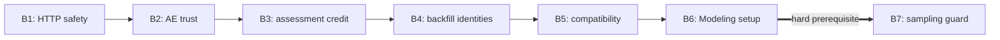

# Minimal remediation plan — Step 3

Date: **2026-10-05, Asia/Seoul**. Workspace: `/Users/key/_AI-OS`.

This plan addresses exactly the **two verified P0 findings and five verified P1 findings** in [Step 2][audit]. [Step 1][discovery] supplies the system and entrypoint map. Source inspection was limited to affected owners, public interfaces, current callers and tests. No new audit, product change, dependency installation, test execution or learner-record inspection was performed for Step 3. All fix acceptance checks below are **planned, not passed**.

Use seven small batches, one finding per batch. The order is **A-02 → A-01 → A-03 → A-04 → A-05 → A-07 → A-06**: secure the HTTP boundary, correct output trust, correct assessment evidence, separate execution history, restore the compatibility guarantee, then repair Modeling's environment before validating its SQL guard. The environment repair is a prerequisite for normal verification of A-06; the native AE adapter already provides a working path for A-01.

Preserve the existing five affected systems, native adapters, isolated profiles and deterministic engines. No framework replacement, repository move, shared service, new database or new technology is required. Existing project guidance lists broad check commands; the validation below follows this request's narrower scope and selects affected checks. Expand it only if implementation changes a wider surface.

## P0 Remediation

### A-02 — Original Toptal interview HTTP boundary · Batch 1

**PROBLEM.** The original interview application permits incoming session requests without a Host allowlist, Origin validation or mutation token. Its response security headers do not authorize requests. Protection installed on the separate SQL trainer does not cover this application.

**EVIDENCE.** Step 2's isolated fake-provider/temporary-database probe accepted hostile-Host create/list/resume requests with 201/200/200 and a cross-origin form pause with 200, persisting PAUSED. No token, cookie or provider call was needed. [Original middleware and routes][interview-main] · [Step 2 security evidence][security-evidence]. This proves the server boundary failure; it does not prove delivery through a real browser.

**ROOT CAUSE.** Request protection was implemented in one application, while the independently constructed original app only applied outgoing headers. There is no common enforcement at its own entrypoint.

**IMPACT.** Requests reaching the service can manipulate local interview state. Read exposure and provider-spend paths also need the same boundary, although further exploitation was not exercised.

**MINIMUM FIX.** Add loopback Host validation and checks on every POST/PUT/PATCH/DELETE before route/database/provider work. Reject an unsafe, `null`, malformed or mismatched Origin. Allow a missing Origin only when the mutation carries the correct per-process token, supporting local non-browser clients. Generate an ephemeral token with existing standard-library facilities; expose it through the already used `/api/config` response and attach `X-Interview-Token` in the static client's API wrapper. Refresh the client token after a restart; do not automatically resend an ambiguous submitted answer. Keep the original strict CSP and loopback launch behavior.

Implement the small policy in the original app with its existing Starlette/stdlib dependencies. The original launcher installs [requirements.txt][interview-requirements], which does not install Observability. Importing the existing Observability boundary helper would broaden that installation and is unnecessary here. Do not extract a new security framework or add a persistent token setting. This is a local browser-request boundary, not remote multi-user authentication; a trusted local process can obtain the bootstrap token.

**FILES/SYSTEMS AFFECTED.** Toptal only: modify [app/main.py][interview-main], [app/models.py][interview-models] (`ConfigurationView.request_token`), [app/static/app.js][interview-js], [tests/conftest.py][interview-fixtures], [tests/test_api.py][interview-tests], and the original-interviewer subsection of [docs/api.md][toptal-api-doc]. Add one proposed file: `/Users/key/_AI-OS/projects/Toptal-Testing System/tests/test_interview_boundary.py`. No change to the launcher, requirements, database schema, Observability or AI-OS is required.

**DEPENDENCIES.** Every existing interview mutation and the original browser bootstrap now depends on the token contract. Positive API fixtures must obtain a real token and use an allowed loopback base URL. Negative tests must use a separate client without automatic headers, so fixture convenience cannot hide rejection failures. Preserve response headers, provider error handling, request idempotency and evidence sync.

**VALIDATION.** B1-1: hostile Host fails on config/session reads and mutations. B1-2: unsafe/cross-origin/null Origin fails even with a valid token. B1-3: missing, incorrect and previous-process tokens fail, leaving temporary database contents and fake-provider call counts unchanged. B1-4: same-origin and token-bearing Origin-free requests succeed; existing start/submit, duplicate-submit, pause/resume, continue and sync tests retain intended behavior. B1-5: a focused original static-UI smoke run obtains the token, performs normal mutations, and handles restart refresh without duplicating a submission. The separate SQL trainer's browser suite cannot prove this client works.

**ROLLBACK.** Revert the isolated application/client/test patch. There is no data migration. If rollback restores the vulnerable behavior, stop the original interview service until its request boundary is effective; reopening it is not a safe rollback outcome.

**ORDER.** First. Complete server checks, token bootstrap and client transmission together in one independently tested batch. No other remediation is a prerequisite.

### A-01 — AE output trust ignores failed correctness evidence · Batch 2

**PROBLEM.** AE records Modeling FAIL but sets both `publication=ELIGIBLE` and `dashboard.trusted=true` solely from Quality's narrower `gate_open` verdict.

**EVIDENCE.** The Step 2 native control had 1,000 unique rows and correct revenue 53,945.00. With one source-derived loaded amount changed, Modeling rejected revenue 53,946.00, Quality's selected checks passed, and AE still marked the output trusted. [Publication predicate][ae-publication] · [Later stronger verification][ae-verification] · [Existing wrong-amount native contract test][ae-native-tests]. The defect was reproduced through native adapters, not mocked PASS/FAIL engines.

**ROOT CAUSE.** A scoped validity gate was reused as the consumer's complete output-trust decision. The stronger recovery-verification conditions were not applied to phase publication.

**IMPACT.** The local exercise labels known incorrect output trustworthy and teaches an invalid trust rule. No production dashboard was published.

**MINIMUM FIX.** Compute one explicit AE-owned publication decision from the current phase's existing evidence. Require successful declared execution, native Modeling PASS, Quality PASS and OPEN gate, complete expected row coverage, and exact expected revenue reconciliation. Use the current pinned source and materialized output; compare decimal values exactly. A missing, unknown, inconsistent or failed required condition blocks both publication and the trusted flag. Use the same decision for both fields and retain individual verdicts and concise rejection reasons.

Keep the native Modeling exact-row oracle authoritative: matching row count and total alone cannot establish correctness. Bind the decision to the fresh results obtained synchronously for this phase; do not reuse an earlier phase's verdict. The pinned fixture already has a hash. No new wire protocol, Semantic runtime integration, global trust service or sibling engine change is needed. Freshness remains `NOT_MEASURED` and must not be described as certified; it is not a new required check for this authored exercise.

**FILES/SYSTEMS AFFECTED.** AE only: modify [lab/core.py][ae-publication], [tests/unit/test_foundations.py][ae-unit-tests], [tests/contract/test_native_execution.py][ae-native-tests], [tests/integration/test_pipeline.py][ae-integration-tests], and the publication/evidence explanation in [docs/architecture.md][ae-architecture]. Keep existing result fields and event contracts; an additive list of rejection reasons can stay in the existing phase dictionary. No persistent schema migration is required.

**DEPENDENCIES.** Modeling supplies exact-output assertions; Quality supplies scoped validity; Orchestration supplies execution status. AE owns their composition. Observability continues recording failures and impact independently. A-07 is not a prerequisite: the current AE adapter works through its existing source path. Do not use that success as proof that the normal Modeling installation is repaired.

**VALIDATION.** B2-1: small decision tests block each missing/UNKNOWN/failed required condition; a prior passing phase cannot replace missing or failed evidence in the current phase. B2-2: with all native adapters, the clean control remains trusted; a wrong amount with unchanged keys/count and passing Quality becomes BLOCKED/untrusted. B2-3: equal-and-opposite amount errors keep total revenue unchanged but native exact-output failure still blocks trust. B2-4: recovery/rerun becomes trusted only after required evidence passes; historical failure evidence, isolated profiles and the existing learning state gates remain intact. Assert publication directly before `verify()`, so later rejection cannot mask the original defect.

**ROLLBACK.** Revert the AE code/test/doc patch without rewriting historical phases or snapshots. Suspend trusted/eligible output claims if the old predicate returns. Historical saved labels are audit evidence, not newly validated output; this batch does not retroactively certify them.

**ORDER.** Second, after B1. Can be implemented and accepted independently of all P1 batches.

## P1 Remediation

### A-03 — Lexical coverage earns assessment credit · Batch 3

**PROBLEM.** A low-confidence lexical PASS enters the same credit path as assessed reasoning. Changing only `independent_successes` would leave positive mastery, hinted/cold/transfer/family credit, failure-streak clearing and long success-based review spacing unsound.

**EVIDENCE.** Step 2's invented contradictory answer contained required keywords and received lexical PASS, score 1.0, then gained one independent success and mastery 0.12. [Lexical evaluator][lexical] · [Credit and family query][credit] · [Normal and pending-answer recovery scheduling][training-application] · [Mastery policy][mastery]. Actual learner records were not inspected, and immediate MASTERED was not observed.

**ROOT CAUSE.** Persistence and scheduling use outcome/assistance without consistently considering what the evaluator can establish. The evaluator retains mode/confidence metadata, but downstream decisions ignore it.

**IMPACT.** Stored competence and successful recall/transfer can be overstated. Success spacing can delay a needed reassessment. Old unsupported aggregate credit can remain after future writes are fixed.

**MINIMUM FIX.** Add one eligibility rule in the existing mastery policy and use it consistently. Recognized structured `reasoning` evaluations retain the current assessment policy and authoritative-failure override. Lexical, missing or unknown evaluator metadata supplies practice/coverage evidence and cannot establish assessed success. Do not add an arbitrary new confidence threshold or an AI replacement in this batch; confidence alone never turns lexical coverage into semantic evidence.

Retain the answer, literal coverage, diagnostic feedback, assistance and raw evaluation. Record the new eligibility/reason alongside new results in existing evaluation JSON. Ineligible lexical PASS must give no independent, hinted, cold, transfer or distinct-family success credit; no positive mastery change, failure-streak clearing or 7–30 day successful-assessment spacing. Use short practice review based on the existing failure/practice interval and label it as unassessed practice. Lexical coverage alone must not create an assessed failure either; preserve real authoritative deterministic failures. Apply the rule in normal evaluation, recovery, family queries and summary calculations. Diagnostic follow-ups and secondary calibration remain noncrediting.

Provide a bounded, opt-in rebuild of derived competency/current-review summaries using stored primary evaluation metadata and the same rule. Dry-run first against a synthetic/copied profile, showing before/after values and records that cannot be reconstructed. Missing legacy evidence remains unverified; do not invent judgments. Preserve attempts, evaluation runs and historical schedule/evaluation evidence. No schema change is needed. A real profile apply is a separate, explicit state-repair action after a consistent SQLite backup and review of the dry-run. Until that occurs, its pre-policy aggregates remain legacy/unverified; do not claim they were corrected by a code-only change.

Preview must reject a nonexistent database path, open the selected DB read-only and compute in memory. Do not invoke normal `TrainingStore` initialization: directory creation, schema setup/migration or connection journal changes can write before the advertised dry-run. No question synchronization or automatic profile migration belongs in preview. Only explicit apply opens the controlled write transaction.

**FILES/SYSTEMS AFFECTED.** Toptal terminal mode: modify [training/mastery.py][mastery], [training/persistence.py][credit], [training/application.py][training-application], [training/scheduling.py][scheduling], [tests/training/test_mastery.py][mastery-tests], [test_persistence.py][credit-tests], [test_evaluators.py][evaluator-tests], [test_scheduling.py][scheduling-tests], [test_acceptance.py][training-acceptance-tests], and the terminal evaluation policy in [README.md][toptal-readme]. Add a thin proposed project-local entrypoint `/Users/key/_AI-OS/projects/Toptal-Testing System/scripts/rebuild_training_credit.py` that invokes the store's preview/apply operation with an explicit database path; it defaults to dry-run. The lexical algorithm, SQL trainer, browser interviewer and database schema need no rewrite.

**DEPENDENCIES.** Selection and summaries read competency aggregates; review spacing is computed before persistence in both application paths. They must receive consistent eligibility behavior. Existing tests that use lexical fallback as proof of mastery need explicit structured fake reasoning evaluations for assessed-positive cases; preserve separate lexical diagnostic tests. Never weaken objective SQL or authoritative failure expectations.

In particular, the acceptance fake's evaluator name alone does not change `Evaluation`'s default lexical metadata: set recognized reasoning metadata explicitly for its assessed-positive cases. The persistence test deliberately using lexical evaluation should keep its durability/attempt-count checks and gain zero-credit checks. Mark successful-assessment spacing fixtures eligible; keep mastery mathematics and secondary calibration exclusions intact.

**VALIDATION.** B3-1: reproduce contradictory keyword coverage; retain diagnostic result but award zero success effects across unassisted, hinted, cold, transfer and multiple-family cases. B3-2: a lexical PASS after a failure does not clear the failure streak or obtain success spacing. B3-3: missing/unknown modes, optional-provider outage and recovered pending answers remain unassessed; recognized reasoning positives and authoritative failures retain intended behavior. B3-4: follow-up/calibration remain noncrediting. B3-5: mixed historical fixtures rebuild correctly; unknown legacy evidence gets no invented credit; preview writes nothing; apply is atomic/idempotent, preserves raw audit rows, and restores exactly from backup. Rebuild does not treat an old assessment as freshly passed today. No live provider or actual learner profile is necessary for these tests.

**ROLLBACK.** Revert this policy batch. If an explicitly selected profile's derived state was rebuilt, restore its consistent pre-rebuild snapshot with writers stopped, rather than deleting attempts or trying to reverse arithmetic. Suspend independent/mastery claims if the old policy is restored. The code patch and profile repair have distinct rollback records.

**ORDER.** Third, after the P0 batches, as a complete terminal evidence-policy batch. Implement preview/rebuild safety and synthetic acceptance before any real profile apply. No shared learning engine is a prerequisite.

### A-04 — Backfill recovery reuses execution/event identities · Batch 4

**PROBLEM.** A failed partition's full replay reuses the prior run ID; event numbering starts again under that same ID.

**EVIDENCE.** Step 2's failed→successful backfill produced 25 overlapping event IDs, two with conflicting payloads. [Partition-derived run ID][backfill] · [Existing event-ID construction][orchestration-events]. The existing backfill tests verify recovery but not disjoint history identity.

**ROOT CAUSE.** Workflow/partition/mode describe the work, not a distinct invocation. They were used as execution identity.

**IMPACT.** Consumers cannot safely distinguish or deduplicate failed and recovered histories. No external log overwrite or business-data corruption was performed in the audit.

**MINIMUM FIX.** Require `options.execution_id` only at `simulateBackfill`. Validate it before any simulation and retain it in exported result options. Derive each partition run ID as `backfill:${execution_id}:${partition}`; workflow and partition remain their existing separate fields. Bound the execution ID to 1–160 characters so derived run IDs stay within the current 180-character limit. Verify event lengths against the existing schema.

Generate `crypto.randomUUID()` once per new backfill button invocation in the browser caller, outside the pure engine. Exporting an existing result retains its ID. Tests supply explicit fixture IDs. Identical inputs plus the same execution ID reproduce the same trace; a new failed-partition replay uses a new ID. Automatic task retries stay in one run and increment existing attempt fields. No engine clock/randomness, global counter, database, general `RunOptions` change or replay-parent schema field is needed for this defect.

Keep `orchestration-event-v1` and the existing backfill export envelope. `options.execution_id` is additive in exported JSON; no strict backfill importer/schema was found. The required function argument is a source/runtime API change and all active backfill callers must be updated together. Old exports remain historical evidence and are not silently rewritten or executable under the new API without an explicit supplied identity.

**FILES/SYSTEMS AFFECTED.** Orchestration: modify [src/engine/backfill.ts][backfill], [src/ui/BackfillLab.tsx][backfill-ui], [tests/backfill.test.ts][backfill-tests], [tests/verifier-regressions.test.ts][orchestration-regression-tests], the existing backfill/export case in [e2e/learning.spec.ts][backfill-browser-test], and identity/reproduction guidance in [README.md][orchestration-readme]. `simulator.ts`, `types.ts`, `App.tsx`, schemas, export scripts and AE's worker need no changes. Preserve archived independent probes as dated evidence; the verifier can create an updated temporary probe.

**DEPENDENCIES.** Only active `simulateBackfill` callers change. AE invokes the ordinary simulator with an explicit run ID, so this patch must not alter its retries or writes. The browser output is the same result object with additional options metadata.

**VALIDATION.** B4-1: failed and recovered results share workflow/partition but have disjoint run/event IDs and unchanged prior payloads. B4-2: same explicit ID and identical inputs produce identical results; task retries retain a run and increment attempts. B4-3: missing/empty/oversized IDs reject before execution; boundary-length IDs and events satisfy schemas. B4-4: existing global workers/pools, partition dates, replacement protection and failure isolation still pass. B4-5: the focused browser backfill/export test captures two invocations with different IDs and a repeat export with the original ID. Test reload/reset behavior; uniqueness is caller-owned, not engine-generated.

**ROLLBACK.** Revert the caller/engine/test/doc batch together. Keep exports unchanged and identify which code contract produced them. A rollback restores collision risk, so do not combine/deduplicate separate backfills by legacy IDs or advertise their identity safety. No database migration is needed.

**ORDER.** Fourth. Engine signature and caller updates form one batch. Do not precede this with a general simulator identity refactor.

### A-05 — Required-column guarantee disappears from compatibility report · Batch 5

**PROBLEM.** Changing an existing column from required to optional reports COMPATIBLE with no changes, even though future data may omit a field existing consumers were promised.

**EVIDENCE.** Step 2's identical missing-column dataset changed BLOCKED→OPEN after `required=True → False`, while the comparator returned no change records. [Comparator's one-direction presence check][compatibility] · [Existing compatibility tests][quality-contract-tests].

**ROOT CAUSE.** The comparator handles optional→required and both nullability directions, but omits required→optional column presence. Presence and nullability are different guarantees.

**IMPACT.** An old consumer may receive no column under a falsely empty compatibility report. A version-number change alone does not repair this omission.

**MINIMUM FIX.** Add the missing required→optional branch, emitting `presence_relaxed` for the column with classification BREAKING and a reason explaining loss of the presence guarantee. Keep optional→required handling. `allow_optional_additions` continues to concern new fields, not weakened existing fields; a current data sample cannot prove future consumer tolerance. No permissive new policy flag, request/schema/version change or migration framework is needed.

**FILES/SYSTEMS AFFECTED.** Quality: modify [src/quality_system/compatibility.py][compatibility], [tests/test_contracts_and_adapters.py][quality-contract-tests], and the existing compatibility explanation in [docs/architecture.md][quality-architecture]. The API already delegates to this comparator and supports change records. No UI, engine, generated schema or AE contract change is required.

**DEPENDENCIES.** `/api/compatibility` and users of its result receive an intentional stricter verdict. Validation's required/optional semantics stay unchanged; this patch makes the compatibility explanation match them. No active AE compatibility-comparison caller was established.

**VALIDATION.** B5-1: required→optional reports the correct BREAKING record for nullable and non-nullable non-key columns. B5-2: unchanged presence produces no spurious record, optional→required still breaks, and optional-addition policy is preserved. B5-3: the same missing-column acceptance transition is explicit in the compatibility result. B5-4: the serialized `/api/compatibility` response contains the record and existing structural/adaptor tests remain valid. No live schema rollout is required.

**ROLLBACK.** Revert the comparator/test/doc patch; no data restoration is needed. If reverted, required→optional transitions must be treated manually as breaking/unverified rather than trusting the old empty report.

**ORDER.** Fifth, after execution-history safety. Independent of Modeling setup and SQL guard changes.

### A-07 — Modeling installation still points to a deleted root · Batch 6

**PROBLEM.** The normal pytest launcher and editable package mapping reference the removed `Data Modeling Lab System` directory. AE's injected source path hides this broken installation.

**EVIDENCE.** Step 2 recorded direct `.venv/bin/pytest` exit 126; temporary source bootstrap could run selected engine tests. The current [pyproject.toml][model-package] maps the actual source correctly, while [docs/architecture.md][model-architecture] still names the old physical root. This is a generated environment/setup problem, not a reason to rename the project.

**ROOT CAUSE.** Generated absolute executable/editable paths survived a directory change. Normal supported entrypoints were not rechecked; a different consumer path continued working.

**IMPACT.** Documented startup/testing cannot be reproduced reliably, and a later engine fix cannot be accepted solely through path injection.

**MINIMUM FIX.** Preserve the old generated environment outside the active `.venv` path for rollback evidence, then create the project-local environment at its current root with the existing lockfile and `uv sync --frozen --extra dev`. Do not upgrade dependencies or hand-edit shebangs/editable finders. Confirm isolated installed imports and direct launchers, then correct the obsolete physical directory sentence and document environment recreation after a checkout move. Preserve supported logical project aliases. No source/package/adapter rewrite is indicated by the existing evidence.

**FILES/SYSTEMS AFFECTED.** Modeling: recreate ignored `/Users/key/_AI-OS/projects/Data Modeling System/.venv/`; modify [docs/architecture.md][model-architecture] and the setup note in [README.md][model-readme]. The existing `pyproject.toml`, `uv.lock`, Makefile and launcher stay unchanged unless the new setup reveals a distinct failure; such evidence triggers a scoped plan amendment, not an assumed packaging rewrite. Do not commit generated environments.

**DEPENDENCIES.** Normal Modeling entrypoints and AE's default Modeling interpreter use this environment. Keep AE/FDE/other virtual environments separate. No fixture or learner-state migration occurs.

**VALIDATION.** B6-1: installed import and default fixture loading work from a temporary unrelated working directory with inherited `PYTHONPATH` removed/isolated mode. B6-2: direct `.venv/bin/pytest` and documented `uv run --frozen pytest` run the existing Python checks without temporary bootstrap. B6-3: the normal API-only launcher starts on a temporary loopback port and serves the fixture/build flow; stop it afterwards. B6-4: AE's existing native Modeling contract checks pass using the repaired default interpreter, without an alternate interpreter override. Lockfile and source remain unchanged. No browser assets need rebuilding for this environment-only correction.

**ROLLBACK.** Stop temporary processes and restore the previous generated environment at its original active path if needed; revert setup/doc changes. The preserved old environment is known broken, so this rollback restores the baseline, not a working service. Retain failure evidence; never merge environments or overwrite fixtures.

**ORDER.** Sixth, immediately before B7. Do not delay the P0 native AE trust correction for this repair. B7 acceptance requires B6's normal entrypoint checks.

### A-06 — Deterministic Modeling guard accepts random sampling · Batch 7

**PROBLEM.** The SQL guard rejects unsupported functions but accepts sampling syntax that changes rows/verdicts with identical input.

**EVIDENCE.** Step 2's 18 identical `USING SAMPLE 50%` builds yielded nine empty FAIL and nine full PASS outcomes. [SQL AST guard][model-sql] · [Existing nondeterministic SQL tests][model-engine-tests]. This does not allege that an incorrect sampled row set passed the exact-row oracle.

**ROOT CAUSE.** Sampling is an AST construct rather than an ordinary function, so the function allowlist does not cover it.

**IMPACT.** An exercise described as deterministic can give different evidence and verdicts across repeats.

**MINIMUM FIX.** Reject sampling AST nodes (`TableSample` in the installed parser) wherever they occur, before executing SQL. Cover both `USING SAMPLE` and `TABLESAMPLE` forms and nested/CTE uses. Reject seeded sampling too for this slice: no sampling requirement justifies adding seed semantics. Return the existing structured unsupported-query error family. Keep the read-only bounds, permitted equivalent SQL, exact-row assertions and function allowlist intact. Do not add a probabilistic acceptance tolerance or a new SQL parser.

**FILES/SYSTEMS AFFECTED.** Modeling: modify [services/modeling-engine/src/data_modeling_lab/sql.py][model-sql], [tests/test_engine.py][model-engine-tests], [tests/test_api.py][model-api-tests], and the deterministic-query limitation in [README.md][model-readme]. No DuckDB/parser version, fixture, frontend or public result-schema change is required.

**DEPENDENCIES.** Model-building API and its consumers share the guard. AE's ordinary deterministic query must remain accepted. B6 restores the normal test/runtime path before this code change is verified.

**VALIDATION.** B7-1: all supported parser sampling forms, including nested and seeded forms, reject before query execution. B7-2: API returns a stable structured rejection rather than a random PASS/FAIL. B7-3: equivalent deterministic SELECTs still produce repeatable exact-row evidence; existing fanout, key, SQL-safety and resource-bound tests pass. B7-4: the AE native Model/quality/trust regression from B2 still behaves correctly with the repaired installed engine. Repeated sampling runs cannot be used as a test that rejection merely happened by chance.

**ROLLBACK.** Revert this isolated guard/test/doc patch. Sampling remains unsupported in the product contract; if the old guard returns, prevent sampling-based exercise evidence from being certified. Keep the repaired B6 environment unless it independently needs rollback.

**ORDER.** Seventh, after B6, then accept the affected AE integration regression. This does not require full platform E2E.

## Fix Dependency Order

| Order / batch | Finding and reason | Hard prerequisite | Independently testable completion |
| --- | --- | --- | --- |
| **1 — Interview request safety** | A-02: security exposure | None | Original app rejects hostile requests and its own browser client still works. |
| **2 — Output correctness** | A-01: known bad output labeled trusted | Native adapters already available | Clean/corrupt/recovered native publication controls pass. |
| **3 — Assessment evidence** | A-03: evidence boundary and derived learner credit | Same eligibility policy across terminal paths | Synthetic live-write/recovery/rebuild controls pass; real-profile apply remains separately controlled. |
| **4 — Execution history** | A-04: conflicting identities undermine state/evidence consumers | Update engine and active backfill callers together | Recovery IDs disjoint, deterministic reproduction and focused browser export pass. |
| **5 — Compatibility guarantee** | A-05: removed producer obligation misreported | None | Presence relaxation breaks explicitly; existing comparator/API behavior remains sound. |
| **6 — Modeling environment** | A-07: reliability prerequisite | Preserve current generated environment and use existing lock | Normal installed entrypoints and AE native caller work. |
| **7 — Deterministic SQL boundary** | A-06: unreliable repeated verdicts | **Batch 6 accepted** | Sampling rejects deterministically; ordinary engine/API/AE evidence remains valid. |

The security/correctness/assessment/history/compatibility order follows consequence, not how short the patch appears. B6 moves before B7 solely because reliable acceptance needs a working owning environment. B1–B5 have no technical dependency on each other; keep their code and evidence separately reviewable even if implementation is sequential. Every batch includes its own necessary regression tests; there is no final "test everything" batch hiding acceptance until the end.

Ordinary arrows show chosen implementation order; the last arrow is also a hard verification dependency.

## Affected Systems

| System | Planned modification | Affected consumer evidence |
| --- | --- | --- |
| Toptal Testing | B1 original HTTP app/client; B3 terminal credit/scheduling and bounded derived-state repair | Original interview client; terminal reports/selection. The exact SQL trainer remains intact. |
| AE Lab | B2 phase publication decision and regressions | Native Modeling/Quality/Orchestration and unchanged Observability outputs. |
| Data Orchestration | B4 backfill engine/caller/options/tests | Exported histories. AE's ordinary scheduler interface stays unchanged. |
| Data Quality | B5 compatibility comparator and regressions | Compatibility API response; no proved live rollout consumer. |
| Data Modeling | B6 generated environment; B7 query guard | Own API and AE native Modeling adapter. |
| Data Observability | No planned changes | AE incident/snapshot behavior exercised as part of B2/B7; no independent rerun of all Observability checks. |
| AI-OS / Systems Registry | Only this plan is created | Provider transport and registry YAML unchanged; registry validation is unnecessary without a registry edit. |

Semantic, FDE and n8n have no P0/P1 modifications in this plan. Their absence from a test command is intentional scope selection. Local guidance's existing independent Modeling/Orchestration/Quality verifiers should be reused for affected implementation verification; this does not authorize another full architecture audit.

## Required Tests

Tests run from the relevant project root in Step 4. Keep all data/profiles temporary, providers fake/offline and build evidence local. For Toptal checks, set `TOPTAL_TESTING_DB` to a temporary path **before importing** the original global app; otherwise imports can initialize the default DB. The existing fixtures create synthetic assessment files. Do not use actual learner records as test fixtures.

| Batch | Unit | Project checks | Contract | Affected integration / browser |
| --- | --- | --- | --- | --- |
| B1 | Host/Origin/token matrix; per-process token rotation | Original `tests/test_api.py` and proposed boundary file; `node --check app/static/app.js` | Config bootstrap/token header and unchanged structured errors | One focused original static-UI smoke with fake provider/temp DB, including restart and all mutation routes. No SQL-trainer E2E substitute. |
| B2 | Publication decision required-condition table | Existing AE unit checks plus pipeline regression | Native exact-output and Quality coverage/gate checks | AE clean, wrong amount, offsetting wrong rows, fault/recovery/rerun; verify historic snapshot preservation. No unrelated CLI/browser journey. |
| B3 | Eligibility and review-spacing policy | Existing terminal training suite with fake reasoning positives and separate lexical cases | JSON metadata, primary/calibration and assisted/follow-up distinctions | Pending recovery and synthetic mixed-history rebuild/restore. No live evaluator calls or SQL-trainer browser suite. |
| B4 | Backfill identity/replay/length cases; ordinary retry preservation | Four existing engine test files and TypeScript/UI build | Existing event schema on maximum-length and two-history exports | Only the existing browser backfill/export case, extended for identity; AE ordinary retry contract smoke. |
| B5 | Both presence directions, unchanged and nullable variants | Existing Quality Python files | Compatibility API serialization plus acceptance-transition record | In-process validator/comparator check on the same missing-column fixture. No browser or warehouse rollout. |
| B6 | Installed-package/fixture smoke outside checkout | Existing Modeling Python suite through normal launchers | Existing fixture/build API shape | API-only startup and existing AE native Modeling contract tests. No frontend build or browser suite. |
| B7 | AST sampling rejection and deterministic positive controls | Existing Modeling engine/API/verifier Python tests | Structured sampling error and unchanged BuildResult | AE native Modeling and B2 publication regressions. No whole-workspace E2E. |

Necessary command selection, to be executed later:

- **B1:** Toptal `.venv/bin/python -m pytest -q -p no:cacheprovider tests/test_api.py tests/test_interview_boundary.py`; `node --check app/static/app.js`; focused original-client smoke. The boundary test file is proposed and does not yet exist.
- **B2:** AE `uv run --frozen pytest -q tests/unit/test_foundations.py tests/contract/test_native_execution.py tests/contract/test_quality.py tests/contract/test_observability.py tests/integration/test_pipeline.py`. New publication negatives belong in these existing files.
- **B3:** Toptal `.venv/bin/python -m pytest -q -p no:cacheprovider tests/training`. Run the proposed rebuild entrypoint only on a synthetic/copied explicit DB during acceptance.
- **B4:** Orchestration `npm test`, `npm run build`, and `npm run test:e2e -- --grep 'backfill range'` after extending the existing named backfill case. AE `uv run --frozen pytest -q tests/contract/test_native_execution.py -k orchestration` checks the unchanged consumer. Avoid overwriting dated screenshots/evidence when collecting new output.
- **B5:** Quality `uv run --frozen pytest -q tests/test_contracts_and_adapters.py tests/test_engine.py`.
- **B6:** Modeling recreation with `uv sync --frozen --extra dev`, then `.venv/bin/pytest -q` and the documented `uv run --frozen pytest -q` entrypoint; isolated import/fixture smoke and a temporary-port `uv run --frozen python scripts/run.py --api-only` startup check. AE `uv run --frozen pytest -q tests/contract/test_native_execution.py -k modeling`.
- **B7:** Modeling `uv run --frozen pytest -q tests/test_engine.py tests/test_api.py tests/test_verifier_regressions.py`; AE's focused native Modeling checks and B2 publication controls. Repetition after B6 is warranted by the new SQL change.

A necessary check that cannot run is an acceptance gap, not a PASS. Record the reason and do not compensate by weakening assertions or silently switching to source injection. Full browser E2E and whole-workspace testing are not required by these proposed changes. If implementation expands into another contract/UI/runtime, amend the affected row before expanding tests.

The selected B4 browser case currently writes a screenshot into `docs/screenshots/`; redirect that capture to temporary/test output when extending the listed spec. This keeps the focused command from replacing dated evidence.

## New Regression Invariants

Only rules directly justified by these seven findings are proposed. They belong beside the owning code, with consumer tests where a boundary is used.

| Finding | Permanent rule | Regression location |
| --- | --- | --- |
| A-02 | Original-app mutations require its incoming Host/Origin/token policy before state/provider operations; authorized client works. | Original Toptal boundary/API tests and focused client smoke. |
| A-01 | AE trusted/eligible output requires every applicable correctness condition for the same current phase; missing/failed evidence blocks. | AE decision and native publication regression; include wrong rows with correct total. |
| A-03 | Lexical/unknown evidence cannot create assessed success or success-based spacing; every credit path uses the same eligibility rule. | Terminal mastery/persistence/scheduling/recovery tests and synthetic rebuild. |
| A-04 | Different backfill executions use different run/event IDs; same explicit invocation/input can be reproduced; automatic retries preserve run identity. | Backfill tests, existing schema checks and browser export case. |
| A-05 | Required→optional presence weakening is reported as breaking, separately from nullability and new optional additions. | Quality comparator/API acceptance-transition regression. |
| A-07 | Supported installed entrypoints work from the current root without an injected source path; installed fixture loading works outside the checkout. | Existing setup/installed-package smoke in Modeling verification, plus AE interpreter consumer check. No brittle ban on historical logical aliases. |
| A-06 | Sampling cannot enter the deterministic execution engine, including nested/seeded forms. | Modeling engine guard/API regressions and deterministic positive controls. |

No general ban on private imports, new centralized invariant runner, universal state migration or provider calibration program is added: those are not required to close the demonstrated P0/P1 defects.

## Deferred P2/P3 Items

- **A-08:** document broader checkout/version environment expectations after the local A-07 repair. Do not split packages or add services in this plan.
- **A-09:** refresh remaining registry/navigation/test-category omissions separately. Correct only Modeling's directly implicated setup sentence in B6. Registry edits, when eventually made, require its existing validator.
- **A-10:** stronger learner-produced transfer evidence remains a separate learning improvement. B3 stops unsupported credit; it does not redesign scenario generation.
- **P3:** optional n8n instance-AI simplification requires actual usage evidence. Shared HTTP-helper ownership and Observability backup/concurrency documentation can wait; B1's original-only installation remains intact.
- Live provider readiness, real learning outcomes and production release readiness remain outside these batches. No new findings are promoted from those unknowns.

**Remove rather than repair:** the Quality-only full-trust implication; lexical-only assessment credit/success-spacing effects; partition-only backfill execution identity; stale generated Modeling launchers/editable paths; and obsolete physical setup references. Remove the effects or assumptions, while retaining useful Quality rules, lexical practice, simulator retries and valid logical aliases. No whole system, raw learner history, native adapter or separate project environment should be removed.

## Risks / Rollback

| Batch | Main implementation risk | Protection and rollback boundary |
| --- | --- | --- |
| B1 | Server protection works but client token bootstrap breaks normal use | Deliver server/client together, test original UI. Code revert requires service suspension if boundary protection is lost. |
| B2 | Predicate accepts aggregate equality despite wrong rows, or blocks every baseline | Native exact-row negative plus clean/recovered positives. Revert code only; preserve evidence and withhold unsafe trust labels. |
| B3 | Partial gating leaves another credit path open; derived repair loses evidence or uses today's time as old success | One policy, mixed-history fixture, atomic preview/apply and consistent backup. Preserve attempts/evaluations. Restore profile snapshot only with writers stopped and a recorded apply boundary. |
| B4 | Caller omits new ID, UUID enters pure engine, or export loses reproduction metadata | Runtime rejection, typed caller/build and two-export browser check. Revert caller/engine together; keep original exports and mark collision-era identity limitations. |
| B5 | New branch changes optional-addition or nullability policy accidentally | Focused both-direction controls and serialized API test. Stateless patch revert; maintain explicit breaking treatment manually if reverted. |
| B6 | Reusing moved environment preserves stale absolute paths or dependency versions drift | Preserve old environment, reconstruct at final path with frozen lock, verify normal imports/launchers. Restore old environment only as known-broken baseline; no fixture writes. |
| B7 | Overbroad AST rejection blocks equivalent deterministic SQL, or misses nested sampling | Installed-parser tests plus existing positive/SQL-safety suite and AE query. Independent code revert; keep B6 environment repair. |

Before each Step 4 batch, inspect current scoped Git changes and retain the exact pre-batch files; many projects are untracked in this workspace. A blanket Git reset/clean or deletion of an untracked project is not a rollback. Keep each batch's patch and evidence separate. Confirm the Step 2 code condition still exists; concurrent work that already corrects it should be verified rather than overwritten.

For B3, use SQLite's consistent backup facility and an explicit profile path; a raw file copy while writers are active is not the planned recovery mechanism. Profile application follows the [existing transition guidance][migration-guidance]: preview/copy validation first, then a concrete reviewed diff and separately authorized state repair. Do not inspect or automatically rewrite real learner records as part of code testing. The plan does not claim they are all affected.

For B6, the old environment is generated and ignored; preserve it until the replacement's normal entrypoints pass, then remove it only after it is no longer needed for recovery. No repository is moved. For all other batches, no persistent-format migration is necessary.

**First Step 4 implementation batch: B1 / A-02 only.** Add the original interview request checks and token client contract, update the listed positive fixtures, add the negative boundary regressions, and accept the focused original-client flow using temporary state and fake providers. Close that batch before starting AE publication work. This document authorizes no implementation by itself.

### Evidence references

[audit]: </Users/key/_AI-OS/systems-registry/audits/architecture-audit.md:1>
[discovery]: </Users/key/_AI-OS/systems-registry/audits/discovery-audit.md:1>
[security-evidence]: </Users/key/_AI-OS/systems-registry/audits/architecture-audit.md:310>
[interview-main]: </Users/key/_AI-OS/projects/Toptal-Testing System/app/main.py:16>
[interview-models]: </Users/key/_AI-OS/projects/Toptal-Testing System/app/models.py:1>
[interview-js]: </Users/key/_AI-OS/projects/Toptal-Testing System/app/static/app.js:11>
[interview-fixtures]: </Users/key/_AI-OS/projects/Toptal-Testing System/tests/conftest.py:1>
[interview-tests]: </Users/key/_AI-OS/projects/Toptal-Testing System/tests/test_api.py:1>
[interview-requirements]: </Users/key/_AI-OS/projects/Toptal-Testing System/requirements.txt:1>
[toptal-api-doc]: </Users/key/_AI-OS/projects/Toptal-Testing System/docs/api.md:1>
[ae-publication]: </Users/key/_AI-OS/projects/AE Lab/lab/core.py:120>
[ae-verification]: </Users/key/_AI-OS/projects/AE Lab/lab/core.py:195>
[ae-native-tests]: </Users/key/_AI-OS/projects/AE Lab/tests/contract/test_native_execution.py:40>
[ae-unit-tests]: </Users/key/_AI-OS/projects/AE Lab/tests/unit/test_foundations.py:1>
[ae-integration-tests]: </Users/key/_AI-OS/projects/AE Lab/tests/integration/test_pipeline.py:1>
[ae-architecture]: </Users/key/_AI-OS/projects/AE Lab/docs/architecture.md:46>
[lexical]: </Users/key/_AI-OS/projects/Toptal-Testing System/training/evaluation.py:13>
[credit]: </Users/key/_AI-OS/projects/Toptal-Testing System/training/persistence.py:336>
[training-application]: </Users/key/_AI-OS/projects/Toptal-Testing System/training/application.py:338>
[mastery]: </Users/key/_AI-OS/projects/Toptal-Testing System/training/mastery.py:1>
[scheduling]: </Users/key/_AI-OS/projects/Toptal-Testing System/training/scheduling.py:13>
[mastery-tests]: </Users/key/_AI-OS/projects/Toptal-Testing System/tests/training/test_mastery.py:1>
[credit-tests]: </Users/key/_AI-OS/projects/Toptal-Testing System/tests/training/test_persistence.py:1>
[evaluator-tests]: </Users/key/_AI-OS/projects/Toptal-Testing System/tests/training/test_evaluators.py:1>
[scheduling-tests]: </Users/key/_AI-OS/projects/Toptal-Testing System/tests/training/test_scheduling.py:1>
[training-acceptance-tests]: </Users/key/_AI-OS/projects/Toptal-Testing System/tests/training/test_acceptance.py:1>
[toptal-readme]: </Users/key/_AI-OS/projects/Toptal-Testing System/README.md:1>
[backfill]: </Users/key/_AI-OS/projects/Data Orchestration System/src/engine/backfill.ts:51>
[orchestration-events]: </Users/key/_AI-OS/projects/Data Orchestration System/src/engine/simulator.ts:44>
[backfill-ui]: </Users/key/_AI-OS/projects/Data Orchestration System/src/ui/BackfillLab.tsx:6>
[backfill-tests]: </Users/key/_AI-OS/projects/Data Orchestration System/tests/backfill.test.ts:1>
[orchestration-regression-tests]: </Users/key/_AI-OS/projects/Data Orchestration System/tests/verifier-regressions.test.ts:1>
[backfill-browser-test]: </Users/key/_AI-OS/projects/Data Orchestration System/e2e/learning.spec.ts:97>
[orchestration-readme]: </Users/key/_AI-OS/projects/Data Orchestration System/README.md:1>
[compatibility]: </Users/key/_AI-OS/projects/data-quality-contracts-system/src/quality_system/compatibility.py:26>
[quality-contract-tests]: </Users/key/_AI-OS/projects/data-quality-contracts-system/tests/test_contracts_and_adapters.py:64>
[quality-architecture]: </Users/key/_AI-OS/projects/data-quality-contracts-system/docs/architecture.md:53>
[model-package]: </Users/key/_AI-OS/projects/Data Modeling System/pyproject.toml:1>
[model-architecture]: </Users/key/_AI-OS/projects/Data Modeling System/docs/architecture.md:1>
[model-readme]: </Users/key/_AI-OS/projects/Data Modeling System/README.md:1>
[model-sql]: </Users/key/_AI-OS/projects/Data Modeling System/services/modeling-engine/src/data_modeling_lab/sql.py:53>
[model-engine-tests]: </Users/key/_AI-OS/projects/Data Modeling System/tests/test_engine.py:141>
[model-api-tests]: </Users/key/_AI-OS/projects/Data Modeling System/tests/test_api.py:1>
[migration-guidance]: </Users/key/_AI-OS/architecture/migration.md:1>
